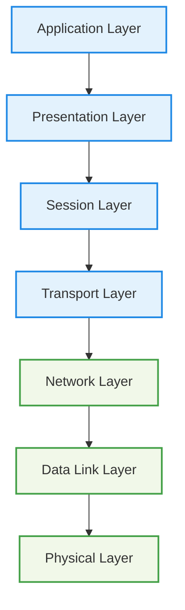
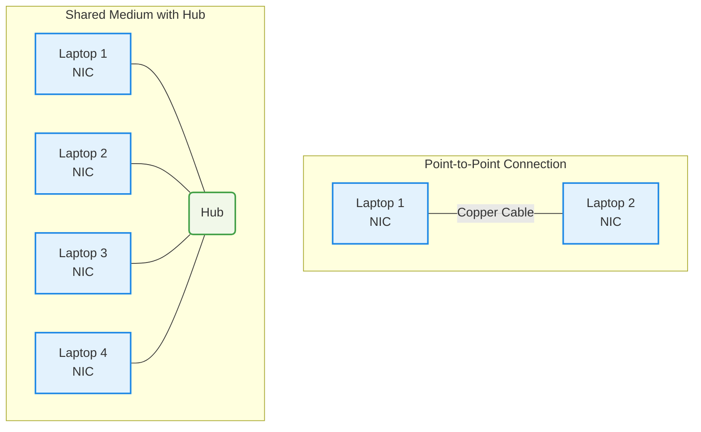

Tips: [Create multiples AWS Account using 1 Email](https://youtu.be/hnien_pKs4g?si=-wxAnnH3NpHf9Hag)

## 0. Cloud, Networking and Technical Fundamental

OSI 7-Layer Networking Model

OSI Model

OSI 7-Layer Model

* **Lower (Media) Layers:** Physical, Data Link, Network – deal with how data physically moves between points (local or global).
* **Upper (Host) Layers:** Transport, Session, Presentation, Application – deal with how data is packaged, transmitted reliably, and interpreted by applications.

Data flows **down** the OSI stack on the sender’s side and **up** the stack on the receiver’s side. For example, a web browser on one end communicates with a web server on the other through these layers.

---

#### Diagram – OSI 7 Layers

* **Host Layers (Top):** Handle data formatting, reliability, and application logic.
* **Media Layers (Bottom):** Handle transmission and routing of data across networks.

Layer 1 - Physical

**Layer 1 (Physical Layer)** is the foundation of networking. It defines how raw bits (0s and 1s) are transmitted over a **shared physical medium** (copper, fiber optic, or wireless).

* Key Concepts:
    * **Point-to-Point Links:**
        * Two devices (e.g., laptops) can communicate using a direct cable connection or by joining the same wireless network.
    * **Physical Mediums:**
        * **Copper cable** → electrical signals
        * **Fiber optic** → light pulses
        * **Wireless (Wi-Fi)** → radio frequencies
    * **Standards/Specifications:**
        * Define **voltage levels, timings, data rates, distances, modulation methods, and connector types** so that devices can interpret signals consistently.

* How Communication Works
    * Network Interface Cards (NICs) transmit bits as signals (e.g., 1 volt = binary 1, 0 volts = binary 0).
    * Both devices must use the **same physical standard** to interpret signals correctly.

* Expanding to Multiple Devices
    * **Hub (Layer 1 Device):**
        * A hub retransmits incoming signals to all other ports.
        * Creates a **shared medium** for multiple devices.
        * Forms one **broadcast domain** and one **collision domain**.

* Limitations of Layer 1
    * **No addressing:** All transmissions are broadcast to everyone.
    * **Collisions:** If two devices transmit at once, signals overlap and corrupt data.
    * **No Media Access Control (MAC):** No rules to decide who transmits and when.
    * **No error detection or correction:** Layer 1 cannot identify or recover from collisions.
    * **Poor scalability:** More devices → higher chance of collisions.

* Importance
    * Layer 1 is **fundamental**: it enables the physical transmission of data.
    * However, it lacks intelligence for reliable, directed communication.
    * **Layer 2 (Data Link Layer)** builds on top of Layer 1 to provide **addressing, access control, and error handling**, making practical communication possible.

---

- Key Concept:
    - Layer 1 defines the **physical transmission environment** for networking, but by itself only supports raw broadcasting without reliability or control. 
    - For effective networking, we need the intelligence of higher layers starting with **Layer 2**.

Layer 2 - DataLink

#### Role of Layer 2

* Sits above Layer 1 (Physical layer).
* Enables reliable device-to-device communication on the same network segment.
* Provides addressing, flow control, and error detection/correction.

#### Frames
* 
* Layer 2 introduces **frames** as the unit of communication.
* Frame structure includes:

  * **Preamble & Start delimiter** – identifies start of frame.
  * **Destination & Source MAC addresses** – unique 48-bit hardware identifiers.
  * **EtherType field** – indicates which Layer 3 protocol is encapsulated.
  * **Payload** – actual data (often Layer 3 packets).
  * **Frame Check Sequence (FCS)** – error detection via CRC.
* Concept of **encapsulation**: higher-layer data is wrapped inside a frame.

#### Media Access Control

* Solves the collision problem of Layer 1 shared mediums.
* Uses **CSMA/CD** (Carrier Sense Multiple Access with Collision Detection):

  * Check if medium is free before sending.
  * Detect collisions, send jam signal, apply random backoff, retry.
* Supports **unicast** (one-to-one) and **broadcast** (one-to-all).

#### Devices

* **Hubs (Layer 1)**: repeat signals blindly, cause collisions, all devices receive data.
* **Switches (Layer 2)**:

  * Understand frames and maintain **MAC address tables**.
  * Forward frames intelligently to the correct port.
  * Each port is its own collision domain.
  * Store-and-forward mechanism ensures only valid frames are delivered.

#### Benefits of Layer 2

* Provides unique device identification (MAC addresses).
* Enables controlled and reliable sharing of a medium.
* Reduces collisions and improves scalability (especially with switches).
* Forms the foundation for higher-layer protocols and the internet itself.

Layer 3 - Network

#### Purpose of Layer 3

* Enables communication **across different Layer 2 networks** (internetworking).
* Provides **logical addressing, routing, and packet delivery** between devices separated by multiple networks.
* Supports scalability beyond local LANs.

#### Packets and Encapsulation

* Layer 3 unit of data = **Packet**.
* Packets have **source and destination IP addresses** (can be global, unlike Layer 2).
* Encapsulation: IP packet is placed inside a Layer 2 frame for each hop.
* As packets move, **frames change** but the **IP packet remains constant**.

#### Key Fields in IP Packets

* **Source IP & Destination IP** – device identifiers.
* **Protocol field** – specifies Layer 4 protocol (e.g., TCP=6, UDP=17, ICMP=1).
* **Time To Live (TTL)** / Hop Limit – maximum hops before discard.
* **Payload** – data from Layer 4 protocols.

#### IPv4 vs IPv6

* **IPv4**: 32-bit addresses, dotted decimal (e.g., 133.33.3.7).
* **IPv6**: 128-bit addresses, larger space, similar structure but with Hop Limit.
* Both carry Layer 4 data inside.

#### IP Addressing & Subnetting

* IP address = **Network part + Host part**.
* Subnet mask (e.g., /16, 255.255.0.0) defines network vs host bits.
* Devices are **local** if network parts match; otherwise, communication goes through a **router**.
* Subnets allow calculation of **network start and end addresses**.

#### Routing and Route Tables

* **Routers** forward packets between networks.
* Each router has a **routing table**:

  * Destination network (prefix).
  * Next hop (where to send packet).
* **Default route (0.0.0.0/0)** used if no specific match exists.
* Routing can be static or dynamic (e.g., BGP).

#### Address Resolution Protocol (ARP)

* Translates IP addresses to MAC addresses for local delivery.
* Process: device broadcasts “Who has IP X?” → target replies with MAC address.
* Enables Layer 3 packets to be encapsulated in Layer 2 frames.

#### Example Scenarios

* **Local communication**: Devices use ARP to resolve MAC and send directly.
* **Remote communication**: Device sends packet to **default gateway (router)**, which forwards it across multiple networks until destination is reached.

#### Limitations of Layer 3

* Provides only **basic delivery** (no sessions, no reliability).
* Packets can arrive **out of order**.
* Cannot distinguish between multiple application streams on the same devices.
* These gaps are solved by **Layer 4 protocols** (TCP/UDP).

Layer 4 & 5

## 1. Cloud, Networking and Technical Fundamentals
### Cloud Computing

## 2. AWS Fundamentals

## 3. IAM, ACCOUNTS AND AWS ORGANISATIONS

## 4. SIMPLE STORAGE SERVICE (S3)

## 5. VIRTUAL PRIVATE CLOUD (VPC) BASICS

## 6. ELASTIC COMPUTE CLOUD (EC2) BASICS

## 7. CONTAINERS & ECS

## 8. ADVANCED EC2

## 9. Route 53 - Global DNS

## 10. Relational Database Service (RDS)

## 11. NETWORK STORAGE & DATA LIFECYCLE

## 12. HA & SCALING

## 13. SERVERLESS AND APPLICATION SERVICES

## 14. GLOBAL CONTENT DELIVERY AND OPTIMIZATION

## 15. ADVANCED VPC Networking

## 16. HYBRID ENVIRONMENTS AND MIGRATION

## 17. SECURITY, DEPLOYMENT & OPERATIONS

## 18. Infrastructure as Code (CloudFormation)

## 19. NOSQL Databases & DynamoDB

## 20. Machine Learning 101

## 21. Other Services & Features