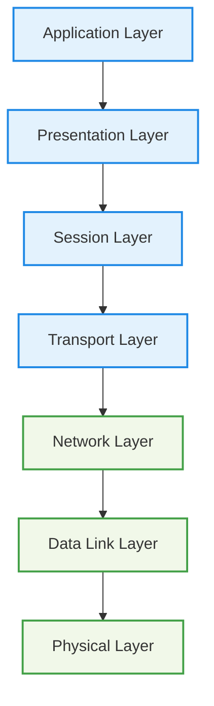
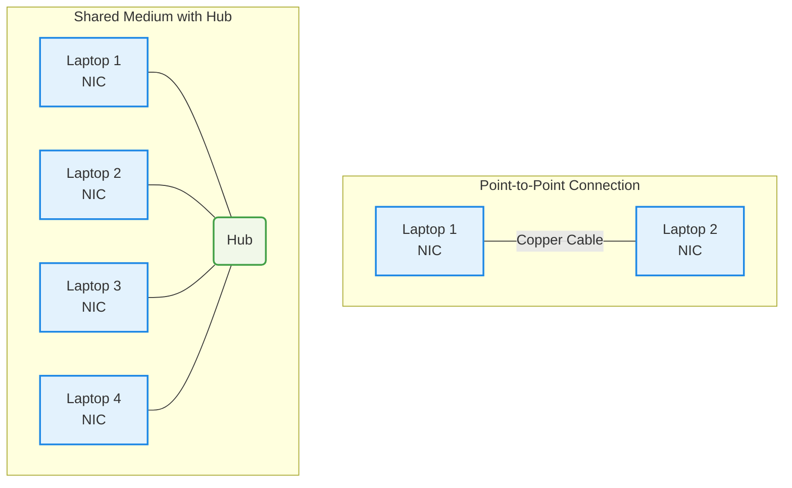

Tips: [Create multiples AWS Account using 1 Email](https://youtu.be/hnien_pKs4g?si=-wxAnnH3NpHf9Hag)

## 0. Cloud, Networking and Technical Fundamental

OSI 7-Layer Networking Model

OSI Model

OSI 7-Layer Model

* **Lower (Media) Layers:** Physical, Data Link, Network – deal with how data physically moves between points (local or global).
* **Upper (Host) Layers:** Transport, Session, Presentation, Application – deal with how data is packaged, transmitted reliably, and interpreted by applications.

Data flows **down** the OSI stack on the sender’s side and **up** the stack on the receiver’s side. For example, a web browser on one end communicates with a web server on the other through these layers.

---

#### Diagram – OSI 7 Layers

* **Host Layers (Top):** Handle data formatting, reliability, and application logic.
* **Media Layers (Bottom):** Handle transmission and routing of data across networks.

Layer 1 - Physical

**Layer 1 (Physical Layer)** is the foundation of networking. It defines how raw bits (0s and 1s) are transmitted over a **shared physical medium** (copper, fiber optic, or wireless).

* Key Concepts:
    * **Point-to-Point Links:**
        * Two devices (e.g., laptops) can communicate using a direct cable connection or by joining the same wireless network.
    * **Physical Mediums:**
        * **Copper cable** → electrical signals
        * **Fiber optic** → light pulses
        * **Wireless (Wi-Fi)** → radio frequencies
    * **Standards/Specifications:**
        * Define **voltage levels, timings, data rates, distances, modulation methods, and connector types** so that devices can interpret signals consistently.

* How Communication Works
    * Network Interface Cards (NICs) transmit bits as signals (e.g., 1 volt = binary 1, 0 volts = binary 0).
    * Both devices must use the **same physical standard** to interpret signals correctly.

* Expanding to Multiple Devices
    * **Hub (Layer 1 Device):**
        * A hub retransmits incoming signals to all other ports.
        * Creates a **shared medium** for multiple devices.
        * Forms one **broadcast domain** and one **collision domain**.

* Limitations of Layer 1
    * **No addressing:** All transmissions are broadcast to everyone.
    * **Collisions:** If two devices transmit at once, signals overlap and corrupt data.
    * **No Media Access Control (MAC):** No rules to decide who transmits and when.
    * **No error detection or correction:** Layer 1 cannot identify or recover from collisions.
    * **Poor scalability:** More devices → higher chance of collisions.

* Importance
    * Layer 1 is **fundamental**: it enables the physical transmission of data.
    * However, it lacks intelligence for reliable, directed communication.
    * **Layer 2 (Data Link Layer)** builds on top of Layer 1 to provide **addressing, access control, and error handling**, making practical communication possible.

---

- Key Concept:
    - Layer 1 defines the **physical transmission environment** for networking, but by itself only supports raw broadcasting without reliability or control. 
    - For effective networking, we need the intelligence of higher layers starting with **Layer 2**.

Layer 2 - DataLink

#### Role of Layer 2

* Sits above Layer 1 (Physical layer).
* Enables reliable device-to-device communication on the same network segment.
* Provides addressing, flow control, and error detection/correction.

#### Frames
* 
* Layer 2 introduces **frames** as the unit of communication.
* Frame structure includes:

  * **Preamble & Start delimiter** – identifies start of frame.
  * **Destination & Source MAC addresses** – unique 48-bit hardware identifiers.
  * **EtherType field** – indicates which Layer 3 protocol is encapsulated.
  * **Payload** – actual data (often Layer 3 packets).
  * **Frame Check Sequence (FCS)** – error detection via CRC.
* Concept of **encapsulation**: higher-layer data is wrapped inside a frame.

#### Media Access Control

* Solves the collision problem of Layer 1 shared mediums.
* Uses **CSMA/CD** (Carrier Sense Multiple Access with Collision Detection):

  * Check if medium is free before sending.
  * Detect collisions, send jam signal, apply random backoff, retry.
* Supports **unicast** (one-to-one) and **broadcast** (one-to-all).

#### Devices

* **Hubs (Layer 1)**: repeat signals blindly, cause collisions, all devices receive data.
* **Switches (Layer 2)**:

  * Understand frames and maintain **MAC address tables**.
  * Forward frames intelligently to the correct port.
  * Each port is its own collision domain.
  * Store-and-forward mechanism ensures only valid frames are delivered.

#### Benefits of Layer 2

* Provides unique device identification (MAC addresses).
* Enables controlled and reliable sharing of a medium.
* Reduces collisions and improves scalability (especially with switches).
* Forms the foundation for higher-layer protocols and the internet itself.

Layer 3 - Network

#### Purpose of Layer 3

* Enables communication **across different Layer 2 networks** (internetworking).
* Provides **logical addressing, routing, and packet delivery** between devices separated by multiple networks.
* Supports scalability beyond local LANs.

#### Packets and Encapsulation

* Layer 3 unit of data = **Packet**.
* Packets have **source and destination IP addresses** (can be global, unlike Layer 2).
* Encapsulation: IP packet is placed inside a Layer 2 frame for each hop.
* As packets move, **frames change** but the **IP packet remains constant**.

#### Key Fields in IP Packets

* **Source IP & Destination IP** – device identifiers.
* **Protocol field** – specifies Layer 4 protocol (e.g., TCP=6, UDP=17, ICMP=1).
* **Time To Live (TTL)** / Hop Limit – maximum hops before discard.
* **Payload** – data from Layer 4 protocols.

#### IPv4 vs IPv6

* **IPv4**: 32-bit addresses, dotted decimal (e.g., 133.33.3.7).
* **IPv6**: 128-bit addresses, larger space, similar structure but with Hop Limit.
* Both carry Layer 4 data inside.

#### IP Addressing & Subnetting

* IP address = **Network part + Host part**.
* Subnet mask (e.g., /16, 255.255.0.0) defines network vs host bits.
* Devices are **local** if network parts match; otherwise, communication goes through a **router**.
* Subnets allow calculation of **network start and end addresses**.

#### Routing and Route Tables

* **Routers** forward packets between networks.
* Each router has a **routing table**:

  * Destination network (prefix).
  * Next hop (where to send packet).
* **Default route (0.0.0.0/0)** used if no specific match exists.
* Routing can be static or dynamic (e.g., BGP).

#### Address Resolution Protocol (ARP)

* Translates IP addresses to MAC addresses for local delivery.
* Process: device broadcasts “Who has IP X?” → target replies with MAC address.
* Enables Layer 3 packets to be encapsulated in Layer 2 frames.

#### Example Scenarios

* **Local communication**: Devices use ARP to resolve MAC and send directly.
* **Remote communication**: Device sends packet to **default gateway (router)**, which forwards it across multiple networks until destination is reached.

#### Limitations of Layer 3

* Provides only **basic delivery** (no sessions, no reliability).
* Packets can arrive **out of order**. No flow control, leading to possible congestion and packet drops.
* Cannot distinguish between multiple application streams on the same devices.
* These gaps are solved by **Layer 4 protocols** (TCP/UDP).

Layer 4 & 5

#### Layer 4 (Transport Layer) Functions

* Adds **TCP** (reliable, ordered, connection-oriented) and **UDP** (fast, connectionless, less reliable).
* Introduces **segments**, encapsulated in IP packets.
* Provides **multiplexing** via **source/destination ports**.
* Ensures **ordering** with sequence numbers and acknowledgements.
* Implements **flow control** using window size.
* Uses **checksums** for error detection.
* Can prioritize data with the **urgent pointer**.

#### TCP Architecture

* **Client-server model** with **ephemeral ports** (client) and **well-known ports** (server, e.g., 443).
* **Bidirectional communication**: each direction has its own source/destination port pair.
* Segments provide a **reliable stream** despite packet unreliability at Layer 3.

#### TCP Three-Way Handshake

1. **SYN**: client sends initial sequence number.
2. **SYN-ACK**: server responds with its own sequence number and acknowledges client’s.
3. **ACK**: client acknowledges server’s sequence number.

* After this, both sides are synchronized and ready to exchange data reliably.

#### Sessions and State

* A **session** is the ongoing, stateful communication between client and server.
* Managed via TCP sequence numbers, acknowledgements, and connection state.

#### Stateless vs Stateful Firewalls

* **Stateless (e.g., AWS NACLs)**: Require explicit rules for both directions (outbound and inbound).
* **Stateful (e.g., AWS Security Groups)**: Track TCP connection state—allowing return traffic automatically once an initial connection is permitted.

    
Networking

    
Network Address Translation (NAT)

#### Purpose of NAT

* Solves the **IPv4 address shortage** by allowing multiple private devices to share fewer public IPs.
* Translates **private IP addresses ↔ public IP addresses** so private devices can access the internet.
* Provides **basic security benefits** by hiding internal private addresses.
* Not required in IPv6 (sufficient address space).

#### Types of NAT

**1. Static NAT (One-to-One)**

* Permanent mapping between a private IP and a specific public IP.
* Used when a device (e.g., server) must always be reachable on the same public IP.
* Example: AWS Internet Gateway.

**2. Dynamic NAT (Many-to-Many, from a pool)**

* Private IPs are temporarily mapped to available public IPs from a pool.
* Allocation happens only when needed.
* If the pool is exhausted, new connections fail.
* Suitable when public IPs are fewer than private devices, but not all need internet simultaneously.

**3. Port Address Translation (PAT) / NAT Overload (Many-to-One)**

* Most common (e.g., home routers, AWS NAT Gateway).
* Many private devices share **one public IP**.
* Differentiates sessions using **unique source ports**.
* Maintains a NAT translation table with mappings:

  * (Private IP, Private Port) → (Public IP, Public Port).
* Return traffic is correctly routed back using this table.
* Limitation: **inbound connections cannot be initiated** directly to private devices (no entry in NAT table).

#### Key Points

* NAT operates only with **IPv4** (IPv6 removes the need).
* Ensures private devices can access public services like Netflix or APIs.
* Static = fixed mapping, Dynamic = temporary pool mapping, PAT = many devices share one public IP via ports.
* Widely used in **business networks, home routers, and cloud (AWS NAT Gateway/Instance)**.

    
IP Address Space & Subnetting

#### IPv4 Address Classes

1. **Class A** (0.0.0.0 – 127.255.255.255)

   * 128 networks, each with \~16.7 million addresses.
   * Historically allocated to large organizations (e.g., Apple, Ford, US Military).

2. **Class B** (128.0.0.0 – 191.255.255.255)

   * 16,384 networks, each with \~65,536 addresses.
   * Used by medium-to-large organizations.

3. **Class C** (192.0.0.0 – 223.255.255.255)

   * Over 2 million networks, each with 256 addresses.
   * Common for small businesses.

4. **Class D** (224.0.0.0 – 239.255.255.255)

   * Reserved for multicast.

5. **Class E** (240.0.0.0 – 255.255.255.255)

   * Experimental use.

#### Private IPv4 Address Ranges (RFC 1918)

1. **10.0.0.0 – 10.255.255.255**

   * Single Class A block (\~16.7 million addresses).
   * Widely used in cloud platforms.

2. **172.16.0.0 – 172.31.255.255**

   * Sixteen Class B networks (\~65,536 addresses each).
   * Default range for AWS VPCs.

3. **192.168.0.0 – 192.168.255.255**

   * 256 Class C networks (256 addresses each).
   * Common in home and small office networks.

**Key Note**: Private ranges cannot be routed on the internet and require Network Address Translation (NAT).

#### IPv6 Addressing

* **Need for IPv6**: IPv4 addresses are nearly exhausted due to rapid device growth and cloud services.
* **Scale**: IPv6 provides **340 undecillion addresses** (3.4 × 10³⁸).

#### Subnetting Concepts

* **Definition**: Subnetting divides a larger network into smaller networks, each with its own prefix length.
* **CIDR (Classless Inter-Domain Routing)**: Introduced prefixes (e.g., `/16`, `/24`) to describe subnet size.
* **Principles**:

  * Larger prefix number = smaller subnet.
  * Example: `10.0.0.0/16` can be split into two `/17` networks, each covering half the range.
  * Repeated subdivision can produce multiple smaller subnets.

    
Distributed Denial of Service (DDOS) Attacks

#### Categories of DDoS Attacks

1. **Application Layer Attacks (Layer 7)**

   * Examples: HTTP floods.
   * **Method**: Attackers exploit computational imbalance—simple client requests trigger expensive server responses.
   * **Impact**: Servers become overloaded, leading to performance degradation or failure.

2. **Protocol-Based Attacks (Layer 3/4)**

   * Examples: SYN floods.
   * **Method**: Exploit the TCP three-way handshake by sending spoofed SYN packets.
   * **Impact**: Server holds connections in half-open state, consuming memory and network resources, preventing legitimate users from connecting.

3. **Volumetric/Amplification Attacks**

   * Examples: DNS amplification.
   * **Method**: Small requests (with spoofed victim IP) trigger disproportionately large responses from third-party servers to the victim.
   * **Impact**: Saturates the victim’s network bandwidth, making services inaccessible even if servers remain operational.

    
VLANS, TRUNKS & Q-in-Q

#### What VLANs Solve
- A VLAN (Virtual Local Area Network) is a logical separation of devices on the same physical switch.
- Using VLANs, one switch can host multiple isolated networks.
- Each VLAN creates its own broadcast domain, so broadcasts don’t leak into other groups.
- Distinguish by VLAN ID (eg. Finance = VLAN 20, Game Testers = VLAN 10, Sales = VLAN 30)
#### 802.1Q-Capable Switch (Managed Switch/VLAN Tagging)
- 
- Standard that makes VLANs work.
- It modifies the Ethernet frame to add a VLAN tag (12 bits) → supports up to 4096 VLANs.
- How it works:
    - Devices connected to a switch don’t see VLAN tags.
    - Switches add/remove tags internally to know which VLAN traffic belongs to.
- **Access and Trunk ports** apply when switch supports VLANs (via IEEE 802.1Q standard)

#### Access Ports vs Trunk Ports
- 
- Access Port
    - Belongs to a single VLAN.
    - Strips off the VLAN tag before sending frames to the end device.
    - End devices (PCs, printers, phones) don’t need to understand VLAN tags.
- Trunk Port
    - Carries multiple VLANs across a single link (usually switch-to-switch, or switch-to-router/firewall).
    - Frames keep their 802.1Q VLAN tags while traveling over the trunk.
    - The receiving device must also understand 802.1Q.
- Benefit: Access + Trunk ports allow VLANs to work across a network of switches instead of being stuck on just one switch.

#### Q-in-Q (802.1ad, VLAN Stacking)
- 
- Problem: What if you and your service provider both use VLANs? IDs might conflict (e.g., both use VLAN 1337).
- Solution: Q-in-Q = add a second VLAN tag
- VLAN in VLAN, Outer envelope = provider’s VLAN. Inner envelope = your VLAN.

#### Key
- 802.1Q define (VLANS)
- 802.1AD define (nested QinQ VLANS)

    
Decimal to Binary Conversion IPv4

    
Decimal to Binary Conversion (Complex Direction)

1. Approach:
    - Convert each octet (0–255) individually.
    - Use a binary position value table: 128, 64, 32, 16, 8, 4, 2, 1.
2. Rules:
    - Rule 1: If the decimal value < binary position → write 0.
    - Rule 2: If the decimal value ≥ binary position → write 1, subtract the binary position value from the decimal, and continue.
3. Examples:
    - 133 → 10000101.
    - 33 → 00100001.
    - Students practice converting 33 (third octet) and 7 (last octet).
    - Final IP (133.33.33.7) in binary: 10000101.00100001.00100001.00000111.

    
Binary to Decimal Conversion (Easier Direction)

1. Process:
    - Break the 32-bit binary into four octets.
    - For each octet, add the decimal values corresponding to binary 1 positions.
2. Example:
    - 10000101 → 128 + 4 + 1 = 133.
    - 00100001 → 32 + 1 = 33.
    - 00000111 → 4 + 2 + 1 = 7.
3. Result:
    - The binary IP converts back into the dotted decimal form.

    
SSL & TLS

Here’s a concise, topic-based summary of the video content you provided:

### TLS/SSL Overview

* **SSL vs TLS**
  * SSL = Secure Sockets Layer (older, less secure).
  * TLS = Transport Layer Security (newer, secure replacement).
  * Both provide privacy and integrity between client and server.
* **Core Functions of TLS**
  * **Encryption (Privacy):** Protects communications so only client/server can read data.
  * **Authentication (Identity Verification):** Ensures the server is the one it claims to be.
  * **Integrity:** Detects and prevents alteration of data in transit.

### TLS Handshake Process
1. **Cipher Suite Agreement**
   * Client sends *Client Hello* with supported cipher suites, TLS version, session ID.
   * Server responds with *Server Hello*, selecting a cipher suite and sending its certificate (with public key).
2. **Authentication**
   * Server certificate is validated against trusted Certificate Authorities (CA).
   * Checks include: CA signature, expiration, revocation status, and domain match.
   * Client tests encryption using the server’s public key to ensure server holds the private key.
3. **Key Exchange**
   * Client generates a pre-master key, encrypts it with server’s public key, and sends it.
   * Server decrypts using its private key.
   * Both derive a *master secret*, used to create session keys.
   * Session keys enable efficient symmetric encryption for ongoing communication.

### Key Takeaways

* TLS uses **asymmetric encryption** initially, then switches to **symmetric encryption** for performance.
* Server identity is verified using **CA-issued certificates**.
* Final result: a secure, encrypted channel for client-server communication (e.g., HTTPS).

    
Border Gateway Protocol (BGP)

### Purpose and Basics

* **BGP**: Routing protocol controlling data flow between networks.
* Used by AWS services such as **Direct Connect** and **dynamic VPNs**.
* Operates between **Autonomous Systems (AS)**—self-managed networks identified by **AS Numbers (ASN)**.
* Runs over **TCP port 179**, providing reliability but requiring manual configuration of peering.

### Autonomous Systems and ASNs

* **ASNs**: 16-bit numbers (0–65,535).
  * Public: Allocated by IANA.
  * Private: 64,512–65,534 (used in private peering).
* BGP views an AS as a black box—concerned only with **routes in/out**, not internal routing.

### BGP Operation
* **Path-vector protocol**: Advertises only the **best path** (ASPATH) to destinations.
* **iBGP**: Routing inside an AS.
* **eBGP**: Routing between ASes (focus for AWS).
* Each AS shares routes with peers, building a distributed routing topology—this underpins the internet.

### Example Topology (Brisbane, Adelaide, Alice Springs)

* Each site has its own ASN and IP range.
* Links:
  * Brisbane ↔ Adelaide (1 Gb fiber).
  * Adelaide ↔ Alice Springs (1 Gb fiber).
  * Brisbane ↔ Alice Springs (5 Mb satellite).
* **Routing tables**: Initially list only local networks. After peering, each learns paths to others with ASPATH details.
* **Multiple paths**: BGP prefers the shortest path (fewest AS hops).

### Path Control – ASPATH Pre-Pending

* BGP ignores link speed/latency, focusing only on path length.
* Example: Alice Springs can make its **satellite link** look worse by artificially adding extra ASNs (ASPATH pre-pending).
* This forces Brisbane to route traffic via Adelaide’s faster fiber link instead of the slower satellite.

### Key Takeaways

* BGP builds a **dynamic routing map** of interconnected networks.
* **Shortest path wins** (based on AS hops, not performance).
* Supports **high availability** by automatically rerouting if a path fails.
* Core protocol behind the **internet** and hybrid networking solutions in **AWS**.

    
Stateful vs. stateless firewalls

### TCP/IP Refresher
* **TCP** (Layer 4): Adds ports and error correction on top of IP.
* **Connection structure**:
  * **Request**: Client → Server (ephemeral port → well-known port, e.g., 443).
  * **Response**: Server → Client (well-known port → ephemeral port).
* **Direction depends on perspective**: same packet flow may be outbound for client, inbound for server.

### Stateless Firewalls

* Treat **request and response** as separate flows.
* Require **two rules** for each connection: one for request, one for response.
* Responses use **ephemeral ports**, forcing wide port ranges to be opened.
* Higher admin overhead and greater security risk.

### Stateful Firewalls

* Track the **state of connections** and link requests to responses automatically.
* Only the **request rule** needs to be defined; response is implicitly allowed.
* Do **not** require opening large ephemeral port ranges.
* Lower admin effort, fewer errors, more secure.

### Key Takeaways

* Every TCP connection has **two parts**: request and response.
* **Stateless firewalls**: need explicit rules for both parts.
* **Stateful firewalls**: more intelligent, handle responses automatically, more secure and easier to manage.

    
Jumbo Frames

### Consideration
- All devices in the path must support jumbo frames, otherwise fragmentation occurs.
- Not all AWS services/paths support jumbo frames.

### Standard vs. Jumbo Frames
| Feature                   | Standard Frames              | Jumbo Frames                     |
| ------------------------- | ---------------------------- | -------------------------------- |
| Max Size                  | 1,500 bytes                  | \~9,000 bytes (AWS TGW: 8,500)   |
| Efficiency                | Higher overhead ratio        | Lower overhead ratio             |
| Frames Needed (same data) | More frames (less efficient) | Fewer frames (more efficient)    |
| Use Case                  | General networking           | High-performance, demanding apps |

### AWS Jumbo Frame Support
| AWS Service / Path           | Jumbo Frames Support            |
| ---------------------------- | ------------------------------- |
| **Within a single VPC**      | ✅ Supported (9,000 bytes)       |
| **Same-region VPC Peering**  | ✅ Supported                     |
| **Inter-region VPC Peering** | ❌ Not supported                 |
| **VPN Connections**          | ❌ Not supported                 |
| **Internet Gateway**         | ❌ Not supported                 |
| **Direct Connect**           | ✅ Supported                     |
| **Transit Gateway**          | ✅ Supported (up to 8,500 bytes) |

    
Application Layer Firewalls (Layer 7)

## Background
* **Layer 3 & 4 firewalls**:
  * See IPs, ports, flags, packets, and segments.
  * Treat request/response as separate flows.
  * Cannot inspect application data.
* **Layer 5 firewalls**:
  * Add session awareness (link request and response together).
  * Still no visibility into Layer 7 (application data opaque).

## Layer 7 Firewall Capabilities

* Understands **application protocols** (e.g., HTTP, HTTPS, SMTP).
* Terminates encrypted connections (e.g., HTTPS → inspects HTTP in plaintext).
* Creates a new secure connection to the backend server (transparent to client/server).
* Can **inspect, block, replace, or tag** Layer 7 content.

### Example Use Cases

* Filter/allow based on **protocol elements**: headers, DNS names, content type, connection rates.
* Protect against **protocol-specific attacks** or malformed traffic.
* Content control:
  * Allow cat images, block malware/spam/adult content.
  * Replace restricted content (e.g., adult images → kitten pictures).
* Application blocking (e.g., Facebook, Dropbox).

### Key Points

* Retains all features of L3–L5 firewalls.
* Adds **granular, content-aware security** at the application layer.
* Effectiveness depends on which protocols the firewall supports.

    
IPsec VPN

### IPsec

* **Purpose**: Secure tunnels over the internet → authentication, encryption, integrity.
* **Use Cases**: Site-to-site, AWS VPN, hybrid networks.
* **Trigger**: “Interesting traffic” starts a tunnel.

### Phases

1. **IKE Phase 1**
   * Purpose: Authenticate peers and establish secure channel.
   * Methods: Pre-shared keys or certificates.
   * Uses Diffie-Hellman exchange to derive a shared symmetric key.
   * Result: Phase 1 tunnel / Security Association (SA).

2. **IKE Phase 2**
   * Purpose: Negotiate encryption methods and set up tunnel for data transfer.
   * Builds on Phase 1 tunnel.
   * Creates IPsec keys for bulk encryption.
   * Result: Phase 2 tunnel / IPsec SA pair (one for each direction).

---

## VPN Types

* **Route-based**:
    * Matches traffic by prefix (e.g., 192.168.0.0/24).
    * One SA pair (phase 2 tunnel) for all traffic between sites.
    * Simpler setup, less flexible.

* **Policy-based**: 
    * Matches traffic by rules/policies.
    * Different SAs per traffic type (e.g., infra, CCTV, finance).
    * More complex, more flexible security.

---

**Key Point**: Phase 1 = identity + key exchange, Phase 2 = data encryption. Route-based = simple; Policy-based = granular.

    
Fiber Optic Cables

### Basics

* **Fiber vs Copper**:
  * Copper → electrical signals.
  * Fiber → light through glass/plastic core.
* Advantages: **higher speeds, longer distances, EMI resistant, consistent performance**.
* Widely used in LAN, metro, and global networks; adoption increasing.

### Structure

* **Core**: Tiny glass/plastic strand (carries light).
* **Cladding**: Surrounds core; lower refractive index → keeps light inside by reflection.
* **Buffer**: Coating/strength material for protection.
* **Jacket**: Outer visible layer, color-coded (indicates cable type).

### Fiber Types
* 
* **Single-Mode (SMF)**
  * Core: \~8–9 microns, usually yellow jacket.
  * Light path nearly straight → minimal distortion.
  * Uses **lasers**, longer distances, high speeds (10 Gbps+ over km).
  * Cable cheap, optics expensive (but prices falling).
* **Multi-Mode (MMF)**
  * Core: larger (e.g., 50–62.5 microns), orange/aqua jacket.
  * Multiple light paths → faster over short distances but more distortion at long distances.
  * Uses **LED optics**, cheaper, shorter runs.
  * Standards: OM2, OM3, OM4, etc.

### Transceivers (SFP / Mini-GBIC)

* Plug into networking equipment to convert **light ↔ data**.
* Must match fiber type (SMF or MMF) on both ends.
* Common standards: **1000BASE-LX, 10GBASE-LR, 100GBASE-LR4** (used in AWS Direct Connect).

---

**Key Point**:
* **Single-mode** = long distance, high speed, higher optic cost.
* **Multi-mode** = short distance, cost-effective, simpler.
* Both rely on transceivers matched to cable type and connector.

## 1. Cloud, Networking and Technical Fundamentals
### Cloud Computing

## 2. AWS Fundamentals

## 3. IAM, ACCOUNTS AND AWS ORGANISATIONS

## 4. SIMPLE STORAGE SERVICE (S3)

## 5. VIRTUAL PRIVATE CLOUD (VPC) BASICS

## 6. ELASTIC COMPUTE CLOUD (EC2) BASICS

## 7. CONTAINERS & ECS

## 8. ADVANCED EC2

## 9. Route 53 - Global DNS

## 10. Relational Database Service (RDS)

## 11. NETWORK STORAGE & DATA LIFECYCLE

## 12. HA & SCALING

## 13. SERVERLESS AND APPLICATION SERVICES

## 14. GLOBAL CONTENT DELIVERY AND OPTIMIZATION

## 15. ADVANCED VPC Networking

## 16. HYBRID ENVIRONMENTS AND MIGRATION

## 17. SECURITY, DEPLOYMENT & OPERATIONS

## 18. Infrastructure as Code (CloudFormation)

## 19. NOSQL Databases & DynamoDB

## 20. Machine Learning 101

## 21. Other Services & Features