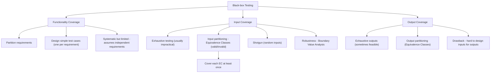

# 31282 and 32571 - Summary

## 1. Software Testing and Quality Assurance

### Software Quality and Software Quality Assurance (SQA)

- **Software quality** is often a moral and legal requirement.
- **Quality** (almost) always comes with a cost.
- **Cost Categories**:
    - **Prevention Costs:** Training, planning, early reviews/testing.
    - **Appraisal Costs:** Inspections and testing.
    - **Failure Costs:** Rework, complaint handling, loss management.

### Software Quality
- 3 different terms of software quality issues:
    - **Errors**: An error is something in the static artefacts of a system that causes a failure.
        - ex: Syntax error
    - **Defect/Fault**: A defect or bug is a situation at runtime where some underlying error has become reflected in the system's runtime state.
        - ex: Incorrect condition in logic
    - **Failure**: A failure is any deviation of the observed behaviour of a program or system from the specification.
        - ex: Software's working, but fail/lag during the runtime

### Measuring Software Quality

- Technical Quality Parameters
    - **Correctness:** Defect rate
    - **Reliability:** Failure rate
    - **Capability:** Requirements coverage
    - **Maintainability:** Ease of modification
    - **Performance:** Speed, memory, and resource efficiency
- User Quality Parameters
    - **Usability:** User satisfaction
    - **Installability:** Installation experience
    - **Documentation:** Clarity and usefulness of manuals
    - **Availability:** System uptime and access
- Quality Models and Standards
    - **McCall’s Quality Factors:** Operation, Transition, Revision
    - **Standards:** ISO/IEC 90003:2018, CMMI

### Software Quality Assurance (SQA)

- SQA is a structured set of activities to ensure both the software product and its development process meet functional, technical, and managerial requirements.
- Objectives:
    - Prevent defects early in development
    - Improve development and maintenance efficiency
    - Ensure alignment with quality goals

### Three Principles of SQA

1. **Know What You Are Doing**: Understand current system state and project progress. Maintain clear reporting, structure, and planning.

2. **Know What You Should Be Doing**: Maintain and track up-to-date requirements and specifications. Use acceptance criteria, prototypes, and user feedback.

3. **Measure the Difference**:Use tests and metrics to compare actual vs. expected performance. Quantify quality (e.g., percentage of passed test cases).

### SQA Environment Considerations

1. **Contractual Requirements** – Timeline, budget, functional scope
2. **Customer-Supplier Relationship** – Active collaboration and validation
3. **Team Collaboration** – Diverse skills and mutual review
4. **Inter-team Cooperation** – External expertise and project division
5. **System Interfaces** – Interaction with other software systems
6. **Team Turnover** – Knowledge transfer and onboarding
7. **Software Maintenance** – Long-term operational quality

### Software Quality Models

    
McCall's Quality Factors

    

    McCall’s model categorizes software quality into three main perspectives:
    <ul>
      <li><strong>Product Operation:</strong> Correctness, Reliability, Efficiency, Integrity, Usability</li>
      <li><strong>Product Revision:</strong> Maintainability, Flexibility, Testability</li>
      <li><strong>Product Transition:</strong> Portability, Reusability, Interoperability</li>
    </ul>
    These factors are depicted as branches of a tree, emphasizing how they contribute to "Quality Software."
  

    
Boehm's Software Quality Tree

    

    Boehm’s model uses a hierarchical quality tree structure with characteristics such as:
    <ul>
      <li><strong>As-is Utility:</strong> Portability, Reliability, Efficiency, Usability (Human Engineering)</li>
      <li><strong>Maintainability:</strong> Testability, Understandability, Modifiability</li>
    </ul>
    Each characteristic further breaks down into attributes like Robustness, Consistency, Accuracy, etc., showing interrelated quality aspects.
  

    
ISO/IEC 9126

    

    ISO/IEC 9126 defines six high-level quality characteristics for software:
    <ul>
      <li>Functionality</li>
      <li>Reliability</li>
      <li>Usability</li>
      <li>Efficiency</li>
      <li>Maintainability</li>
      <li>Portability</li>
    </ul>
    Each characteristic answers key questions such as “How easy is it to use/modify/transfer the software?” or “How reliable is the software?”
  

    
Dromey's Quality Model

    

    Dromey’s model links product properties with quality attributes and focuses on how implementation affects software quality.
    <ul>
      <li><strong>Product properties:</strong> Correctness, Internal, Contextual, Descriptive</li>
      <li><strong>Quality attributes:</strong> Functionality, Reliability, Maintainability, Efficiency, Reusability, Portability, Usability</li>
    </ul>
    This model provides a constructive framework that emphasizes the role of implementation.
  

    
ISO 9128

    

    ISO/IEC 25010 is an evolution of ISO 9126 and provides a more detailed breakdown of quality factors and sub-factors:
    <ul>
      <li><strong>Functionality:</strong> Suitability, Accuracy, Interoperability, Compliance, Security</li>
      <li><strong>Reliability:</strong> Maturity, Fault Tolerance, Recoverability, Compliance</li>
      <li><strong>Efficiency:</strong> Time behavior, Resource behavior, Compliance</li>
      <li><strong>Maintainability:</strong> Analyzability, Changeability, Stability, Testability, Compliance</li>
      <li><strong>Portability:</strong> Adaptability, Installability, Co-existence, Replaceability, Compliance</li>
      <li><strong>Usability:</strong> Understandability, Learnability, Operability, Attractiveness, Compliance</li>
    </ul>
  

---

## 2. Software Testing and Processes 

### Software Testing

#### Verification vs. Validation
- Verification – Confirms that the software meets specified requirements
- Validation – Ensures the developed software meets user needs and expectations

Relational:
- Verification without Validation = Perfect implementation of the wrong solution
- Validation without Verification = Right idea, broken execution
- Both Together = Quality software that actually helps users

#### V-model
| Development Phase     | Corresponding Test Phase |
| --------------------- | ------------------------ |
| Business Requirements | User Acceptance Testing  |
| System Requirements   | System Testing           |
| Architecture/Design   | Integration Testing      |
| Program Specification | Unit Testing             |
| Coding                | (Implementation phase)   |

### Types, Techniques, and Levels of Testing

  
Static and Dynamic Testing

- **Static Testing** – Conducted without executing the program (e.g., inspections, analyses, documenting).
- **Dynamic Testing** – Involves executing the program to observe outputs.

  
Functional and Non-Functional Testing

- **Functional**: What the system does
  - Login functionality
  - Calculation accuracy
  - User registration
  - Data processing
- **Non-Functional**: How the system performs
  - Speed, security, usability, reliability

  
Levels of Testing based on system abstraction

  
- **Unit Testing** (On: Code) – Individual components are tested independently to ensure their quality. Focus to detect error on:
    - Data structure
    - Program logic and program structure
    - Interface
    - Functions and operations
- **Integration Testing** (On: Design) – A group of dependent components are composed and tested together. Objectives to detect errors in:
    - Software architecture
    - Integrated functions or operations
    - Interfaces and interactions between components
- **System Testing** (On: Requirements) – Tests the overall system (both hard- & soft- ware) if they meet the requirements. Objects:
    - System input/output
    - System functions and information
    - System interfaces with external parts
    - User interfaces
    - System behavior and performance
behavior and performance.
- **Acceptance Testing** (On: What users
really need) – Confirms the software meets customer needs and expectations. 

  
(Unit) Testing Techniques

- **Black Box** – Based on input-output behavior without internal code knowledge.
- **White Box** – Focuses on internal code paths and structures.
- **Grey Box** – Partial knowledge of internal code is used.

### Testing in Software Development Lifecycle
- A software process is a framework that guides the planning, development, testing, and delivery of software.
- Common models include:
  - Waterfall (sequential stages)
  - Agile (iterative and incremental)
  - V-Model (verification and validation aligned)
  - DevOps (continuous integration and delivery)

###  Software Processes and Their Role in SQA
- Software development includes:
    - Requirements → Specification → Design → Code → Testing → Maintenance
- Testing is a **continuous** activity throughout the lifecycle:
- Core Activities:
    - Specification: Define requirements
    - Development: Build the product
    - Validation: Ensure it meets needs
    - Evolution: Adapt to changes
- Common Process Models:
    - Waterfall, Prototyping, Spiral, Iterative

### Software Process Models

  
1. Waterfall Model

- Concept: Sequential phases with sign-off before moving to the next stage.
- Phases:
  1. Requirements definition
  2. System/software design
  3. Implementation & unit testing
  4. Integration & system testing
  5. Operation & maintenance
- Advantages: Structured, easy to manage, quality control at each stage.
- Drawbacks:
  - Early freezing of requirements/design leads to mismatches with user needs.
  - Inflexible partitioning can produce unusable systems.
  - Requirement gathering is difficult and prone to change.

  
2. Prototyping Model

- Concept: Iterative creation of partial system versions to refine requirements.
- Process: Requirements gathering → Quick design → Build prototype → Customer evaluation → Design refinement → Full development.
- Advantages: Improves requirement accuracy, engages users early.
- Drawbacks:
  - Prototypes often discarded (wasted work).
  - Incomplete prototypes may miss critical requirements.
  - Risk of over-refinement ("creeping excellence").
- Variation: Evolutionary Prototyping – Gradually evolve prototype into final system.

  
3. Spiral Model

- Concept: Combines waterfall with continuous risk analysis and iteration.
- Four Steps per Cycle:
  1. Determine objectives, constraints, alternatives.
  2. Assess/reduce risks.
  3. Develop and validate.
  4. Review and plan next iteration.
- Advantages: Strong risk management, adaptable to project needs, high-quality results.
- Drawbacks:
  - Heavy documentation and meetings (slow progress).
  - More of a “meta-model” than a strict development method.
  - Requires experienced team for risk analysis.

  
4. Iterative Development Model

- Concept: Build software in subsets, each adding critical features.
- Process:
  - Start with key requirements and architecture.
  - Develop subset product → Get feedback → Refine design and requirements → Add next subset.
- Advantages: Adapts to evolving customer needs, improves design through feedback.
- Drawbacks:
  - Works best with small teams.
  - Requires early architecture decisions, which are hard to change later.

## 3. Static Testing, RBT, and FMEA

### Static Testing
- Reviews and analyses software documentation or code without execution, aiming to identify issues early when they are easier and cheaper to fix.

  
Manual Methods

- Informal reviews – casual peer review.
- Walkthroughs – presentation for feedback.
- Technical reviews – specialist checks.
- Inspections – formal, checklist-driven review.
- Audits – compliance verification.

  
Automated Methods

- Static Analysis – detects errors, vulnerabilities, quality issues.
- Lint Checks – enforce coding standards.
- Formal Methods – mathematical correctness proofs.

  
When Used, Focus Areas, Common Requirement Defects

  
- When Used: Throughout design, documentation, and development phases before dynamic testing.
- Focus Areas: Requirements, design documents, source code, and compliance with legal/security standards.
- Common Requirement Defects: Incompleteness, ambiguity, inconsistency, untestability, unfeasibility.

### Risk-Based Testing (RBT)
- Testing that focuses on areas of highest risk to reduce overall project risk.

  
Risk Types & Benefit

  
- Risk Types:
  - Product risk – quality issues causing failures.
  - Project risk – factors affecting project success (e.g., staffing, delays).

- Benefits: Prioritises testing, supports contingency planning, improves productivity, and reduces costs.

### Failure Modes and Effects Analysis (FMEA)
- Systematic technique to identify, prioritise, and mitigate potential failures before they occur.
- Failure Modes are the ways in which a design/ process/ system/ software might fail.
- Effects are ways these failures can lead to risks, e.g., waste, defects or harm.

  
Perform FMEA: Process Steps

1. Define **scope**.
2. Identify **functions**.
3. Identify **potential failure** modes.
4. Identify **consequences**.
5. Rate severity (determine how **serious** the effect is).
6. Calculate **Risk Priority Number (RPN = Priority × Severity)**.
7. Identify **root causes**.
8. Recommend **actions**.

- Risk priority number (RPN) is used to quantify the overall ranking of risks (potential failure).

  
Failure Mode Types & Risk Categories

- Failure Mode Types: Loss of function, unintended function, delayed function, poor performance, incorrect value, support system failures.
- Risk Categories: System functionality, UI, transaction processing, performance, security, compliance, infrastructure, etc. 

  
Potential Actions & Benefit

- Potential Actions: Remove requirement, add controls, quarantine risk.
- Benefits:
  - No expensive tools required.
  - Flexible for any project size.
  - Helps prioritise changes.
  - Supports building quality into products.

### Relationship Between Static Testing & FMEA
- Static testing ensures clear, complete requirements.
- FMEA extends this by anticipating and ranking potential failures to guide dynamic testing priorities.

## 4. Black-box Testing
### (Dynamic) Software Testing Life Cycle
0. Software artifact
1. Define test objectives.
2. Design test cases.
3. Develop test scripts.
4. Run test scripts.
5. Evaluate results.
6. Generate feedback and change system.
7. Regression testing.

### Systematic Testing
* Explicit discipline for creating, executing, and evaluating tests.
* Recognizes complete testing is impossible; uses chosen criteria.
* Must include rules for test creation, completeness measure, and stopping point.

### Black-box Testing
* Based on functional specifications (inputs, actions, outputs).
* Occurs throughout the life cycle, requires fewer resources than white-box testing.
* Supports unit, load, availability testing; can be automated.

**Advantages:** independent of software internals, early detection, automation friendly.

### Black-box Methods

### a. Functionality Coverage

* Partition functional specs into small requirements.
* Create simple test cases for each requirement.
* Systematic but treats requirements as independent (not full acceptance testing).

### b. Input Coverage

* Ensures all possible inputs are handled.
* **Methods:**
  * Exhaustive: test all inputs (impractical for large domains).
  * Input partitioning: group into equivalence classes (valid/invalid).
  * Shotgun: random inputs.
  * Robustness: boundary value analysis.
* **Examples:**
  * Partition inputs into valid/invalid ranges.
  * Create minimal test cases for each partition.

#### c. Robustness Testing
* Ensures program doesn’t crash on unexpected inputs.
* Focus on **boundary values** (e.g., empty file, stack full/empty).
* More systematic than shotgun.

#### d. Input Coverage Review
* Exhaustive impractical, input partitioning practical.
* Shotgun + partitioning increases confidence.
* Robustness complements other methods.

### C. Output Coverage

* Tests based on possible outputs (instead of inputs).
* Harder: requires mapping inputs to outputs.
* Effective in finding problems but often impractical.

**Methods:**

* Exhaustive output coverage (test every possible output, feasible in some cases).
* Output partitioning: group outputs into equivalence classes (e.g., number of values, zeros present).
* Drawback: finding inputs to trigger specific outputs is time-consuming.

## 5. White-box Testing

### Whitebox Testing & Code Injection

  
Whitebox Testing

- Category: test perform in a lower level, concentrates on actual code, done by Developers or Testers
- Uses knowledge of a program’s internal structure to verify its logic, flow, and functionality by systematically covering code paths.

  
Testing Types

- **Code Coverage**: Tests ensure every method, statement, or branch runs at least once.
- **Mutation Testing**: Creates modified code versions to check if tests detect changes.
- **Data Coverage**: Focuses on testing the program’s data handling rather than control flow.

  
Code Injection

- Make code testing more efficient; generate copy of the code to test.
- Common approaches include:
  - Action Instrumentation: Logs execution for coverage.
  - Performance Instrumentation: Records time and resource usage.
  - Assertion Injection: Validates program state at runtime.
  - Fault Injection: Simulates failures to test fault handling.

### Whitebox Testing Techniques

  
Code Coverage Methods

1. **Statement Coverage:** Ensures every line of code executes at least once.
2. **Basic Block Coverage:** Ensures each block of statements that always execute together is tested.
3. **Decision Coverage:** Ensures each decision (e.g., if/else, switch) is evaluated both true and false.
4. **Condition Coverage:** Ensures each condition within a decision is tested for both true and false.
5. **Loop Coverage:** Ensures loops are tested with zero, one, two, and many iterations.
6. **Path Coverage:** Ensures all possible execution paths in the control-flow graph are tested.

## 6. Whitebox Testing Techniques
### Mutation Testing

  
Mutation Testing

- Purpose: Measures how effective a test suite is by introducing small faults (mutants) into the program.
- Process:
  1. Run the original program and fix any issues.
  2. Create mutants (one change each).
  3. Run test suite on mutants.
  4. If results differ → mutant is “killed” (detected). If not → tests are inadequate.
- Adequacy: Proportion of killed mutants to total mutants.

  
Systematic Mutation

- Requires rules for creating mutants and criteria for completion.

  
Common mutation types

- **Value Mutation**: Change constants or expressions `(e.g., 0 → 1, x → x+1)`.
- **Decision Mutation**: Invert conditions `(e.g., == → !=, > → <)`.
- **Statement Mutation**: Delete, swap, or duplicate statements.

### Data Coverage

  
Data Coverage

- Focuses on how data is used and moves through a program

  
Data Flow Coverage

- Concerned with variable definitions:
  - Variable definitions: variable is assigned a value
- Types of Variables:
  - P-use: Predicate use (e.g., in conditions)
  - C-use: Computation or output use

  
Data Flow Testing Strategies

- **All-Defs**: Every definition reaches at least one use.
- **All P-Uses**: Every definition reaches all predicate uses.
- **All C-Uses**: Every definition reaches all computation uses.
- **All-Uses**: Every definition reaches all predicate and computation uses.

