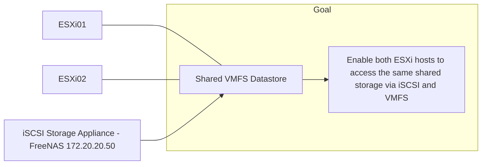
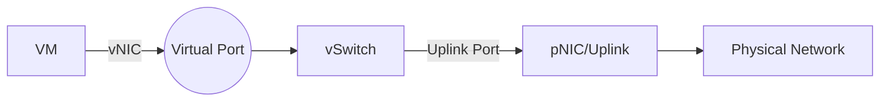
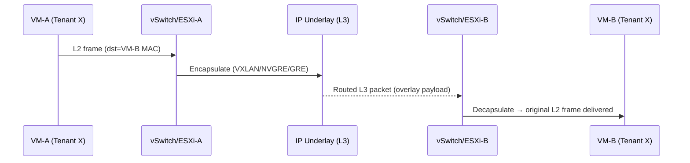
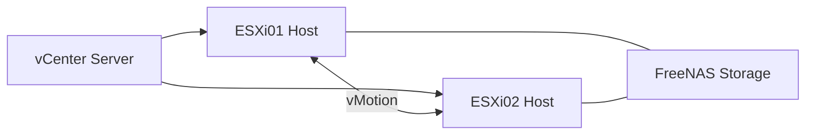
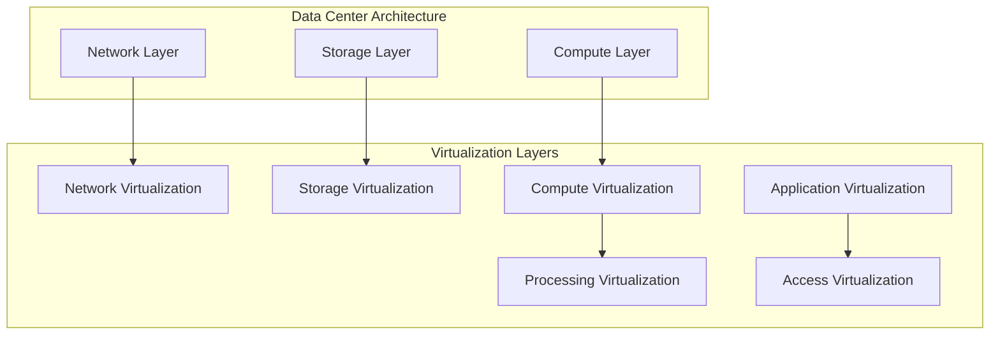
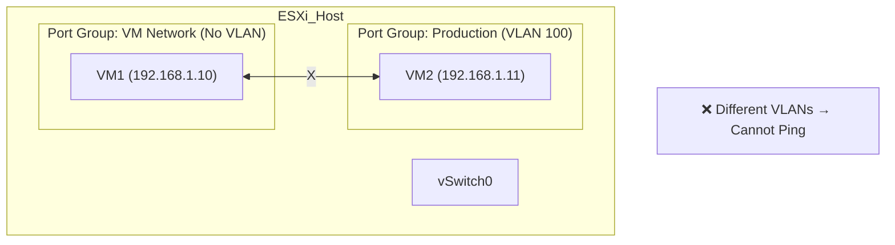

# 41891 and 42891 - Summary
# 1.  Introduction to Cloud Computing
## 1.1 Lecture

### What is Cloud Computing?

* A **cloud** is a pool of **virtualized computing resources**.
* It can host **various workloads** and dynamically provision **hardware, software, and data**.
* Accessed over the internet and typically offered as **paid services**.


### Key Concepts Covered

#### Cloud vs Traditional Computing

   * **Traditional computing**: Buy, install, and maintain hardware/software for peak use. High upfront cost.
   * **Cloud computing**: Pay-as-you-go model. Save 80–95% cost by paying only for resources used (QoS-based).

#### Cost Models
   * **Traditional IT**: Large capital expenses + growing operational expenses as users increase.
   * **Cloud**: Only operational costs; no capital investment.
   * **Ideal for**: Small and large businesses needing scalable, flexible solutions.

#### Cloud Service Models & Example

| Model    | Description                                                        | Example                 |
| -------- | ------------------------------------------------------------------ | ----------------------- |
| **IaaS** | Infrastructure-as-a-Service: provides VMs, storage, and networking | AWS EC2                 |
| **PaaS** | Platform-as-a-Service: offers development tools and environments   | AWS Elastic Beanstalk   |
| **SaaS** | Software-as-a-Service: delivers full apps via the web              | Google Docs, Office 365 |


#### Deployment Models

   * **Public Cloud**: Open to general public (e.g., AWS, GCP)
   * **Private Cloud**: Dedicated to a single organization (on/off-premise)
   * **Community Cloud**: Shared between known organizations with common policies
   * **Hybrid Cloud**: Combines two or more models


### IaaS Cloud Architecture Components

Main Component: Cloud Operating System (Cloud OS)
Manages virtual and physical resources. Divided into 3 layers:

1. Drivers Layer: Interfaces with physical hardware (network, storage)

2. Core Layer: Includes:
    * VM Manager: Handles VM lifecycle (deploy, migrate, suspend, etc.)
    * Network Manager: Manages private/public IPs and connectivity
    * Storage Manager: Offers scalable, reliable virtual storage
    * Federation Manager: Connects to external/public clouds
    * Image Manager: Manages VM images
    * Auth Manager: Access control (authentication & authorization)
    * Accounting & Auditing: Tracks usage data
    * Information Manager: Monitors VMs and infrastructure state

3. Tools Layer:
    * Admin Tools: Add/remove users
    * Service Manager: Web interface for users to request services
    * Scheduler:
        * Hypervisor Scheduler: Allocates system resources to VMs (at physical host level)
        * Cloud Scheduler: Determines physical host allocation
        * Federated Scheduler: Chooses remote deployment if local is full
        * Cloud Interfaces (APIs)


### Cloud OS vs Traditional OS

| Computer OS                | Cloud OS                                |
| -------------------------- | --------------------------------------- |
| Manages local resources    | Manages distributed virtual resources   |
| Single-machine abstraction | Multi-tenant, multi-machine abstraction |
| User interacts via GUI/CLI | User interacts via API/web interface    |


## 1.2 Labs (no lab)
---
# 2. Cloud virtualisation technologies
## 2.1 Lecture
### Cloud service models - Definitions
- **National Institute of Standards and Technology (NIST)**: On-demand network access to a shared pool of configurable computing, releasing/provisioning with mininal effort.
- **Thomas Erl**: Specialized distributed computing model enabling scalable and measurable resource provisioning.

### Roles and Terminology
- Cloud Service: IT resources with remote access.
- Cloud Provider: Offers cloud services.
- Cloud Consumer: Uses services under a formal agreement.
- Cloud Carrier: Provides network connectivity.
- Cloud Service Owner: Legally owns cloud service.
- Cloud Resources Administrator: Manage the resources/services.

### [Cloud Service Models](#cloud-service-models--example)
- IaaS: Consumer manages OS and applications on virtual servers.
- PaaS: Platform provided without exposing underlying infrastructure.
- SaaS: Full application access without resource management.

### Virtualization
- Purpose: Abstraction and efficient resource utilization.
- Types:
    - **Processor Virtualization**: Shares CPU among multiple vm/application.
    - **Memory Virtualization**: Combines physical memory into a shared pool and allocates it dynamically to virtual machines as needed.
    - **Storage Virtualization**: Provides a layer of abstraction for the physical storage of data
    - **Network Virtualization**: Creates virtual networks over shared hardware

#### Virtual Machines (VMs)
- Encapsulate virtual hardware and guest OS.
- Operate like physical machines with full isolation.

#### Hypervisors (Virtual Machine Monitors - VMMs)
- Functions: Manage VMs, allocate virtual hardware, support VM migration.
- Types:
    - **Type 1 (Bare-metal)**: Runs directly on hardware.
    - **Type 2 (Hosted)**: Runs on top of an OS.

### Typical Cloud Architecture
- Components:
    - Virtual Machines
    - Hypervisors
    - Physical Servers
    - Networks
    - Storage (SAN, NAS, DAS)

### Virtual Infrastructure Manager (VIM) – Hypervisor
- 
- Virtual servers are created by hypervisors on individual physical servers.
- Multiple hypervisors are jointly controlled by a VIM.
- The VIM handles centralized management of all hypervisors, enabling consistent control over virtual infrastructure.
- Could Live VM Migration:
    - Moving a running virtual machine from one physical server to another without downtime.
    - For Hardware maintenance, Load balancing, or Fault tolerance
- Managed by The Virtual Infrastructure Manager

### Storage Hardware
#### Direct Attached Storage (DAS)
- Storage system directly connected to a computing IT resource (physical server) using a host bus adapter (HBA)
#### Network-Attached Storage (NAS)
-  File-level storage shared over a network to multiple clients.
#### Storage Area Network (SAN)
- High-speed network providing block-level storage to multiple servers.
- Centralizes Storage, Supports Scalability, Improves Availability & Reliability, Enables Advanced Storage Features

### Storage Virtualization
- 
- Abstracts/Hide the complexity of physical storage devices and treating all storage media as a **single pool of storage**.
- 2 Main Storage Virtualization Technologies: 
    - **Block-Level Virtualization**
    - **File-level Virtualization**
- Three Methods:
    - Network-Based
        - Virtualization is handled in the network, between the server and storage (e.g., through an appliance).
        - Centralized and scalable.
    - Host-Based
        - Implemented on the server (host) using software.
        - Each server handles its own virtualization.
    - Array-Based
        - Virtualization is done within the storage array itself.
        - Vendor-specific but efficient for that hardware.

### Storage and Network Architecture

<details>
    <summary>Storage Architecture</summary>


- Top Layer: Hosts and VMs (Virtual Layer)
    - Each VM has associated virtual disk files (e.g., file1.vmdk) that act like their hard drives.
    - These disk files are stored inside datastores.
- Middle Layer: Datastores (Virtual Layer)
    - Bridge between Virtual and Physical
    - Logical containers used to store virtual disk files (.vmdk) and configuration files (.vmx) for VMs.
    - Can have different file system (ex: database1 used VMFS, while database2 used NFS)
- Bottom Layer: Physical Storage (Physical Layer)
    - Actual storage devices that hold the data.
    - Type of storage device:
        - DAS SCSI (Direct Attached Storage)
        - FC SAN (Fibre Channel Storage Area Network)
        - iSCSI (Internet SCSI)
        - NAS (Network Attached Storage)
</details>

<details>
    <summary>Network Architecture</summary>


- Top Layer: Virtual Machines (Virtual Layer)
    - Has its own virtual network interface card (vNIC).
    - Connects to a vSphere Standard Switch inside the same host.
    - vNIC roles: act as physical network interface cards and cables
- Middle Layer: vSphere Standard Switch (Virtual Layer)
    - This is the virtual switch — it works just like a physical switch but in software.
    - Located inside each host (Host1 and Host2).
    - Connects VMs to each other and to the physical network.
    - Contains Port Groups (A to E):
- Bottom Layer: Physical Network Adapters and Physical Network (Physical Layer)
    - Each host has physical NICs (network interface cards).
    - These connect the host to the external physical network (e.g., internet, other servers).
    - The vSphere Standard Switch uses these physical NICs to bridge virtual traffic to the real world.
</details>

## 2.2 Labs
<details>
    <summary>Main purpose of Lab</summary>
    ```
    PC
    └── VMware Fusion/WorkStation (Type 2 hypervisor)
        └── ESXi (hypervisor, a VM acting like a physical server)
            └── TinyCore, Ubuntu, etc. (nested VMs)
    ```
* You simulate a physical ESXi server using VMware Fusion on your Mac.
* Learn to manage a real hypervisor, not just create VMs.
* Practice remote management via browser, as done in real IT environments.
* Understand how cloud platforms (AWS, Azure) work, since they use hypervisors like ESXi, KVM, or Xen.

 </details>

<details>
    <summary>VMware ESXi, Build VMs</summary>
    <details>
        <summary>Step 1 - Verify Access and setup</summary>
        
        1. Folder [ESXi01 and ESXi02](https://drive.google.com/drive/folders/1ljiPLqRPCpnKLaoPqsuESWfIPXV6mkxr) contain ESXi01.vmx and ESXi02.vmx respectively.
        2. Open VMware and select "Open a Virtual Machine"
        3. Select ESXi01.vmx then create, repeat for ESXi02.vmx
        4. Power on both VMs
    </details>

    <details>
        <summary>Step 2 - Verify VMs and Config networking</summary>
        1. Login to each ESXi VM, Press F2 to access the console, Login with: Username: root and Password: VMware1!
        2. Press F2, Check and configure management network
            - 
            - IP Configue, Select the ipv4 option
            - Set static IP addresses:
            - ESXi01: 172.20.20.51, Gateway: 172.20.20.2
            - ESXi02: 172.20.20.52, Gateway: 172.20.20.1
        3. Set the network adapter
            - Right-click the VM > Settings
            - Go to Network Adapter
            - Set to: `Custom: vmnet6` (for internal lab network)

    <details>
    <summary>Touble-shooting: If web browser is not showing</summary>
    
    - Select f2 in vm then select the 'Reset System Configuration' option to reset then f11
    - Then Login:`root`, then `enter` no password
    - Lastly, configure the IPv4 of each
    </details>

    </details>

    <details>
        <summary>Step 3 (Skip) - Create a new ESXi host (as a VM)</summary>
        - Why did skipping Task 3 not cause problems?
        - Purpose: It's there to give you experience installing a fresh ESXi host from scratch, like adding a new server in a data center.
        - ESXi03 is not used in later steps. Task 4 and 5 only require ESXi01 and ESXi02
    </details>

    <details>
        <summary>Step 4 - Manage ESXi Hosts via Web Interface</summary>
        - 
        - Open a web browser (preferably Firefox).
        - In the address bar, enter the IP address of your ESXi host:
            - For ESXi01: http://172.20.20.51/
            - For ESXi02: http://172.20.20.52/
        - Click “Accept the risk and continue” (bypass SSL warning).
        - Login with: Username: root, Password: VMware1!
        ---
        - 
        - Assign a license key: (need key to start vm when create)
            - Navigate to Manage > Licensing > Assign License
            - Use key: JH09A-2YL84-M7EC8-FL0K2-3N2J2
    </details>

    <details>
        <summary>Step 5 - Create New Virtual Machines</summary>
        1. Login to ESXi01 via browser (https://172.20.20.51).
        2. Go to Virtual Machines > Create/Register VM.
        3. Set:
            - Name: YourName-vm1
            - Guest OS: Linux → Ubuntu (64-bit)
            - Memory: 384 MB
            - Disk: 1 GB (thin provisioned)
        4. Power on the VM.
        5. Open the browser console to view the VM.
        6. You’ll likely see an error (because no OS is mounted).
        7. Power off the VM.
        8. Edit Settings:
            - Attach the TinyCore-current.iso from the local datastore (ISO folder).
            - Check the “Connect” box for the CD/DVD drive and Save.
        9. Power on the VM again — it should boot from the ISO and launch TinyCore Linux.
        10. Repeat steps 1–9 for ESXi02:
            - Name the second VM YourName-vm2.
    </details>

    <details>
        <summary>Step 6 - Tidy Up</summary>
        - Shut down any running VMs (on Web)
        - Shut down the ESXi01 and ESXi02 hosts (on VMware (Red button))
    </details>
</details>

---
# 3. Cloud Architecture and Management Mechanisms
## 3.1 Lecture
### Infrastructure of Cloud Service Provider
#### 1. Broadband Networks & Internet Architecture
- Broadband Networks & Internet Architecture: 
    - Internet Service Providers (ISP): Use the ISPs backbone as Cloud Service Provider base
    - Connectionless Packet Switching (Datagram Networks): Divided data into packages (limited size)
    - Router-Based Interconnectivity: Direct packages to correct address
#### 2. Data Center Technology
- Facilities: (racks, power, cooling, etc)
- Computing Hardware: (Server, blade servers, etc)
- Storage Hardware: (Hard Disk Arrays, SAN, NAS)
- Network Hardware: (load balancers and accelerator, LAN Fabric, etc)
#### 3. Virtualization Technology
- Server: Physical Server -> Virtual Server
- Storage: Physical Storage -> Virtual Storage
- Network: Physical Router and Switch -> VLANS
- Power: Physical (Uninterruptible Power Supply) UPS -> Virtual UPS
#### 4. Web & Service Technology
- **Web Technology**: Web technologies for implementation and management
- **Service Technology**: Service technologies (SOAP, REST, WSDL) form the foundation of cloud computing.

### Cloud Infrastructure Mechanisms
- **Logical Network Perimeter**: Network isolation for security.
- **Virtual Server**: Software-based emulation of a physical server.
- **Cloud Storage Device**: Storage designed for cloud provisioning.
- **Cloud Usage Monitor**: Software that collects usage data.
- **Resource Replication**: Creation of multiple identical resource instances.
- **Ready-made Environment**: Preconfigured development or runtime environments.

### Cloud Management Mechanisms
- **Remote Administration System**: Central control panel that lets you manage your cloud resources remotely.
- **Resource Management System**: Tools for internal and external resource administration, ensuring your computing power, storage, and network are used efficiently.
- **Service Level Agreement (SLA) Management System**: Monitors uptime/downtime (eg. avaliability and reliability) against service agreements.
- **Billing Management System**: Tracks usage, calculates fees, and issues invoices.

### Cloud Security Mechanisms
- Encryption
- Hashing
- Digital Signatures
- Public Key Infrastructure (PKI)
- Identity and Access Management (IAM)
- Single Sign-On (SSO)
- Cloud-Based Security Groups
- Hardened Virtual Server Images

### Fundamental Cloud Architectures
- **Workload Distribution Architecture**: Balancing load across redundant instances.
- **Resource Pooling Architecture**: Shared resources for multiple consumers.
- **Dynamic Scalability Architecture**: Automatic horizontal scaling of resources.
- **Service Load Balancing Architecture**: Distributes service requests among instances.

### Hosts, Clusters and Resource Pools
- Hosts, Clusters, Resource Pools: Grouping and managing computing resources.
### VCenter Management Server Architecture
- VCenter Management Server: Centralized management with access control, core and distributed services, plug-ins, interfaces.
### VMotion
- Migrates running VMs between physical hosts without downtime by transferring state data and resuming execution.
## 3.2 Labs

<details>
    <summary>Main purpose of Lab</summary>



- The purpose of this lab is to configure ESXi hosts to connect to an existing iSCSI storage appliance and create a shared VMFS datastore for use by multiple hosts

</details>

<details>
    <summary>iSCSI (VMFS) on ESXi</summary>
    
    <details>
    <summary>Step 1 - Prepare/Setup the environment</summary>
    - Open VMware Workstation, Open a virtual machine
    - Lab .vmx files: ESXi 1, ESXi 2, FreeNAS iSCSI
    - Configure the setting of each:
        - Network Adapter: `custom vmnet6`
    - Start VMs
    </details>

    <details>
    <summary>Step 2 - Setup FreeNAS iSCSI</summary>
    - Enter `1` for `Configue Network Interface`
    - Purpose: Configue IPv4:
        - Select an interface: `1` which is `em0`
        - Delete interface: `n`
        - Remove the current setting of this interface: `n`
        - Configure interface for DHCP: `n`
        - Configure IPv4: `y`
            - Interface name [em0]: `em0`
            - IPv4 Address: `172.20.20.50`
            - IPv4 Netmask: `24`
        - Configure IPv6: `n`
    </details>

    <details>
    <summary>Step 3 - Set up ESXi 1 & 2</summary>
    - Login with: Username: root, Password: VMware1!
    - IP Configue, Select the ipv4 option
    - ESXi01: 172.20.20.51, Gateway: 172.20.20.2
    - ESXi02: 172.20.20.52, Gateway: 172.20.20.2
    ---
    - For ESXi01: http://172.20.20.51/
    - For ESXi02: http://172.20.20.52/
    - Click “Accept the risk and continue” (bypass SSL warning).
    - Login with: Username: root, Password: VMware1!

    <details>
    <summary>Touble-shooting: If web browser is not showing</summary>
    
    - Select f2 in vm then select the 'Reset System Configuration' option to reset then f11
    - Then Login:`root`, then `enter` no password
    - Lastly, configure the IPv4 of each
    </details>
    </details>

    <details>
    <summary>Step 4 - Setup EXSi 1 & 2 to connect with FreeNAS and Create datastore</summary>
    - 
    - 
    - On web (for both), Click in Storage -> Adapter -> Software iSCSI -> vmhba64
    - Configure: `Enable`, `add static` and `add dynamic target` targeting to the FreeNAS
        - Click to add address: 172.20.20.50
    ---
    - Create datastore:
        - VMFS
        - Set Name & Link to FreeNAS ISCSI Disk for both
        ---
        - Fail to create datastore:
            - Remove the default VM(s) and delete the default datastore (desy-vmfs1)
            - Now it should work
    - Both should be able to see the new create storage(s) as both are connected to same FreeNas

    </details>

    <details>
    <summary>Step 5 - Assign License & Create VM</summary>
    - Add [Free license key](https://gist.github.com/Nyquist-CABJ/da70399eee8bdce0043858614ab22885)
    - Create VM (Same as Lab 2):
        - Only select your datastore as the storage
        - Edit Settings:
        - Attach the TinyCore-current.iso from the local datastore (ISO folder).
        - Check the “Connect” box for the CD/DVD drive and Save.
    ---
    - Boot the VM (Everything working, close all running vms)
    </details>
</details>


---
# 4. : Cloud Virtualisation and NaaS
## 4.1 Lecture

### Building an IaaS Environment

* Core resources: virtual servers, cloud storage, and virtual networks.
* Standardized configurations include hardware, OS, processors, memory, and virtualization layers.
* All cloud services rely on interconnected networks, primarily through the Internet’s backbone ISPs.

### Internet Architecture

* **Tier-1 ISPs**: Global backbones interconnecting multinational networks.
* **Tier-2 ISPs**: Regional/national providers.
* **Tier-3 ISPs**: Local/organizational access networks.
* Together, they form the “network of networks,” interconnected by routers and backbones that enable remote provisioning of cloud resources.

### Network Virtualization

* Enables multiple isolated virtual networks to share the same physical substrate.
* Each virtual network consists of virtual nodes and links, independent from hardware.
* VMware concepts:

  * **vNIC** emulates physical NICs in software.
  * **vSwitch** forwards frames between virtual and physical interfaces, with optional bandwidth/security controls.
  * **Virtual ports, Uplink ports, Uplinks** bridge virtual and physical networks.
    * Virtual ports: Logical connection points on a vSwitch for VMs and other virtual/physical devices.
    * Uplink ports: vSwitch ports bound to physical adapters, bridging the virtual network to the physical network.
    * Uplinks:

* Diagram VMware data-plane placement:
    * vNIC/vPort/vSwitch/pNIC map how VM traffic reaches the physical network


### Data Center Network Design & Overlay Network

* Traditional racks connect servers to **Top-of-Rack (ToR) switches**.
#### Challenges with virtualization:
* **Isolation**: preventing cross-VM security risks.
* By default, VMs can talk to each other; you must segment workloads (e.g., finance vs. engineering) and protect sensitive domains.
* **Connectivity**: ensuring communication across data centers using routable IPs.
* Within one DC, L2/MAC identification works; across DCs you need L3/IP that is globally routable—introducing addressing, routing, and multi-site constraints

#### Solution: Network virtualization with tunneling protocols.
* 
* **Overlay network protocols** - Packet encapsulation methods: **VXLAN**, **NVGRE**, **GRE**.
    * VXLAN creates scalable virtual networks over physical infrastructure.
    * Overlay networks provide logical network topologies decoupled from physical networks.
* Virtual overlays encapsulate tenant Layer 2 frames inside routable Layer 3 packets (e.g., VXLAN, NVGRE, GRE), providing isolation and scalable multi-tenant connectivity over existing IP fabrics.


* Brief: The tenant L2 frame is wrapped (encapsulated) in an L3 packet, routed across the underlay, then unwrapped at the destination host—preserving L2 semantics without stretching the physical L2 domain.

* Overlay Solve:
    * Isolation: Each tenant gets its own virtual network (VNI/VSID), co-existing yet isolated on shared hardware. 
    * Connectivity: Overlays ride on routable L3 underlays, enabling cross-rack and cross-DC reachability without extending L2 domains.

### Business Model and NaaS

* Roles:

  * **Infrastructure Providers (InP)** manage physical resources.
  * **Service Providers (SP)** create virtual networks.
  * **Users (U)** consume services.
  * **Brokers (B)** mediate between InP, SP, and users.
* **NaaS** delivers networking capabilities on demand, extending the cloud service model.
    * Focus On: Network Virtualization, Optimize the network and computing resources
    * laaS, PaaS, and SaaS rely on NaaS


## 4.2 Labs

<details>
<summary>Main purpose of Lab</summary>



- Introdue vCenter, vCenter manages both hosts.
- Both hosts connect to shared storage.
- Perform vMotion, vMotion allows VMs to move between hosts.
</details>

<details>
    <summary>vCenter Server and VM migration</summary>

<details>
        <summary>Step 1 - Set up 4 vm: ESXi 1, ESXi 2, VCSA7.0, FreeNAS iSCSI</summary>

- Copy all files in Cloud_Computing/Master to your student_id folder
- Initial set up like in Lab 3, `IPv4`, `Subnet`, `Network Config`
    - All configure network need to be vmnet6
- VCSA7.0 is set IPv4: `172.20.20.94` and correct subnet by default

</details>

<details>
    <summary>Step 2 - Start the VCSA7</summary>

- Go to the web (Managment Portal) -> https://vcsa.vsphere.local:5480
    - 
    - Login with user `root` password: `VMware1!`
    - Go to the `Services` section: Tick the `VMware vCenter Server` then start if it haven't start

- Login to the vcsa machine Administration portal: `https:// vcsa.vsphere.local:443` or `https://172.20.20.94`
    - Click on the given option: LAUNCH VSPHERE CLIENT (HTML5)
        - 
    - Login with the credentials: Username: `administrator@vsphere.local` Password: `VMware1!`
        - 
</details>

<details>
    <summary>Step 3 - Login to the webpage of ESXi 1 and 2</summary>
    - Remove the first dynamic and static and add the FreeNAS ipv4 to both
    - Create your datastore from FreeNAS storage. 
        - Only 1 would be fine, both ESXi will be able to see both as both are connect to the FreeNAS 
    - Create VM in each ESXi 1 & 2. 
        - Let one vm store in local storage (default datastore1) of ESXi 
        - And the other one store in your FreeNAS datastore
</details>

<details>
    <summary>Step 4 - Verify Licensing for vCenter and hosts</summary>

    - The required licenses have been installed in the provided files. No further action is required for this
task.
    - Remove the exist host if have
    - Add VM host to the vsphere: right click in Datacenter-my `add Host` (In the image is it name as SA-Datacenter)
        - 
    - Enter your VMs IPv4 to the box, repeat for both
        - So vCenter manages both hosts
        - 
        - User name: `root`, Password: `VMware1!`
        - Next -> License 3 -> Disabled -> Next -> Finish
</details>

<details>
    <summary>Step 5 - Vmotion</summary>

    - In vsphere: right click in the VM (VM that is store in ESXi local storage) that you want to migrate
        1. But first (right left in VM) Edit Setting, change the CD/DVD drive 1 from `Datastore ISO File` to `Client Device`
        2. Right click, Migrate
            - 
            - Change storage only -> select the storage that is share in the FreeNas -> finish
            - Change compute resource only -> next -> next -> finish
    - Now VM in ex: `172.20.20.51` (the VM you choose to store in local ESXi) will then be migrate to `172.20.20.52` ESXi
</details>

</details>


---
# 5. Data centre Fundamentals: Virtualisation for Data Centres
## 5.1 Lecture
### Data Center
<details>
    <summary>Data Center</summary>

- A data center is a facility that houses critical computing resources under controlled environments and central management. 
- These resources include servers, applications, storage systems, operating systems, and networking equipment
</details>

<details>
    <summary>Goals</summary>

- **Business Continuity**: Keep operations running without major interruptions.
- **Security**: Protect data and systems from threats.
- **Consolidation**: Merge servers, storage, and applications to reduce cost and complexity.
- **Scalability and Performance**: Ensure growth and efficiency.
- **Manageability**: Simplify administration and monitoring.
</details>

<details>
    <summary>Facilities</summary>

- To ensure performance, data centers need:
    - Sufficient power and cooling systems
    - Proper cabling, temperature, and humidity control
    - Fire and smoke detection systems
    - Physical security (restricted access, surveillance)
    - Rack space, raised floors, modularity, and flexibility
</details>

### Data Center Architecture


<details>
    <summary>Data Center Architecture (3 Layers)</summary>

- **Three-Layer Model**: Separates resources into compute, storage, and network layers.

1. Network Layer
    - Connects data center to the internet.
    - Provides security & reliable access.
    - Uses LAN switches to connect users to resources.
2. Compute Layer
    - Provides processing resources (servers).
    - Runs user applications.
    - Servers interconnected with switches.
3. Storage Layer
    - Stores application data.
    - Uses disk drives, storage switches, and transport platforms.
    - Supports replication between data centers.
---
- **Dedicated Resources**: Each layer can have its own dedicated equipment.
- **Consolidation & Virtualisation**: Resources at each layer (compute, storage, network) can be pooled and shared instead of kept separate
</details>


### Virtualising a Data Center

<details>
    <summary>Virtualization: Why It Matters</summary>

- Virtualisation allows multiple workloads to run on a single host and makes it easy to clone machines for testing, development, or disaster recovery.
---
- **Efficiency**: Better hardware utilization.
- **Cost reduction**: Fewer servers needed.
- **Downtime reduction**: Faster recovery with snapshots.
- **Deployment speed**: Minutes instead of hours/days.
- **Testing environments**: Easy to clone and roll back.
- **Disaster recovery**: Snapshots allow fast failover.
- **Cloud enablement**: Without virtualization, there’s no cloud.
</details>

<details>
    <summary>Benefits of Virtualization</summary>

- Reduced hardware & electricity costs.
- Faster redeployment of systems.
- Easier maintenance.
- Better disaster recovery.
- Vendor independence (no lock-in).
- Less heat buildup.
- Smooth migration to the cloud.
</details>

<details>
    <summary>Types of Virtualisation - Kusnetzky Group Model of Virtualisation</summary>

<details>
    <summary>Network Virtualisation</summary>

- **Definition**: Combines multiple physical network resources (switches, routers, links) into one logical unit, or splits a physical network into multiple isolated logical networks.
- **How it works**: It abstracts networking functions so administrators can manage networks as software-defined entities rather than hardware.
- **Technologies & Standards**:
    - VLANs (802.1q) – divide a physical LAN into multiple logical segments.
    - VXLAN (Virtual Extensible LAN) – allows creation of logical networks across large-scale data centers.
    - NVGRE (Network Virtualization using GRE) – encapsulates traffic to create isolated virtual networks.
</details>

<details>
    <summary>Storage Virtualisation</summary>
    
- **Definition**: Abstracts physical storage devices into logical pools that can be managed centrally and allocated flexibly.
- **Levels**:
    - Block-level virtualisation – abstracts disk blocks below the file system; often used in SANs (Storage Area Networks).
    - File-level virtualisation – abstracts files/directories above the block level, typically over NFS or SMB.
- **How it works**: The virtualisation layer maps logical storage (what users see) to actual physical storage (disks).
</details>

<details>
    <summary>Processing Virtualisation</summary>
    
- **Definition**: Abstracts physical CPU and memory resources so that multiple virtual machines (VMs) can run on a single physical server, or multiple physical servers can be combined to act as one.
- **How it works**: A hypervisor (e.g., VMware ESXi, Xen, KVM) sits between hardware and OS, slicing compute resources for VMs.
- **Capabilities**:
    - Partitioning: one server split into many VMs.
    - Aggregation: combine servers into a grid/cluster.
</details>

<details>
    <summary>Application Virtualisation</summary>

- **Definition**: Separates applications from the underlying OS, allowing them to run on different environments without modification.
- **How it works**: Uses an abstraction layer or framework so the application doesn’t directly depend on the OS.
- **Technologies**:
    - Java Virtual Machine (JVM) – Java programs run anywhere with a JVM installed.
    - Microsoft App-V – packages applications so they run in isolated environments.
- **Advanced features**:
    - Automatic recovery (restart app if it fails).
    - Load balancing (distribute traffic across multiple app instances).
    - Scalability (spin up new app instances when demand increases).
</details>

<details>
    <summary>Access Virtualisation</summary>

- **Definition**: Provides users with access to applications and data from any device, without requiring direct compatibility between the device and the application.
- **How it works**: Uses protocols or special software to translate between app and device.
- **Technologies**:
    - Microsoft Remote Desktop Protocol (RDP).
    - Citrix ICA.
    - Virtual Desktop Infrastructure (VDI).
</details>

</details>

<details>
    <summary>Key Considerations in Virtualizing Data Centers</summary>

- Adequate electrical power & cooling.
- Proper security facilities.
- Disaster recovery planning (multiple sites).
- Staff skills and new support tools.
- Some workloads (e.g., high I/O apps, hardware-dependent tasks) may not be virtualized.
</details>

## 5.2 Labs

<details>
    <summary>Main purpose of Lab</summary>



- Understand vSphere networking basics: Learn what vSwitches, Port Groups, and VLAN IDs are.
- Deploy and manage VMs: Deploy from an OVF/OVA template.
- Explore VLAN segmentation: See how Port Groups with VLAN IDs isolate traffic. Test communication between VMs in same/different VLANs.
- Practice vMotion: Move VMs between ESXi hosts and discover network prerequisites for migration.
- Restore connectivity: Fix networking by placing VMs into correct Port Groups or VLANs.

 </details>

 <details>
    <summary>vSwitches and Port groups</summary>
    
 <details>
    <summary>Step 1 - Set up</summary>
    
- Power on: ‘ESXi01’, ‘ESXi02’, ‘VCSA’ and ‘iSCSI’ and ‘OpenWRT’. Configure network to vmnet6. Configure the IPv4 of each VMs ([See Lab 4](#42-labs))
- Set up the web configuration:
    - https://172.20.20.51/ - [Add License 7](https://gist.github.com/CHSuworatrai/dcc0c625183202b2065aeab623356d50)
    - https://172.20.20.52/ - [Add License 7](https://gist.github.com/CHSuworatrai/dcc0c625183202b2065aeab623356d50)
    - https://vcsa.vsphere.local:5480 - Setup can be see in [Lab4](#42-labs),  ensure the `VMware vCenter Server` is Started in `Services`
    - https://172.20.20.94/ - user: `administrator@vsphere.local` password: `VMware1!`

 </details>

  <details>
    <summary>Step 2 - Create VM using OVF file</summary>

- Configure the `Adapter/Software iSCSI` of ESXi 1 and 2 to make it connect to FreeNAS 
- In both ESXi: Create 1-2 VMs with option deploy with ovf using `TinyCore_Script.ovf` and `TinyCore_Script.vmdk`
    - Select `Deploy a virtual machine from an OVF or OVA file`
    - Select the storage as `Datastore1`
    - Keep default setting

 </details>

<details>
    <summary>Step 3 - Add host to vsphere datacenter -> 172.20.20.94</summary>
    
- See lab 4, Migrate all VMs storage in both EXSi-> change the `storage only` -> desy-vmfs1
 </details>

<details>
    <summary>Step 4 - Change your VMs network connectivity</summary>


1. On the VCSA web browser, select any ESXi host.
2. Go to Configure tab -> Networking -> Virtual switches.
3. On this page click Add Networking, select 'Virtual Machine Port Group for Standard' Switch option and click Next.
4. Select the existing standard switch vSwitch0.
5. Name the network label as ‘Production’ and assign a VLAN ID as 100 to the portgroup.

 </details>

 <details>
    <summary>Step 5 - vMotion</summary>
- 
- Motion your VMs to your other host. Just Drag and Drop:
    - Change both xompute resource and storage
    - Select the other sub-datacenter that is different from the one that it is in
    - keep desy-vmfs1
    ---
    - Select networks: this one you can change the Destination Network to 'Production' but note that you need to change for rest of VMs if you want all vm in that VLAN to be able to ping each other
    - But keep default as dev is fine, all vm will be able to ping each other anyway
    - If it is in a different VLAN then it can't ping each other
    ---
    - Test by ensuring all VMs are started -> to go terminal -> ping command
 </details>

 </details>

    

---
# 6. Management of Data Centre
## 6.1 Lecture
### Data Center - Background and Designs Standard

<details>
    <summary>Background Benefit</summary>

- Benefits of data centers: cost and energy savings, reduced downtime, better productivity, improved security, and compliance
</details>

<details>
    <summary>Design Standards</summary>

- 4 Standards:
<details>
    <summary>Uptime Institute’s Tier Standard (performance-based)</summary>

- Tier I: Basic capacity, single path, planned downtime required.
- Tier II: Adds redundancy (N+1), still downtime for power path.
- Tier III: Concurrently maintainable, no shutdown for planned maintenance.
- Tier IV: Fault tolerant, survives worst unplanned events
</details>

<details>
    <summary>TIA-942 Standard</summary>

- IT cable and network-oriented, construction costs vary by tier
- Similar four-tier model with defined downtime hours:
    - Tier I: ~28.8 hrs/year
    - Tier II: ~22 hrs/year
    - Tier III: ~1.6 hrs/year
    - Tier IV: ~0.4 hrs/year
</details>

<details>
    <summary>Other standards: Energy Star (USA), Data Center Star Audit (Germany)</summary>

- Details not define
</details>

</details>

### Key management areas, Management challenges, Hardening steps management

<details>
    <summary>Key Management Areas</summary>

1. Capacity Management – optimize rack space, network, power, cooling with DCIM and CFD tools.
2. Service Delivery – ensure multi-tenancy, scale, high availability, disaster recovery.
3. Resource Management – optimize electricity bills, use green energy, temperature-aware strategies.
    - Metrics: Power Usage Effectiveness (PUE) and DCiE (reciprocal of PUE).
4. Asset Management – track hardware/software assets, warranties, contracts, automate reporting
</details>

<details>
    <summary>Management Challenges</summary>

- Maintaining uptime.
- Improving utilization of space, power, and connectivity.
- Reducing operating expenses.
- Managing energy usage and costs.
- Improving staff productivity via automation
</details>

<details>
    <summary>Hardening Steps</summary>

- Environmental control: temperature, humidity, fire, flood.
- Physical security: location, surveillance, access control.
- Disaster recovery: plans, offsite backups.
- Remote management: logical security requirements.
- Other measures: staff training, operational procedures
</details>

## 6.2 Labs

<details>
    <summary>Main purpose of Lab</summary>

- Demonstrate Resource Pools:
    - VMs in same host, but different Resource Pools, can lead to different speed of performance
 </details>

 <details>
    <summary>Resources</summary>

<details>
    <summary>Step 1 - Set up</summary>

- Set everything up (like Lab 5)
- For openwrt vm-> network adapter 1 to vmnet 6 and network adapter 2 change it to NAT
- Create 2 VMs in each host with ovf and vmdk file (`Must use ovf and vmdk`)
</details>

<details>
    <summary>Step 2 - Creates Resources Pool</summary>

- Login to the vcsa machine Administration portal: `https:// vcsa.vsphere.local:443` or `https://172.20.20.94`
- Username: `administrator@vsphere.local` Password: `VMware1!`
- Add VM host to the vsphere: right click in Datacenter-my add Host
- Creates 2 Resources Pool (Select 1 of the host):
    - 
    - Create a new Resource Pool called "Fast" and assign it High share values. (Right click on the host IP -> New Resource Pool)
    - Create a new Resource Pool called "Slow", and assign it Low share values, and a 500Mhz Limit.
- Add one VM to the High Pool, and one VM to the Low Pool (make sure both VMs are on same host) (Simply drag and drop the VMs on the respective Resource Pool)
</details>

<details>
    <summary>Step 3 - Create CPU Workload on the VMs</summary>

- VMs in both resources pool must be on, observe changes to the VM performance:
    - Open Terminal window in the virtual machine and run the cpubusy.sh script. On the '$' prompt type the command: '`./cpubusy.sh`'.
    - You will notice that VMs in the same host will have a difference speed behavior.
</details>

 </details>

---
# 7. Quiz 1
## 7.1 Lecture
## 7.2 Labs

<details>
    <summary>Main purpose of Lab</summary>

 </details>

 <details>
    <summary>Resources, HA and DRS</summary>
    
 </details>

---
# 8. Security and Compliance in the Cloud
## 8.1 Lecture
## 8.2 Labs

<details>
    <summary>Main purpose of Lab</summary>

 </details>

 <details>
    <summary>ESXi Install and Host Profile</summary>
    
 </details>

---
# 9. No Lecture
## 9.1 Lecture
## 9.2 Labs

---
# 10. Public/Private Cloud Comparison and Review and Discussion
## 10.1 Lecture
## 10.2 Labs

---
# 11. Quiz 2
## 11.1 Lecture
## 11.2 Labs
---
# 12. No Lecturer
## 12.1 Lecture
## 12.2 Labs