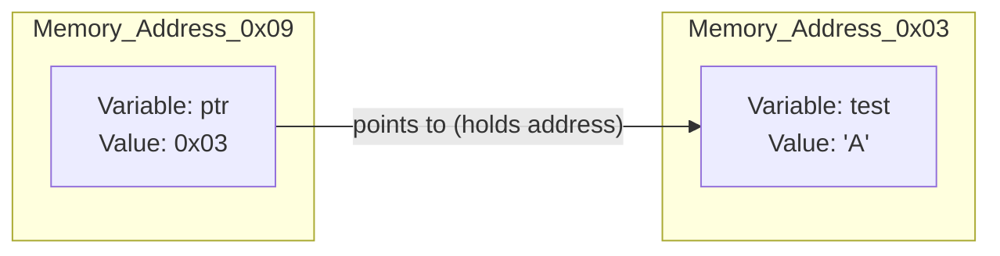
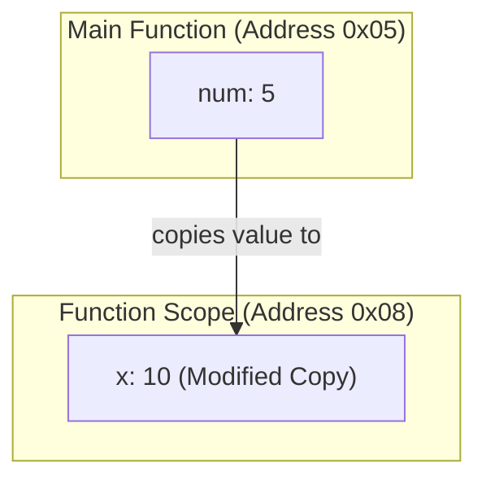
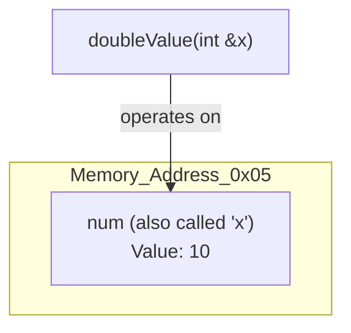
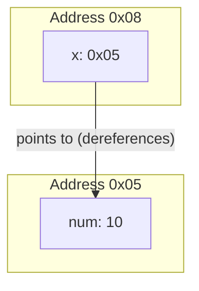

# 31251 - Summary
# 1. Intro to C++
## 1.1 Lecture

### Introduction to C++ I/O

The course utilizes the C++ standard library (`std`) for interacting with the console.

* **Output (`std::cout`)**: Stands for "character output" and uses the **insertion operator** (`<<`) to flow data from the program to the console.
* **Input (`std::cin`)**: Stands for "character input" and uses the **extraction operator** (`>>`) to flow data from the console into a variable.
* **Type Sensitivity**: The behavior of `std::cin` is dependent on the data type of the variable receiving the input , such as `int` , `float` , or `std::string`.

### Memory Management: Variables, References, and Pointers

Understanding how C++ handles data in RAM is fundamental to Data Structures and Algorithms.

#### Variables
* Variables act like a **box** stored in memory.
* Each variable box has a unique **hexadecimal address**.
* **Declaration**: A free memory box is selected and assigned a name.
* **Initialization**: Assigning a name and putting a specific value into the box.

#### References
* A reference acts as an **alias** or "nickname" for an existing variable.
* It is declared using the `&` symbol, such as `char &ref = test;`.
* Modifying a reference directly changes the value of the original variable because they share the same memory address.

#### Pointers
* A pointer is a variable that stores the **memory address** of another variable.
* **Address Operator (`&`)**: Used to retrieve the memory address of a variable.
* **Pointer Declaration (`*`)**: Tells the compiler the variable is a pointer, such as `char *ptr;`.
* **Dereferencing (`*`)**: Using the `*` symbol to access or change the value stored at the memory address the pointer is pointing to.




### Passing Variables to Functions

There are three distinct methods for passing arguments to functions in C++:

| Method | Description | Effect on Original Variable |
| --- | --- | --- |
| **Pass by Value** | A **copy** of the value is created and passed to the function. | <br />**None**; changes within the function do not affect the original. |
| **Pass by Reference** | The function receives a **reference** to the original variable. | <br />**Direct**; changes to the parameter affect the original value. |
| **Pass by Pointer** | The function receives the **memory address** (pointer) of the variable. | <br />**Direct**; changes via dereferencing affect the original value. |

<details>
    <summary>Pass by Value</summary>

The function creates a completely new "box" in memory and copies the value into it. Changes to the parameter x do not affect the original num. 
```cpp
void doubleValue(int x) {
    x = x * 2; // Changes ONLY the copy
}

int main() {
    int num = 5;
    doubleValue(num);
    // num is still 5
}
```



</details>

<details>
    <summary>Pass by Reference</summary>

The function receives an alias (nickname) for the original variable. No copy is made, so modifying x directly modifies num.
```cpp
void doubleValue(int &x) {
    x = x * 2; // Changes the original num
}

int main() {
    int num = 5;
    doubleValue(num);
    // num is now 10
}
```

</details>

<details>
    <summary>Pass by Pointer</summary>

The function receives the memory address of the original variable. Using the dereference operator (*), it can directly access and modify the value in the original variable's memory location.
```cpp
void doubleValue(int *x) {
    *x = (*x) * 2; // Reaches into the address to change value
}

int main() {
    int num = 5;
    doubleValue(&num); // Pass the address of num
    // num is now 10
}
```

</details>

## 1.2 Tasks

* **Released:** Ex 1 (18 Feb, 9am)

---

# 2. Sequence Containers

## 2.1 Lecture

### Vectors, Deques, and Arrays

## 2.2 Tasks

* **Released:** Ex 2 (25 Feb, 9am)

---

# 3. Templates and Iterators

## 3.1 Lecture

### Generic Programming and Pointer Abstractions

## 3.2 Tasks

* **Released:** Ex 3 (4 Mar, 9am)
* **Due:** Ex 1 (1 Mar, 23:59)

---

# 4. Linked Lists

## 4.1 Lecture

### Singly, Doubly, and Circularly Linked Lists

## 4.2 Tasks

* **Released:** Ex 4 (11 Mar, 9am)
* **Due:** Ex 2 (8 Mar, 23:59)

---

# 5. Hash Tables, Stacks, Queues

## 5.1 Lecture

### Linear Data Structures and Hashing Collisions

## 5.2 Tasks

* **Released:** Ex 5 (18 Mar, 9am) & Assignment 1 (16 Mar, 9am)
* **Due:** Ex 3 (15 Mar, 23:59)

---

# 6. Big Oh, Analysis of Algorithms

## 6.1 Lecture

### Time and Space Complexity Analysis

## 6.2 Tasks

* **Released:** Ex 6 (25 Mar, 9am)
* **Due:** Ex 4 (22 Mar, 23:59)

---

# 7. Sorting, Divide and Conquer

## 7.1 Lecture

### Merge Sort, Quick Sort, and Recursion

## 7.2 Tasks

* **Released:** Ex 7 (1 Apr, 9am)
* **Due:** Ex 5 (29 Mar, 23:59)

---

# 8. STUVAC (Study Vacation)

## 8.1 Revision

### Review Weeks 1-7

## 8.2 Tasks

* **Due:** Ex 6 (12 Apr, 23:59)

---

# 9. Priority Queues and BSTs

## 9.1 Lecture

### Binary Search Trees and Heaps

## 9.2 Tasks

* **Released:** Ex 8 (15 Apr, 9am)
* **Due:** Ex 6 (12 Apr, 23:59) & Assignment 1 (12 Apr, 23:59)

---

# 10. Graphs

## 10.1 Lecture

### Adjacency Matrices and Lists

## 10.2 Tasks

* **Released:** Ex 9 (22 Apr, 9am)
* **Due:** Ex 7 (19 Apr, 23:59)

---

# 11. Shortest Paths

## 11.1 Lecture

### Dijkstra's and Bellman-Ford Algorithms

## 11.2 Tasks

* **Released:** Ex 10 (29 Apr, 9am) & Assignment 2 (27 Apr, 9am)
* **Due:** Ex 8 (26 Apr, 23:59)

---

# 12. Topological Sort

## 12.1 Lecture

### Directed Acyclic Graphs (DAGs) and Ordering

## 12.2 Tasks

* **Due:** Ex 9 (3 May, 23:59)

---

# 13. Dynamic Programming

## 13.1 Lecture

### Memoization and Bottom-up Optimization

## 13.2 Tasks

* **Due:** Ex 10 (10 May, 23:59)

---

# 14. Final STUVAC

## 14.1 Final Exam Prep

### Comprehensive Review

## 14.2 Tasks

* **Due:** Assignment 2 (24 May, 23:59)
