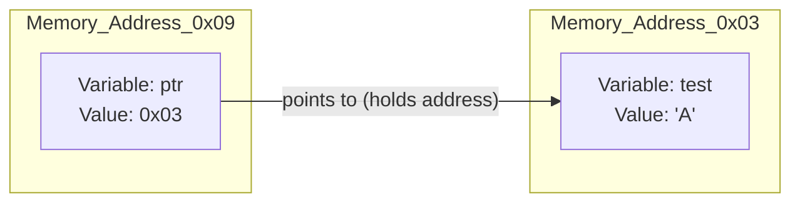
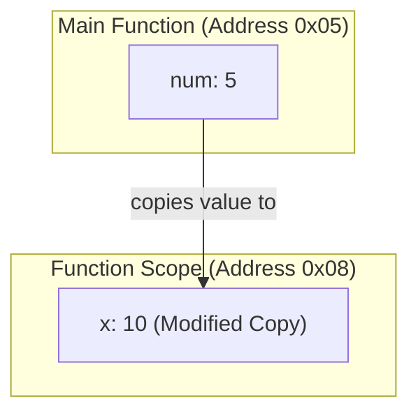
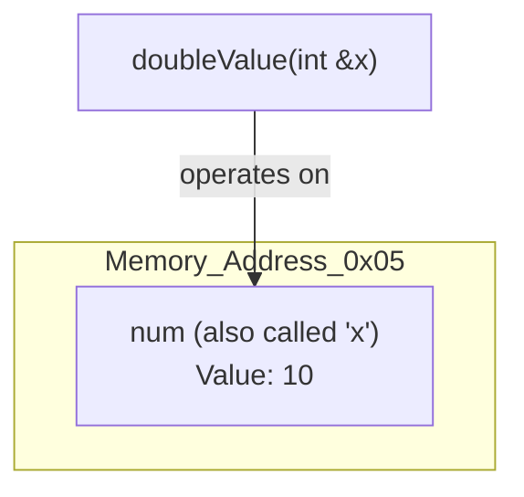
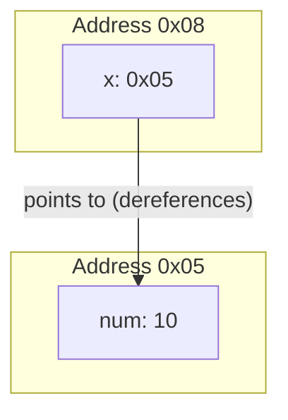

# 31251 - Summary
# 1. Intro to C++
## 1.1 Lecture

### Introduction to C++

<details>
    <summary>Output and Input I/O</summary>

* **Output (`std::cout`)**: Stands for "character output" and uses the **insertion operator** (`<<`) to flow data from the program to the console.
* **Input (`std::cin`)**: Stands for "character input" and uses the **extraction operator** (`>>`) to flow data from the console into a variable.
* **Type Sensitivity**: The behavior of `std::cin` is dependent on the data type of the variable receiving the input , such as `int` , `float` , or `std::string`.

</details>

<details>
    <summary>Different between std::cin and std::getline (std::cin, userInput)</summary>

* `std::cin` is used for reading a single word (up to the first whitespace) into a variable.
* `std::getline` reads an entire line of text, including spaces, into a variable.
```cpp
std::string userInput;
std::cin >> userInput; // Reads a single word
std::getline(std::cin, userInput); // Reads the entire line
```
</details>

<details>
    <summary>Ways to define int</summary>

* `int x;` - Declares an integer variable named `x` without initialization.
* `int x = 5;` - Declares and initializes `x` with the value 5.
* `int x(5);` - Declares and initializes `x` with the value 5 using direct initialization.
* `int x{5};` - Declares and initializes `x` with the value 5 using uniform initialization (C++11).
---
* `int myNumber{3.5}` //this will give an error
* `int myNumber(3.5)` //no error will change to 3
* `int myNumber{}` //value is 0
* `int myNumber()` //value is random
</details>

<details>
    <summary>Function</summary>

```cpp
void myFunction() {
    // Function body
}

int main() {
    myFunction();
    return 0;
}
```
</details>

<details>
    <summary>Classes</summary>

```cpp
class Car {
    public:
        std::string brand;
        int model;
        void start() {
            std::cout << "Car started!" << std::endl;
        }
    private:
        int speed;
};
```
</details>

### Memory Management: Variables, References, and Pointers

Understanding how C++ handles data in RAM is fundamental to Data Structures and Algorithms.

#### Variables
* Variables act like a **box** stored in memory.
* Each variable box has a unique **hexadecimal address**.
* **Declaration**: A free memory box is selected and assigned a name.
* **Initialization**: Assigning a name and putting a specific value into the box.

#### References
* A reference acts as an **alias** or "nickname" for an existing variable.
* It is declared using the `&` symbol, such as `char &ref = test;`.
* Modifying a reference directly changes the value of the original variable because they share the same memory address.

#### Pointers
* A pointer is a variable that stores the **memory address** of another variable.
* **Address Operator (`&`)**: Used to retrieve the memory address of a variable.
* **Pointer Declaration (`*`)**: Tells the compiler the variable is a pointer, such as `char *ptr;`. **This Declaration also apply to the function parameters**
    ```cpp
    //variable declaration
    char test = 'A';
    char *ptr = &test;

    //function with pointer parameter
    void myFunction(char *ptr) {
        // Function body
        *ptr = 'B'; // *ptr, dereferencing the pointer to change the value
    }
    myFunction(&test); //pass the address of test to the function
    ```
* **Dereferencing (`*`)**: Using the `*` symbol to access or change the value stored at the memory address the pointer is pointing to.



```mermaid
graph LR
    subgraph Memory_Address_0x03
    A[Variable: test<br/>Value: 'A']
    end
    subgraph Memory_Address_0x09
    B[Variable: ptr<br/>Value: 0x03]
    end
    B -- "points to (holds address)" --> A

```

### Passing Variables to Functions

There are three distinct methods for passing arguments to functions in C++:

| Method | Description | Effect on Original Variable |
| --- | --- | --- |
| **Pass by Value** | A **copy** of the value is created and passed to the function. | <br />**None**; changes within the function do not affect the original. |
| **Pass by Reference** | The function receives a **reference** to the original variable. | <br />**Direct**; changes to the parameter affect the original value. |
| **Pass by Pointer** | The function receives the **memory address** (pointer) of the variable. | <br />**Direct**; changes via dereferencing affect the original value. |
| **Pass by Const Reference** | Receives a **reference** (alias) but treats it as **read-only**. | <br />**None**; Efficient for large data (no copy). |

<details>
    <summary>Pass by Value</summary>

The function creates a completely new "box" in memory and copies the value into it. Changes to the parameter x do not affect the original num. 
```cpp
void doubleValue(int x) {
    x = x * 2; // Changes ONLY the copy
}

int main() {
    int num = 5;
    doubleValue(num);
    // num is still 5
}
```


```mermaid
graph TD
    subgraph Main_Scope["Main Function (Address 0x05)"]
    A["num: 5"]
    end
    subgraph Function_Scope["Function Scope (Address 0x08)"]
    B["x: 10 (Modified Copy)"]
    end
    A -- "copies value to" --> B
```

</details>

<details>
    <summary>Pass by Reference</summary>

The function receives an alias (nickname) for the original variable. No copy is made, so modifying x directly modifies num.
```cpp
void doubleValue(int &x) {
    x = x * 2; // Changes the original num
}

int main() {
    int num = 5;
    doubleValue(num);
    // num is now 10
}
```

```mermaid
graph TD
    subgraph Memory_Address_0x05
    A["num (also called 'x')<br />Value: 10"]
    end
    Function["doubleValue(int &x)"] -- "operates on" --> A
```
</details>

<details>
    <summary>Pass by Pointer</summary>

The function receives the memory address of the original variable. Using the dereference operator (*), it can directly access and modify the value in the original variable's memory location.
```cpp
void doubleValue(int *x) {
    *x = (*x) * 2; // Reaches into the address to change value
}

int main() {
    int num = 5;
    doubleValue(&num); // Pass the address of num
    // num is now 10
}
```

```mermaid
graph TD
    subgraph Main_Memory["Address 0x05"]
    A["num: 10"]
    end
    subgraph Pointer_Memory["Address 0x08"]
    B["x: 0x05"]
    end
    B -- "points to (dereferences)" --> A
```
</details>

<details>
    <summary>Pass by Const Reference</summary>

The function uses the direct memory block (address) but cannot alter the value. This combines the safety of **Pass by Value** with the efficiency of **Pass by Reference** by avoiding expensive copies (e.g., when passing large text or 1 million rows of data).

```cpp
void processBigData(const std::string &data) {
    // data += " modification"; // Error: Cannot modify const reference
    std::cout << "Read-only access to " << data.length() << " chars." << std::endl;
}

int main() {
    std::string hugeText(1000000, 'A'); // Simulate large data
    processBigData(hugeText); // Fast: Passes by address, no copy is made
}
```
</details>

### Class in C++

<details>
    <summary>Simple Class in C++</summary>

```cpp
#include <iostream>
using namespace std;

class MyClass {
private:
    int data;                 // private data
public:
    MyClass(int val = 0) {    // constructor (default/parameter)
        data = val;
    }
    void insert(int val) { data = val; }  // setter
    int get() { return data; }            // getter
    void display() { cout << data << endl; }
};

int main() {
    MyClass obj1;       // default constructor
    MyClass obj2(10);   // parameter constructor
    obj1.insert(5);
    obj2.display();     // 10
    cout << obj1.get(); // 5
    return 0;
}
```
Key Points
* private: data hidden, public: accessible methods
* Constructor: initialize objects (default or with parameters)
* Member functions: access/modify private data
* main() → program entry

</details>

<details>
    <summary>Copy Class Objects</summary>

# Copying a Simple Class (Shallow Copy)

Suppose your class only has **simple types** like `int`:

```cpp
class MyClass {
public:
    int data;
};
```

Now:

```cpp
MyClass obj1;
obj1.data = 5;

MyClass obj3 = obj1; // copy obj1 into obj3
```

**What happens in memory:**

```
obj1.data ---> 5
obj3.data ---> 5  (a separate copy)
```

* `obj1` and `obj3` have **independent copies** of `data`
* Changing one does **not** affect the other:

```cpp
obj1.data = 10;
cout << obj3.data; // still 5
```

✅ This is simple, safe, and what happens by default.

---

# Copying a Class with a Pointer (Shallow Copy Problem)

```cpp
class MyClass {
public:
    int* data;
    MyClass(int val) { data = new int(val); }
};
```

Now:

```cpp
MyClass obj1(5);
MyClass obj3 = obj1; // default copy
```

**Memory layout:**

```
obj1.data ---> [5]   (some heap memory)
obj3.data ---> same [5]  (points to the same memory)
```

```
obj1        obj3
+----+     +----+
|data| --->|    |  <-- both point to the SAME heap memory
+----+     +----+
             |
             v
           [ 5 ]  <- heap
```

* Both objects **share the same memory** for `data`
* Changing one affects the other:

```cpp
*obj1.data = 10;
cout << *obj3.data; // prints 10 too!
```

⚠ Problem: **shallow copy** → unintended side effects; `obj1` and `obj3` share the same memory.

---

# How to Fix It: Deep Copy (Custom Copy Constructor)

Define a **copy constructor**:

```cpp
class MyClass {
public:
    int* data;
    MyClass(int val) { data = new int(val); }

    // copy constructor for deep copy
    MyClass(const MyClass &other) {
        data = new int(*other.data); // allocate new memory
    }
};
```

Now:

```cpp
MyClass obj1(5);
MyClass obj3 = obj1;  // deep copy
```

**Memory layout:**
```
obj1        obj3
+----+     +----+
|data| --->|    |  <-- separate memory blocks
+----+     +----+
  |          |
  v          v
 [ 5 ]      [ 5 ]  <- two independent heap memory blocks
```

* `obj1` and `obj3` are fully independent
* No side effects

```cpp
*obj1.data = 10;
cout << *obj3.data; // prints 5
```

---

# Summary

| Case                                    | Copy Behavior                   | Notes                         |
| --------------------------------------- | ------------------------------- | ----------------------------- |
| Only `int` or simple types              | Default copy → independent      | Safe, shallow copy works fine |
| Class has **pointers / dynamic memory** | Default copy → shared memory    | Can cause bugs (shallow copy) |
| Use **custom copy constructor**         | Allocate new memory → deep copy | Each object fully independent |

---

# Takeaway
* **`MyClass obj3 = obj1;` works by default**
* Safe for normal types like `int`, `double`, etc.
* Use **deep copy** for pointers or dynamic memory to avoid shared memory problems.
</details>

---

# 2. Sequence Containers

## 2.1 Lecture Part 1: Abstract Data Types (ADTs)

### ADT vs Data Structure
* **ADT Definition**: A collection of values and a specification of operations that can be performed on them. It acts like a "user's manual," focusing on what can be done rather than how.
* **Data Structure Definition**: A concrete implementation of an ADT.
* **Problem Solving Strategy**: Design algorithms using ADTs by imagining "special powers" (operations) needed to solve the problem, then find a data structure that efficiently implements those powers

### Example: Contains Duplicate
The lecture uses Leetcode 217 to illustrate these concepts.
* **The Problem**: Given an array, determine if any value appears twice.
* **Brute Force**: A double for loop checks every element against all previous elements.
* **ADT Approach**: Define an ADT with two operations: `contains(val)` and `insert(val)`.
* **Efficiency**: While the double loop is one implementation, using more advanced data structures like Hash Tables or Balanced Binary Search Trees can significantly improve performance.

## 2.2 Lecture Part 2: Sequence Containers: Vectors, Deques, and Arrays

### Fixed-Sized Arrays and the RAM Model
* **Fixed-Size Array ADT**: Requires a maximum size at initialization. Operations include `get(i)` and `set(i, x)`.
* **Random Access Memory (RAM) Model**:
    * Memory is viewed as a long tape of "words" with integer addresses.
    * **Rule 1**: Constant time reading/writing to any address.
    * **Rule 2**: Constant time memory allocation/freeing.
    * **Rule 3**: Constant time arithmetic on addresses.
* **Implementation**: Elements are stored in a **contiguous block** of memory. The address of any element is calculated using the formula:
$$
    \text{Address} = \underbrace{\&arr[0]}_{base\_address} + \underbrace{i \times \text{sizeof(type)}}_{index \times \text{number of bytes per element}}
$$

### Resizable Arrays
* **The Problem**: Fixed-size arrays require knowing the size in advance, which isn't always possible.
* **Resizable Array ADT**: Supports `push_back(x)`, `pop_back()`, `size()`, `get(i)`, and `set(i, x)`.
* **Implementation Strategy**:
    1. Start with a fixed-size array.
    2. Fill it from left to right as long as there is **excess capacity** (takes constant time).
    3. When full, allocate a **new, larger array**, copy the old elements over, and free the old memory.

<details>
    <summary>Growth Strategy: Why Doubling?</summary>

* **Why not just add 1?** If we only add 1 element at a time, the cost of copying dominates. To insert N elements, it would take $1 + 2 + 3 + ... + N = O(N^2)$ time.
* **Why doubling?** By doubling the size, we ensure that the expensive copy operation happens less frequently. This leads to an **amortized** time complexity of $O(1)$ for `push_back`.
---
Doubling Strategy:
When the array becomes full:
1. Create a new array
2. Make its capacity double the old one
3. Copy old elements into it and Free the old array
```
Total Copying Cost
Each resize copies all current elements:
1 + 2 + 4 + ... + n/2
```
---
Why Not +1 Growth?
If capacity increases by 1 each time:
```
1 + 2 + 3 + ... + (n−1) = n(n−1)/2
```
This is O(n²) (very slow).
</details>

### Introduction to Linked Lists

### Deque


---

# 3. Templates and Iterators

## 3.1 Lecture

### Generic Programming and Pointer Abstractions

## 3.2 Tasks

* **Released:** Ex 3 (4 Mar, 9am)
* **Due:** Ex 1 (1 Mar, 23:59)

---

# 4. Linked Lists

## 4.1 Lecture

### Singly, Doubly, and Circularly Linked Lists

## 4.2 Tasks

* **Released:** Ex 4 (11 Mar, 9am)
* **Due:** Ex 2 (8 Mar, 23:59)

---

# 5. Hash Tables, Stacks, Queues

## 5.1 Lecture

### Linear Data Structures and Hashing Collisions

## 5.2 Tasks

* **Released:** Ex 5 (18 Mar, 9am) & Assignment 1 (16 Mar, 9am)
* **Due:** Ex 3 (15 Mar, 23:59)

---

# 6. Big Oh, Analysis of Algorithms

## 6.1 Lecture

### Time and Space Complexity Analysis

## 6.2 Tasks

* **Released:** Ex 6 (25 Mar, 9am)
* **Due:** Ex 4 (22 Mar, 23:59)

---

# 7. Sorting, Divide and Conquer

## 7.1 Lecture

### Merge Sort, Quick Sort, and Recursion

## 7.2 Tasks

* **Released:** Ex 7 (1 Apr, 9am)
* **Due:** Ex 5 (29 Mar, 23:59)

---

# 8. STUVAC (Study Vacation)

## 8.1 Revision

### Review Weeks 1-7

## 8.2 Tasks

* **Due:** Ex 6 (12 Apr, 23:59)

---

# 9. Priority Queues and BSTs

## 9.1 Lecture

### Binary Search Trees and Heaps

## 9.2 Tasks

* **Released:** Ex 8 (15 Apr, 9am)
* **Due:** Ex 6 (12 Apr, 23:59) & Assignment 1 (12 Apr, 23:59)

---

# 10. Graphs

## 10.1 Lecture

### Adjacency Matrices and Lists

## 10.2 Tasks

* **Released:** Ex 9 (22 Apr, 9am)
* **Due:** Ex 7 (19 Apr, 23:59)

---

# 11. Shortest Paths

## 11.1 Lecture

### Dijkstra's and Bellman-Ford Algorithms

## 11.2 Tasks

* **Released:** Ex 10 (29 Apr, 9am) & Assignment 2 (27 Apr, 9am)
* **Due:** Ex 8 (26 Apr, 23:59)

---

# 12. Topological Sort

## 12.1 Lecture

### Directed Acyclic Graphs (DAGs) and Ordering

## 12.2 Tasks

* **Due:** Ex 9 (3 May, 23:59)

---

# 13. Dynamic Programming

## 13.1 Lecture

### Memoization and Bottom-up Optimization

## 13.2 Tasks

* **Due:** Ex 10 (10 May, 23:59)

---

# 14. Final STUVAC

## 14.1 Final Exam Prep

### Comprehensive Review

## 14.2 Tasks

* **Due:** Assignment 2 (24 May, 23:59)
