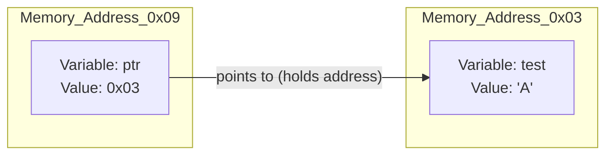
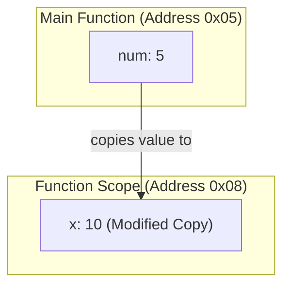
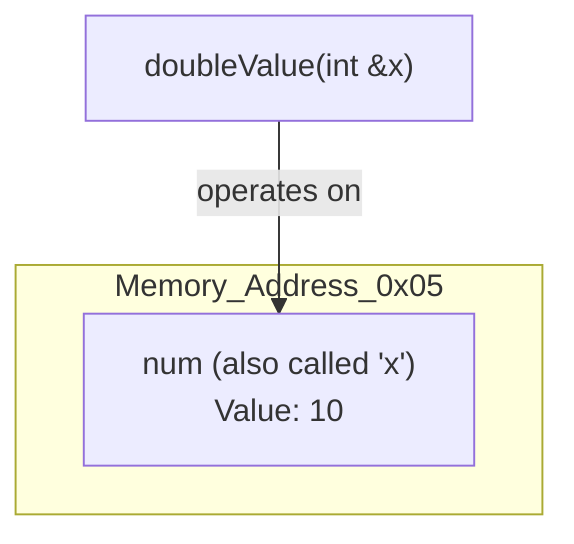
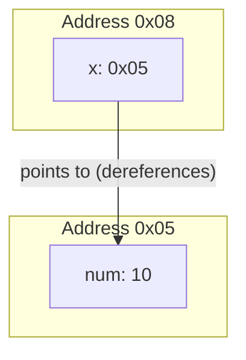

# 31251 - Summary
# 1. Intro to C++
## 1.1 Lecture

### Introduction to C++

<details>
    <summary>Output and Input I/O</summary>

* **Output (`std::cout`)**: Stands for "character output" and uses the **insertion operator** (`<<`) to flow data from the program to the console.
* **Input (`std::cin`)**: Stands for "character input" and uses the **extraction operator** (`>>`) to flow data from the console into a variable.
* **Type Sensitivity**: The behavior of `std::cin` is dependent on the data type of the variable receiving the input , such as `int` , `float` , or `std::string`.

</details>

<details>
    <summary>Different between std::cin and std::getline (std::cin, userInput)</summary>

* `std::cin` is used for reading a single word (up to the first whitespace) into a variable.
* `std::getline` reads an entire line of text, including spaces, into a variable.
```cpp
std::string userInput;
std::cin >> userInput; // Reads a single word
std::getline(std::cin, userInput); // Reads the entire line
```
</details>

<details>
    <summary>Ways to define int</summary>

* `int x;` - Declares an integer variable named `x` without initialization.
* `int x = 5;` - Declares and initializes `x` with the value 5.
* `int x(5);` - Declares and initializes `x` with the value 5 using direct initialization.
* `int x{5};` - Declares and initializes `x` with the value 5 using uniform initialization (C++11).
---
* `int myNumber{3.5}` //this will give an error
* `int myNumber(3.5)` //no error will change to 3
* `int myNumber{}` //value is 0
* `int myNumber()` //value is random
</details>

<details>
    <summary>Function</summary>

```cpp
void myFunction() {
    // Function body
}

int main() {
    myFunction();
    return 0;
}
```
</details>

<details>
    <summary>Classes</summary>

```cpp
class Car {
    public:
        std::string brand;
        int model;
        void start() {
            std::cout << "Car started!" << std::endl;
        }
    private:
        int speed;
};
```
</details>

### Memory Management: Variables, References, and Pointers

Understanding how C++ handles data in RAM is fundamental to Data Structures and Algorithms.

#### Variables
* Variables act like a **box** stored in memory.
* Each variable box has a unique **hexadecimal address**.
* **Declaration**: A free memory box is selected and assigned a name.
* **Initialization**: Assigning a name and putting a specific value into the box.

#### References
* A reference acts as an **alias** or "nickname" for an existing variable.
* It is declared using the `&` symbol, such as `char &ref = test;`.
* Modifying a reference directly changes the value of the original variable because they share the same memory address.

#### Pointers
* A pointer is a variable that stores the **memory address** of another variable.
* **Address Operator (`&`)**: Used to retrieve the memory address of a variable.
* **Pointer Declaration (`*`)**: Tells the compiler the variable is a pointer, such as `char *ptr;`. **This Declaration also apply to the function parameters**
    ```cpp
    //variable declaration
    char test = 'A';
    char *ptr = &test;

    //function with pointer parameter
    void myFunction(char *ptr) {
        // Function body
        *ptr = 'B'; // *ptr, dereferencing the pointer to change the value
    }
    myFunction(&test); //pass the address of test to the function
    ```
* **Dereferencing (`*`)**: Using the `*` symbol to access or change the value stored at the memory address the pointer is pointing to.



```mermaid
graph LR
    subgraph Memory_Address_0x03
    A[Variable: test<br/>Value: 'A']
    end
    subgraph Memory_Address_0x09
    B[Variable: ptr<br/>Value: 0x03]
    end
    B -- "points to (holds address)" --> A

```

### Passing Variables to Functions

There are three distinct methods for passing arguments to functions in C++:

| Method | Description | Effect on Original Variable |
| --- | --- | --- |
| **Pass by Value** | A **copy** of the value is created and passed to the function. | <br />**None**; changes within the function do not affect the original. |
| **Pass by Reference** | The function receives a **reference** to the original variable. | <br />**Direct**; changes to the parameter affect the original value. |
| **Pass by Pointer** | The function receives the **memory address** (pointer) of the variable. | <br />**Direct**; changes via dereferencing affect the original value. |
| **Pass by Const Reference** | Receives a **reference** (alias) but treats it as **read-only**. | <br />**None**; Efficient for large data (no copy). |

<details>
    <summary>Pass by Value</summary>

The function creates a completely new "box" in memory and copies the value into it. Changes to the parameter x do not affect the original num. 
```cpp
void doubleValue(int x) {
    x = x * 2; // Changes ONLY the copy
}

int main() {
    int num = 5;
    doubleValue(num);
    // num is still 5
}
```


```mermaid
graph TD
    subgraph Main_Scope["Main Function (Address 0x05)"]
    A["num: 5"]
    end
    subgraph Function_Scope["Function Scope (Address 0x08)"]
    B["x: 10 (Modified Copy)"]
    end
    A -- "copies value to" --> B
```

</details>

<details>
    <summary>Pass by Reference</summary>

The function receives an alias (nickname) for the original variable. No copy is made, so modifying x directly modifies num.
```cpp
void doubleValue(int &x) {
    x = x * 2; // Changes the original num
}

int main() {
    int num = 5;
    doubleValue(num);
    // num is now 10
}
```

```mermaid
graph TD
    subgraph Memory_Address_0x05
    A["num (also called 'x')<br />Value: 10"]
    end
    Function["doubleValue(int &x)"] -- "operates on" --> A
```
</details>

<details>
    <summary>Pass by Pointer</summary>

The function receives the memory address of the original variable. Using the dereference operator (*), it can directly access and modify the value in the original variable's memory location.
```cpp
void doubleValue(int *x) {
    *x = (*x) * 2; // Reaches into the address to change value
}

int main() {
    int num = 5;
    doubleValue(&num); // Pass the address of num
    // num is now 10
}
```

```mermaid
graph TD
    subgraph Main_Memory["Address 0x05"]
    A["num: 10"]
    end
    subgraph Pointer_Memory["Address 0x08"]
    B["x: 0x05"]
    end
    B -- "points to (dereferences)" --> A
```
</details>

<details>
    <summary>Pass by Const Reference</summary>

The function uses the direct memory block (address) but cannot alter the value. This combines the safety of **Pass by Value** with the efficiency of **Pass by Reference** by avoiding expensive copies (e.g., when passing large text or 1 million rows of data).

```cpp
void processBigData(const std::string &data) {
    // data += " modification"; // Error: Cannot modify const reference
    std::cout << "Read-only access to " << data.length() << " chars." << std::endl;
}

int main() {
    std::string hugeText(1000000, 'A'); // Simulate large data
    processBigData(hugeText); // Fast: Passes by address, no copy is made
}
```
</details>

### Class in C++
#### Class Template and Implementation
```cpp
#ifndef MY_INTEGER_HPP_
#define MY_INTEGER_HPP_

class myInteger {
 private:
  int value {};

 public:
  // default constructor
  myInteger();

  // constructor taking an integer
  // explicit means we don't allow myInteger x = 3
  // the constructor has to be explicitly called
  explicit myInteger(int);

  // copy constructor
  // create a copy constructor with the same value as another myInteger
  myInteger(const myInteger&);

  // assignment operator
  // this enables myInteger x {3}; myInteger y {5}; x = y;
  myInteger& operator=(const myInteger&);
  // allow user to assignment object: a = b = c
  // Without & in the myInteger, it will create copy, causing a redundance work

  // destructor, delete the memory
  ~myInteger();

  // determine if two myIntegers are equal
  friend bool operator==(const myInteger&, const myInteger&);

  // determine if one myInteger is less than another
  friend bool operator<(const myInteger&, const myInteger&);
};

#endif  // MY_INTEGER_HPP_
```

<details>
    <summary>Class Structure and Encapsulation</summary>

```cpp
class myInteger {
private:
    int value {};
```

* The class stores one private variable: `value`.
* Because it is private, outside code cannot access it directly.
* All interaction must happen through constructors, operators, or friend functions.

This demonstrates **encapsulation** — hiding internal data.

</details>

<details>
    <summary>Object Creation (Constructors)</summary>

**Default Constructor**

```cpp
myInteger::myInteger() {}
```

Used when no value is provided:

```cpp
myInteger a;
```

Because `value` was declared as `int value {};`, it is automatically initialized to `0`.

---

**Constructor with an Integer**

```cpp
myInteger::myInteger(int input) : value {input} {}
```

Used when creating an object with a value:

```cpp
myInteger a(5);
```

The syntax `: value {input}` is called a **member initializer list**. It directly initializes `value` with `input`.

The constructor is marked `explicit`, which prevents:

```cpp
myInteger a = 5;   // Not allowed
```

This avoids unintended automatic conversions.

</details>

<details>
    <summary>Copying Objects (Copy Constructor)</summary>

```cpp
myInteger::myInteger(const myInteger& x) : value {x.value} {}
```

Used when creating a new object from an existing one:

```cpp
myInteger a(5);
myInteger b = a;   // Copy constructor
```

What happens:

* A new object `b` is created.
* `b.value` is set to `a.value`.

This teaches how objects are copied safely.

</details>

<details>
    <summary>Assigning Objects (Assignment Operator)</summary>

```cpp
myInteger& myInteger::operator=(const myInteger& x) {
    value = x.value;
    return *this;
}
```

Used when both objects already exist:

```cpp
myInteger a(5);
myInteger b(3);

b = a;   // Assignment operator
```

What happens:

* `b.value` is replaced with `a.value`.
* The function returns `*this` (a reference to the current object).

Returning a reference allows **chained assignment**:

```cpp
a = b = c;
```

If it returned by value instead of reference, extra copies would be created.

</details>

<details>
    <summary>Object Destruction (Destructor)</summary>

```cpp
myInteger::~myInteger() {}
```

Called automatically when an object goes out of scope.

In this class, it does nothing because no dynamic memory is used. However, it demonstrates how cleanup would work if resources were allocated.

</details>

<details>
    <summary>Operator Overloading and Friend Functions Relationship</summary>
<details>
    <summary>Operator Overloading</summary>

The class overloads comparison operators so that objects behave like integers.

**Equality Operator**

```cpp
bool operator==(const myInteger& x, const myInteger& y) {
    return x.value == y.value;
}
```

Allows:

```cpp
if (a == b)
```

It compares the private `value` of both objects.

---

**Less-Than Operator**

```cpp
bool operator<(const myInteger& x, const myInteger& y) {
    return x.value < y.value;
}
```

Allows:

```cpp
if (a < b)
```

</details>

<details>
    <summary>Why Are These Operators friend?</summary>

In the class:

```cpp
friend bool operator==(const myInteger&, const myInteger&);
friend bool operator<(const myInteger&, const myInteger&);
```

These operators are **not** member functions. They are normal functions defined outside the class.

However, they need access to the private `value`. The keyword `friend` gives them permission to access private members.

Without `friend`, this line would cause an error:

```cpp
return x.value == y.value;
```

</details>

</details>

<details>
    <summary>Summary: Object Lifecycle and Operator Overloading</summary>

This class demonstrates:

1. **Encapsulation** (private data)
2. **Object initialization** (constructors)
3. **Copy construction**
4. **Assignment** between objects
5. **Object destruction**
6. **Operator overloading**
7. **Controlled access** using `friend`

Although the class only wraps an `int`, it teaches how real C++ classes manage their lifecycle and behave like built-in types. This is foundational knowledge for writing safe and well-designed C++ classes.

</details>

---

# 2. Sequence Containers

## 2.1 Lecture Part 1: Abstract Data Types (ADTs)

### ADT vs Data Structure
* **ADT Definition**: A collection of values and a specification of operations that can be performed on them. It acts like a "user's manual," focusing on what can be done rather than how.
* **Data Structure Definition**: A concrete implementation of an ADT.
* **Problem Solving Strategy**: Design algorithms using ADTs by imagining "special powers" (operations) needed to solve the problem, then find a data structure that efficiently implements those powers

### Example: Contains Duplicate
The lecture uses Leetcode 217 to illustrate these concepts.
* **The Problem**: Given an array, determine if any value appears twice.
* **Brute Force**: A double for loop checks every element against all previous elements.
* **ADT Approach**: Define an ADT with two operations: `contains(val)` and `insert(val)`.
* **Efficiency**: While the double loop is one implementation, using more advanced data structures like Hash Tables or Balanced Binary Search Trees can significantly improve performance.

## 2.2 Lecture Part 2: Sequence Containers: Vectors, Deques, and Arrays

### Fixed-Sized Arrays and the RAM Model
* **Fixed-Size Array ADT**: Requires a maximum size at initialization. Operations include `get(i)` and `set(i, x)`.
* **Random Access Memory (RAM) Model**:
    * Memory is viewed as a long tape of "words" with integer addresses.
    * **Rule 1**: Constant time reading/writing to any address.
    * **Rule 2**: Constant time memory allocation/freeing.
    * **Rule 3**: Constant time arithmetic on addresses.
* **Implementation**: Elements are stored in a **contiguous block** of memory. The address of any element is calculated using the formula:
$$
    \text{Address} = \underbrace{\&arr[0]}_{base\_address} + \underbrace{i \times \text{sizeof(type)}}_{index \times \text{number of bytes per element}}
$$

### Resizable Arrays
* **The Problem**: Fixed-size arrays require knowing the size in advance, which isn't always possible.
* **Resizable Array ADT**: Supports `push_back(x)`, `pop_back()`, `size()`, `get(i)`, and `set(i, x)`.
* **Implementation Strategy**:
    1. Start with a fixed-size array.
    2. Fill it from left to right as long as there is **excess capacity** (takes constant time).
    3. When full, allocate a **new, larger array**, copy the old elements over, and free the old memory.

<details>
    <summary>Growth Strategy: Why Doubling?</summary>

* **Why not just add 1?** If we only add 1 element at a time, the cost of copying dominates. To insert N elements, it would take $1 + 2 + 3 + ... + N = O(N^2)$ time.
* **Why doubling?** By doubling the size, we ensure that the expensive copy operation happens less frequently. This leads to an **amortized** time complexity of $O(1)$ for `push_back`.
---
Doubling Strategy:
When the array becomes full:
1. Create a new array
2. Make its capacity double the old one
3. Copy old elements into it and Free the old array
```
Total Copying Cost
Each resize copies all current elements:
1 + 2 + 4 + ... + n/2
```
---
Why Not +1 Growth?
If capacity increases by 1 each time:
```
1 + 2 + 3 + ... + (n−1) = n(n−1)/2
```
This is O(n²) (very slow).
</details>


## 2.3 Vector Functions and Syntax
<details>
    <summary>std::vector Fundamentals</summary>

A vector is a dynamic data structure that stores elements in a contiguous block of memory and resizes automatically as needed .

**Key Syntax and Operations:**

- **Initialization:**
    - `std::vector<int> nums {3, 1, 4};` — Creates a vector with initial values.
    - `std::vector<int> result(nums.size(), 1);` — Creates a vector of a specific size filled with a default value (e.g., 1).
- **Accessing Elements:**
    - `nums[i]` — Access via indexing operator (fast, no bounds checking) .
    - `nums.at(i)` — Access with bounds checking .
- **Capacity Management:**
    - `nums.push_back(val)` — Adds an element to the end.
    - `nums.size()` — Returns the number of elements currently in the vector .
    - `nums.capacity()` — Returns the total space allocated before a resize is required .
- **Looping Strategies:**
    - **Standard for-loop:** `for (std::size_t i = 0; i < nums.size(); i++)` — Use `std::size_t` because it is unsigned and can handle larger indices than `int` .
        - Alternative of std::size_t is auto, but we need to add `u (unsigned)`, preventing warning
        ```cpp
        for (auto i = 0u; i < nums.size(); i++) {
            // ...
        }
        ```
    - **Range-based for-loop:** `for (int n : nums)` — Cleanest way to iterate over every element.
    - **Iterator-based for-loop:** `for (auto it = nums.begin(); it != nums.end(); it++)` — Use iterators to iterate over every element.
        ```cpp
        for (auto it = vec.begin(); it < vec.end(); it++) {
            std::cout << *it << '\n';
        }
        ```
</details>

<details>
    <summary>How Vectors Work (Doubling Strategy)</summary>

Vectors use a **doubling strategy** to resize efficiently:

1. **Initial Allocation:** When created, a vector has a small initial capacity (e.g., 1 or 2).
2. **Doubling:** When full, it allocates a new array with **twice** the current capacity.
3. **Copying:** All existing elements are copied to the new array.
4. **Cleanup:** The old array is deleted.

**Example:**

| Action | Size | Capacity | Memory Cost |
|--------|------|----------|-------------|
| Create | 0 | 1 | 1 |
| push_back(10) | 1 | 1 | 1 |
| push_back(20) | 2 | 2 | 2 (copy 1 element) |
| push_back(30) | 3 | 4 | 4 (copy 2 elements) |
| push_back(40) | 4 | 4 | 0 |
| push_back(50) | 5 | 8 | 4 (copy 4 elements) |

**Why Doubling?**

- **O(n) amortized time:** Each element is copied only when the vector doubles, so the average cost per element is constant .
- **Avoids O(n²) copying:** Unlike +1 growth, doubling keeps copying localized .
</details>
---

# 3. Templates and Iterators

## 3.1 Lecture

### Code Architecture in C++

In professional C++ development, programs are divided into multiple files. This approach is called **separate compilation**. It improves organization, maintainability, and compilation efficiency.

#### Header Files (`.hpp`) – Interface

Header files contain **declarations** only. They describe:

* Class definitions (structure)
* Function signatures (name, parameters, return type)
* Member variables

They do not contain implementation logic.

<details>
    <summary>Example: student.hpp</summary>

```cpp
#ifndef STUDENT_HPP
#define STUDENT_HPP

#include <string>

class Student {
private:
    std::string name;
    int age;

public:
    Student(std::string n, int a);
    void printInfo();
};

#endif
```

This file defines what a `Student` is, but not how its functions work.

</details>

#### Implementation Files (`.cpp`) – Definitions

Implementation files contain the actual logic of functions declared in the header.

<details>
    <summary>Example: student.cpp</summary>

```cpp
#include "student.hpp"
#include <iostream>

Student::Student(std::string n, int a) {
    name = n;
    age = a;
}

void Student::printInfo() {
    std::cout << name << " is " << age << " years old.\n";
}
```

The `Student::` prefix connects the function definition to the class declared in the header.

</details>

#### Compilation and Linking

Compilation happens in two stages:

1. Compile source files into object files:

   ```
   g++ -c student.cpp
   g++ -c main.cpp
   ```

2. Link object files into an executable:

   ```
   g++ student.o main.o -o program
   ```

If only `main.cpp` changes, `student.cpp` does not need to be recompiled. This improves efficiency in large projects.

#### Header Guards

Header guards prevent multiple inclusion of the same header file, which would otherwise cause redefinition errors.

```cpp
#ifndef STUDENT_HPP
#define STUDENT_HPP

// declarations

#endif
```

The macro is defined the first time the file is included. Subsequent inclusions are ignored.

---

### Templates (Generic Programming)

Templates allow writing code that works with multiple data types without duplication. They enable **generic programming**.

Without templates, separate versions of the same function would be required for each type.

<details>
    <summary>Function Template Example</summary>

```cpp
#include <iostream>

template<typename T>
T add(T a, T b) {
    return a + b;
}

int main() {
    std::cout << add(3, 4) << "\n";        // int
    std::cout << add(2.5, 1.5) << "\n";    // double
}
```

The compiler generates specific versions of the function when it sees how it is used. This is called **template instantiation**.

</details>

<details>
    <summary>Class Template Example</summary>

```cpp
template<typename T>
class Box {
private:
    T value;

public:
    Box(T v) : value(v) {}

    T getValue() {
        return value;
    }
};
```

Usage:

```cpp
Box<int> intBox(10);
Box<std::string> strBox("Hello");
```

One template definition can produce multiple typed classes.

</details>

#### Importance of Templates

The Standard Template Library (STL) is built using templates. Examples include:

* `std::vector`
* `std::list`
* `std::sort`
* `std::find`

Templates allow algorithms to operate generically on containers using iterators.

---

### Iterators

An iterator is an object that allows traversal of elements in a container. It acts similarly to a pointer. Iterators connect containers with algorithms.

<details>
    <summary>Basic Iterator Example</summary>

```cpp
#include <vector>
#include <iostream>

int main() {
    std::vector<int> vec = {10, 20, 30};

    for (auto it = vec.begin(); it != vec.end(); ++it) {
        std::cout << *it << "\n";
    }
}
```

* `vec.begin()` returns an iterator to the first element.
* `vec.end()` returns an iterator to one past the last element.
* `*it` dereferences the iterator to access the value.

</details>

<details>
    <summary>Iterators with Algorithms</summary>

```cpp
#include <algorithm>
#include <vector>

int main() {
    std::vector<int> vec = {5, 2, 8, 1};
    std::sort(vec.begin(), vec.end());
}
```

`std::sort` operates using iterators. It does not depend on the specific container type, only on the iterator capabilities.

</details>

#### Half-Open Interval

STL algorithms use a half-open interval:

```
[first, last)
```

This means:

* Include `first`
* Exclude `last`

<details>
    <summary>Half-Open Interval Example</summary>

```cpp
std::vector<int> vec = {10, 20, 30, 40, 50};
std::sort(vec.begin() + 1, vec.end() - 1);
```

This sorts the elements from index 1 up to but not including the last element.

**Important:** Dereferencing `vec.end()` results in undefined behavior.

</details>

#### Iterator Categories

| Category | Capabilities | Example Container |
| --- | --- | --- |
| **Random Access** | Jump forward/backward, compare, arithmetic | `std::vector` |
| **Bidirectional** | Move forward and backward | `std::list` |
| **Forward** | Move forward only | `std::forward_list` |

<details>
    <summary>Random Access Example</summary>

```cpp
auto it = vec.begin();
it = it + 2;  // valid for vector
```

This is invalid for `std::list` because it does not support random access.

</details>

<details>
    <summary>Bidirectional Example</summary>

```cpp
#include <list>

std::list<int> myList = {10, 20, 30};
auto it = myList.begin();
++it; // Move forward to 20
--it; // Move backward to 10
```

Bidirectional iterators can be incremented (`++`) and decremented (`--`), but do not support arithmetic like `it + 2`.

</details>

<details>
    <summary>Forward Example</summary>

```cpp
#include <forward_list>

std::forward_list<int> fList = {10, 20, 30};
auto it = fList.begin();
++it; // Move forward to 20
// --it; // Error: Cannot move backward
```

Forward iterators can only be incremented sequentially using `++`.

</details>

### Stack vs Heap (Memory Model)

| Feature | Stack | Heap |
| --- | --- | --- |
| **Usage** | Local variables and function call frames | Dynamic memory (`new`, `new[]` / `delete`, `delete[]`) |
| **Speed/Management** | Fast, automatically managed | Slower, manually managed (unless using smart pointers) |
| **Lifetime** | Memory is freed when the variable goes out of scope | Controlled by the programmer; objects can outlive their creation scope |
| **Size limits** | Limited and fixed per thread (not suitable for very large allocations) | Used by containers (e.g., `std::vector` naturally stores its elements here) |

<details>
    <summary>Stack vs Heap Example</summary>

```cpp
void foo() {
    Player p;                 // p on stack, destroyed at end of foo()
    Player* q = new Player(); // object on heap, pointer q on stack
    // ... use q ...
    delete q;                 // must delete to avoid memory leak
}
```

</details>

---

### Constructors and Destructors

#### Default Constructor
Called when an object is created without arguments. Used to set sensible defaults.

```cpp
class Player {
public:
    std::string name;
    int health;

    Player() : name("Unknown"), health(100) {}
};
```

#### Parameterized Constructor and Initialization Lists
Initializes an object with explicit values.
Prefer **initialization lists** over assignment inside the constructor body—they are more efficient and required for `const` members and references.

```cpp
Player(std::string n, int h) : name(n), health(h) {}
```

#### Destructor
Called when an object is destroyed. Used to free resources allocated by the object (e.g., heap memory, file handles, sockets).

```cpp
~MyVector() {
    delete[] arrayPointer_;
}
```

---

### Copy Initialization and Assignment

#### Copy Constructor
Purpose: Defines how to create a new object as a copy of an existing object.

```cpp
MyVector v1;
MyVector v2 = v1; // copy constructor used
```

<details>
    <summary>Shallow vs Deep Copy</summary>

*   **Shallow Copy (Default):** Member-wise copy where pointers are copied as values, meaning both objects point to the same heap memory. *Dangerous for owned resources.*
*   **Deep Copy:** Allocates new memory and copies the actual contents so each object owns its own resource.

**The Shallow Copy Problem:**
```cpp
MyVector v1;
v1.arrayPointer_ = new int[5]{1,2,3,4,5};
MyVector v2 = v1; // default shallow copy
// v1 and v2 point to the same memory. When both are destroyed -> double delete -> crash.
```

**Deep Copy Implementation:**
```cpp
MyVector::MyVector(const MyVector& other)
  : size_(other.size_), capacity_(other.capacity_) {
    if (other.arrayPointer_) {
        arrayPointer_ = new int[capacity_];
        for (int i = 0; i < size_; ++i)
            arrayPointer_[i] = other.arrayPointer_[i];
    } else {
        arrayPointer_ = nullptr;
    }
}
```

Result: `v2` receives its own copy of the array and can be safely destroyed independently of `v1`.

</details>

#### Copy Assignment
Used to overwrite an existing object with data from another (`v2 = v1;` where both already exist).

<details>
    <summary>Copy-and-Swap Idiom</summary>

**Best Practice:** Use the Copy-and-Swap idiom to ensure exception safety and avoid self-assignment issues.

```cpp
MyVector& MyVector::operator=(MyVector other) {
    std::swap(arrayPointer_, other.arrayPointer_);
    std::swap(size_, other.size_);
    return *this;
}
```

</details>

---

### The Rule of Three
The Rule of Three states that if a class requires a manual implementation of a raw pointer to heap memory, it likely requires **all three**:

1. **Destructor:** To free the memory (`delete[]`).
2. **Copy Constructor:** To perform a Deep Copy during initialization.
3. **Copy Assignment Operator:** To perform a Deep Copy during assignment.

*If you omit any of these while using `new`, your program will likely suffer from memory leaks (forgetting the destructor) or double-free crashes (forgetting the copy logic).*

---

## 3.2 Templated + MyVector functions

### MyVector & Template Example
<details>
<summary>MyVector & Template Example</summary>

### Set up

#### 1. Overview: What is `MyVector`?
<details>
<summary>1. Overview: What is MyVector?</summary>

```cpp
template <typename T>
class MyVector { ... };
```

* A dynamic array container similar to `std::vector`.
* Supports adding, removing, and accessing elements dynamically.
* Stores `size_`, `capacity_`, and `arrayPointer_` to manage memory efficiently.

</details>

#### 2. Private Variables
<details>
<summary>2. Private Variables</summary>

```cpp
T* arrayPointer_ = nullptr;
int size_ = 0;
int capacity_ = 0;
```

* `arrayPointer_` points to the first element of a dynamic array.
* `size_` tracks the number of elements currently in the vector.
* `capacity_` tracks allocated memory size, which may exceed `size_`.
* Key invariant: `size_ <= capacity_`.

</details>

---

### Functions + Templates

#### 3. Default Constructor
<details>
<summary>3. Default Constructor</summary>

```cpp
template <typename T>
MyVector<T>::MyVector() {}
```

* Creates an empty vector.
* Initial values: `arrayPointer_ = nullptr`, `size_ = 0`, `capacity_ = 0`.

</details>

#### 4. Constructor with Size
<details>
<summary>4. Constructor with Size</summary>

```cpp
template <typename T>
MyVector<T>::MyVector(int n) :
  arrayPointer_ {n > 0 ? new T[n]{} : nullptr},
  size_ {n},
  capacity_ {n} {}
```

* Allocates memory for `n` elements initialized to 0.
* Both `size_` and `capacity_` are set to `n`.
* Example: `MyVector<int> v(5)` → `[0,0,0,0,0]`.

</details>

#### 5. Copy Constructor
<details>
<summary>5. Copy Constructor</summary>

```cpp
template <typename T>
MyVector<T>::MyVector(const MyVector<T>& other) 
  : arrayPointer_ {other.size_ > 0 ? new T[other.size_] : nullptr},
    size_ {other.size_},
    capacity_ {other.capacity_} {
    for (int i = 0; i < size_; ++i)
        arrayPointer_[i] = other.arrayPointer_[i];
}
```

* Used when copying a vector: `MyVector<int> b = a;`.
* Allocates new memory and copies elements.
* Ensures `a` and `b` point to **different memory**.

</details>

#### 6. Initializer List Constructor
<details>
<summary>6. Initializer List Constructor</summary>

```cpp
template <typename T>
MyVector<T>::MyVector(std::initializer_list<T> vals) {
  size_ = capacity_ = vals.size();
  arrayPointer_ = new T[size_];
  int i = 0;
  for (T x : vals)
    arrayPointer_[i++] = x;
}
```

* Allows vector initialization with `{}`: `MyVector<int> v = {1,2,3};`.
* Sets `size_` and `capacity_` to list size.
* Copies each element from the initializer list.

</details>

#### 7. Destructor
<details>
<summary>7. Destructor</summary>

```cpp
template <typename T>
MyVector<T>::~MyVector() {
  delete[] arrayPointer_;
}
```

* Frees dynamically allocated memory.
* Prevents memory leaks from `new T[]`.

</details>

#### 8. Copy Assignment Operator
<details>
<summary>8. Copy Assignment Operator</summary>

```cpp
template <typename T>
MyVector<T>& MyVector<T>::operator=(MyVector<T> other) {
  std::swap(arrayPointer_, other.arrayPointer_);
  std::swap(size_, other.size_);
  std::swap(capacity_, other.capacity_);
  return *this;
}
```

* Implements **copy-swap idiom**.
* Swaps content of `*this` with `other` for safe assignment.
* Handles self-assignment and memory management automatically.

</details>

#### 9. push_back()
<details>
<summary>9. push_back()</summary>

```cpp
template <typename T>
void MyVector<T>::push_back(T val) { ... }
```

* Adds an element at the end of the vector.
* If `size_ < capacity_`, simply store the value.
* If `size_ == capacity_`, double `capacity_`, allocate new memory, copy old elements, delete old memory, then add the new value.
* Maintains `size_` correctly after addition.

</details>

#### 10. pop_back()
<details>
<summary>10. pop_back()</summary>

```cpp
template <typename T>
void MyVector<T>::pop_back() {
  if (!empty()) --size_;
}
```

* Removes the last element by decreasing `size_`.
* Memory remains allocated; element is logically removed.

</details>

#### 11. back()
<details>
<summary>11. back()</summary>

```cpp
template <typename T>
T& MyVector<T>::back() {
  return arrayPointer_[size_ - 1];
}
```

* Returns a reference to the last element.
* Can be used to read or modify the last element.
* Requires `size_ > 0` to be safe.

</details>

#### 12. empty()
<details>
<summary>12. empty()</summary>

```cpp
template <typename T>
bool MyVector<T>::empty() {
  return size_ == 0;
}
```

* Returns true if the vector has no elements.
* Simple check on `size_`.

</details>

#### 13. size()
<details>
<summary>13. size()</summary>

```cpp
template <typename T>
int MyVector<T>::size() const {
  return size_;
}
```

* Returns the number of elements stored.
* Constant function, does not modify the vector.

</details>

#### 14. capacity()
<details>
<summary>14. capacity()</summary>

```cpp
template <typename T>
int MyVector<T>::capacity() const {
  return capacity_;
}
```

* Returns the allocated memory size (max elements without reallocation).

</details>

#### 15. operator[]
<details>
<summary>15. operator[]</summary>

```cpp
template <typename T>
T& MyVector<T>::operator[](int i) { return arrayPointer_[i]; }

template <typename T>
const T& MyVector<T>::operator[](int i) const { return arrayPointer_[i]; }
```

* Access elements by index: `v[i]`.
* Returns by reference so values can be modified.
* Const version allows read-only access.
* If returned by value, assignment like `v[0] = 5` would not work.

---
C++ needs two versions to handle:
1. Non-const objects → can read and modify elements.
```cpp
MyVector<int> v;
v[0] = 5;  // uses non-const version
// ---------------
MyVector<int> v = {1,2,3};
v[0] = 10;  // ✅ Can modify
```
2. Const objects → can only read elements.
```cpp
const MyVector<int> cv;
int x = cv[0];  // uses const version
// ---------------
const MyVector<int> cv = {1,2,3};
int x = cv[0];  // ✅ Can read
cv[0] = 10;     // ❌ Error! Cannot modify, because it's const
```

</details>

#### 16. Explicit Template Instantiation
<details>
<summary>16. Explicit Template Instantiation</summary>

```cpp
template class MyVector<int>;
template class MyVector<float>;
template class MyVector<double>;
```

* Tells the compiler to generate code for these types.
* Ensures vector works for `int`, `float`, and `double`.

</details>

#### 17. Example of Memory Layout
<details>
<summary>17. Example of Memory Layout</summary>

```cpp
MyVector<int> v = {1,2,3};

arrayPointer_ → [1][2][3][ ][ ][ ]
size_ = 3
capacity_ = 6
```

* Shows `size_` vs `capacity_`.
* Unused memory is allocated but ignored until needed.

</details>

#### 18. Core Concepts Learned
<details>
<summary>18. Core Concepts Learned</summary>

* Dynamic memory allocation: `new[]` / `delete[]`.
* Pointers to manage dynamic arrays.
* Copy constructor ensures separate memory for copies.
* Push-back resizing doubles capacity.
* Access via reference allows modification.
* Efficient memory management with copy-swap idiom.

</details>

</details>
---


# 4. Linked Lists

## 4.1 Lecture

### Linked List: Singly Linked List


* Each node contains a value and a pointer to the next node.
* Last node points to `nullptr`.
* Insertion and deletion are efficient.
* Random access is not supported.
* Memory allocation is dynamic, not contiguous.

## 4.2 Singly Linked List + forward_list Example
<details>
<summary>forward_list Example</summary>

### Set up

#### 1. Overview: What is `ForwardList`?
<details>
<summary>1. Overview: What is ForwardList?</summary>

```cpp
class ForwardList { ... };
```

* Implements a **singly linked list** storing integers.
* Each node stores `data` and a pointer to the **next node**.
* Supports operations: push/pop at the front, access front element, display, check empty, and get size.

</details>

#### 2. Node Structure
<details>
<summary>2. Node Structure</summary>

```cpp
struct Node {
    int data {};
    Node* next = nullptr;
    Node(){}
    Node(int input_data, Node* next_node = nullptr) : data{input_data}, next{next_node} {}
};
```

* `data` stores the value of the node.
* `next` points to the **next node** in the list.
* Constructors allow default creation or setting data and next node pointer.

</details>

#### 3. Private Variables
<details>
<summary>3. Private Variables</summary>

```cpp
int size_ = 0;
Node* head_ = nullptr;
```

* `size_` tracks the number of nodes.
* `head_` points to the **first node** of the list.
* If `head_ == nullptr`, the list is empty.

</details>

---

### Functions

#### 4. Default Constructor
<details>
<summary>4. Default Constructor</summary>

```cpp
ForwardList::ForwardList() {}
```

* Creates an empty list.
* `head_` is initialized to `nullptr`, `size_ = 0`.

</details>

#### 5. Destructor
<details>
<summary>5. Destructor</summary>

```cpp
ForwardList::~ForwardList() {
  for (Node* cur = head_; cur != nullptr;) {
    Node* tmp = cur;
    cur = cur->next;
    delete tmp;
    --size_;
  }
}
```

* Frees all nodes to prevent memory leaks.
* Traverses from `head_` to the end, deleting each node.
* Updates `size_` as nodes are deleted.

</details>

#### 6. Constructor from Initializer List
<details>
<summary>6. Constructor from Initializer List</summary>

```cpp
ForwardList::ForwardList(std::initializer_list<int> input) {
  for (auto it = std::rbegin(input); it != std::rend(input); it++) {
    push_front(*it);
  }
}
```

* Allows initialization: `ForwardList fl = {1,2,3};`
* Iterates **backwards** through the initializer list.
* Calls `push_front` to maintain order.

</details>

#### 7. push_front()
<details>
<summary>7. push_front()</summary>

```cpp
void ForwardList::push_front(int data) {
  head_ = new Node{data, head_};
  size_++;
}
```

* Adds a node at the **beginning**.
* Creates a new node pointing to the old `head_`.
* Updates `head_` to the new node.
* Increases `size_`.

</details>

#### 8. pop_front()
<details>
<summary>8. pop_front()</summary>

```cpp
void ForwardList::pop_front() {
  Node* temp = head_;
  head_ = head_->next;  // (*head_).next
  delete temp;
  size_--;
}
```

* Removes the first node.
* `head_ = head_->next` moves the head pointer to the **second node**.
* Deletes the old head node.
* Decreases `size_`.

### **Why `head_->next` and not `head_.next`?**

* `head_` is a **pointer to Node**, not a Node object.
* `head_.next` would be valid **only if `head_` were an object**, because `.` accesses members of an object.
* `->` is shorthand for `(*head_).next`:

  ```cpp
  head_->next == (*head_).next
  ```
* Always use `->` when accessing members **through a pointer**.

</details>

#### 9. front() by Value
<details>
<summary>9. front() by Value</summary>

```cpp
int ForwardList::front() const {
  return head_->data;
}
```

* Returns the value of the first node.
* Const version, cannot modify the node.

</details>

#### 10. front() by Reference
<details>
<summary>10. front() by Reference</summary>

```cpp
int& ForwardList::front() {
  return head_->data;
}
```

* Returns a reference to the first node’s data.
* Allows modifying the value:

  ```cpp
  fl.front() = 10;
  ```

</details>

#### 11. display()
<details>
<summary>11. display()</summary>

```cpp
void ForwardList::display() const {
  for (Node* it = head_; it != nullptr; it = it->next)
    std::cout << it->data << (it->next ? " " : "");
}
```

* Traverses the list from `head_` to `nullptr`.
* Prints values in sequence, separated by spaces.

</details>

#### 12. empty()
<details>
<summary>12. empty()</summary>

```cpp
bool ForwardList::empty() const {
  return size_ == 0;
}
```

* Returns true if the list has no nodes.

</details>

#### 13. size()
<details>
<summary>13. size()</summary>

```cpp
int ForwardList::size() const {
  return size_;
}
```

* Returns the number of nodes in the list.

</details>

#### 14. Key Concepts
<details>
<summary>14. Key Concepts</summary>

* **Singly linked list**: each node points only to the next.
* **head_ pointer**: always points to the first node.
* **Dynamic memory**: `new`/`delete` for node allocation.
* **Push/Pop front**: O(1) operations.
* **Accessing node members**:

  * Use `->` for pointers (`head_->next`).
  * Use `.` for objects (`node.data`).
* **Const vs reference access**:

  * `front()` const → read only.
  * `front()` non-const → read/write.

</details>

</details>


---

# 5. Hash Tables, Stacks, Queues

## 5.1 Lecture

### Hashmap Functions

<details>
<summary>Hashmap Functions</summary>

<details>
    <summary>Hashmap in cpp - std::unordered_map</summary>
Most common std::unordered_map functions

1. Accessing Elements
    * Use [] for easy access or at() if you want to ensure the key exists.

    ```cpp
    std::unordered_map<std::string, int> scores = {{"Alice", 10}};
    // operator[]: Creates the key if it doesn't exist (e.g., Bob becomes 0)
    scores["Bob"] = 20; 
    // at(): Throws an error if the key is missing
    int a = scores.at("Alice"); 
    ```

2. Checking Existence
    * Before C++20, find was the standard; now contains is preferred for readability.
    ```cpp
    // Modern (C++20 and later)
    if (scores.contains("Alice")) { /* Found it */ }
    // Traditional (Works in all versions)
    if (scores.find("Alice") != scores.end()) { /* Found it */ }
    ```

3. Inserting Elements
    * `insert` and `emplace` add new items, but they won't overwrite existing ones.
    ```cpp
    // Standard insertion
    scores.insert({"Charlie", 30});
    // Efficient "in-place" construction
    scores.emplace("Daisy", 40);
    // C++17: Insert OR Update if it already exists
    scores.insert_or_assign("Alice", 50); 
    ```

4. Removing Elements
    * You can remove by key or clear everything at once.
    ```cpp
    // Remove by key (returns 1 if found/removed, 0 otherwise)
    scores.erase("Alice");
    // Remove by iterator
    auto it = scores.find("Bob");
    if (it != scores.end()) scores.erase(it);
    // Wipe the entire map
    scores.clear();
    ```

5. Iterating
    * You can loop through the map using a range-based loop. Remember that first is the key and second is the value.
    ```cpp
    for (const auto& [key, val] : scores) { // C++17 Structured Binding
        std::cout << key << " has score " << val << std::endl;
    }
    // Check size or if empty
    if (!scores.empty()) {
        std::cout << "Size is: " << scores.size();
    }
    ```

</details>

<details>
    <summary>Hashmap Functions Constant time logic + Sample Scatch Coding</summary>


* **Hash table concept:** A hash table stores keys in an **array of buckets**, where a **hash function converts a key into an array index**.

* **Core idea:** Instead of searching through elements, the structure **computes the location of the key directly** using a hash function.

* **Operations:** Insert, search, and delete all **compute the bucket first**, then operate only on that bucket.

* **Handling collisions:** If multiple keys map to the same bucket, they are stored together (e.g., using a **linked list**, called *separate chaining*).

* **Why O(1):** Because the hash function **directly jumps to the correct bucket**, avoiding scanning the entire structure, making operations **constant time on average**.

---

<details>
    <summary>Sample: Hashmap Functions</summary>
Example structure:
```
bucket[0] -> 10 -> 20
bucket[1] -> 5
bucket[2] -> 17 -> 22
bucket[3]
bucket[4] -> 9
```

Sample code:
```cpp
#ifndef HASH_HPP_
#define HASH_HPP_

#include <list>
#include <algorithm>


template <std::size_t N>
class Hash {
 
  std::list<int> buckets[N] {}; // Array of N buckets, each bucket is a linked list of integers
  std::size_t numElements {}; // Tracks how many elements are stored in the hash table

 public:
  void insert(int key) {
    std::size_t bucket = key % N; // Compute bucket index using the hash function (key % N)
    
    if (!contains(key)) { // Check if the key is NOT already in the hash table
      buckets[bucket].push_back(key); // Insert the key into the linked list stored in that bucket
      ++numElements;
    }
  }

  void erase(int key) {
    std::size_t bucket = key % N;
    
    if (contains(key)) { // Only remove if the key exists in the table
      buckets[bucket].remove(key); // Remove the key from the linked list in that bucket
      --numElements;
    }
  }

  bool contains(int key) {
    std::size_t bucket = key % N; // Compute the bucket index for this key

    auto it = std::find(buckets[bucket].begin(), buckets[bucket].end(), key); // Search the linked list in that bucket for the key

    return it != buckets[bucket].end();
  }

  std::size_t size() {
    return numElements;
  }
};

#endif      // HASH_HPP_
```
</details>
</details>

</details>

### Stack Functions

<details>
<summary>Stack Functions</summary>

<details>
    <summary>Stack Functions in C++ - std::stack</summary>

* `std::stack` is a container adapter that follows the **LIFO** (Last-In, First-Out) principle. 

### Core Functions and Usage

Here is how those specific functions look and behave in C++:

| Function | C++ Syntax | Description |
| :--- | :--- | :--- |
| **Constructor** | `std::stack<int> A;` | Creates an empty stack (in this case, for integers). |
| **Push** | `A.push(x);` | Adds element `x` to the very top. |
| **Top** | `A.top();` | Returns a reference to the top element without removing it. |
| **Pop** | `A.pop();` | Removes the top element. Note: In C++, `pop()` returns `void`. |
| **Size** | `A.size();` | Returns the number of elements currently in the stack. |

---

### A Quick Code Example
To use a stack, you need to include the `<stack>` header. Here is how your logic translates into a functional snippet:

```cpp
#include <iostream>
#include <stack>

int main() {
    std::stack<int> A; // Creates an empty stack

    A.push(10);        // Stack: [10]
    A.push(20);        // Stack: [10, 20] (20 is at the top)

    std::cout << "Top element: " << A.top() << std::endl; // Returns 20
    std::cout << "Size: " << A.size() << std::endl;        // Returns 2

    A.pop();           // Removes 20. Stack: [10]
    
    return 0;
}
```

### Important Tip
Always check if the stack is empty using `A.empty()` before calling `A.top()` or `A.pop()`. Attempting to access the top of an empty stack will cause your program to crash (undefined behavior).

</details>

<details>
    <summary>Stack Functions from Scratch with Vector</summary>

<details>
    <summary>myStack.hpp</summary>

```cpp
#ifndef STACK_HPP_
#define STACK_HPP_

#include <vector>

template <typename T>
class MyStack {
 private:
  std::vector<T> data {};

 public:
  // default constructor
  MyStack();

  // add an element to the top of stack
  void push(T val);

  // remove an element from the top of stack
  void pop();

  // get the element at the top of stack
  T& top();

  // return number of elements in the stack
  int size();

  // check if stack is empty
  bool empty();
};

#endif      // STACK_HPP_
```

</details>

<details>
    <summary>myStack.cpp</summary>

```cpp
#include <vector>
#include <string>
#include "myStack.hpp"

// default constructor (nothing to do here)
template <typename T>
MyStack<T>::MyStack() {}

// add an element to the top of stack
template <typename T>
void MyStack<T>::push(T val) {
  data.push_back(val);
}

// remove an element from the top of stack
template <typename T>
void MyStack<T>::pop() {
  data.pop_back();
}

// get the element at the top of stack
template <typename T>
T& MyStack<T>::top() {
  return data.back();
}

// return number of elements in the stack
template <typename T>
int MyStack<T>::size() {
  return data.size();
}

// check if stack is empty
template <typename T>
bool MyStack<T>::empty() {
  return data.empty();
}

template class MyStack<int>;
template class MyStack<char>;
template class MyStack<std::string>;
```
</details>

</details>

</details>

---

# 6. Big Oh, Analysis of Algorithms

## 6.1 Lecture

### Time and Space Complexity Analysis

## 6.2 Tasks

* **Released:** Ex 6 (25 Mar, 9am)
* **Due:** Ex 4 (22 Mar, 23:59)

---

# 7. Sorting, Divide and Conquer

## 7.1 Lecture

### Merge Sort, Quick Sort, and Recursion

## 7.2 Tasks

* **Released:** Ex 7 (1 Apr, 9am)
* **Due:** Ex 5 (29 Mar, 23:59)

---

# 8. STUVAC (Study Vacation)

## 8.1 Revision

### Review Weeks 1-7

## 8.2 Tasks

* **Due:** Ex 6 (12 Apr, 23:59)

---

# 9. Priority Queues and BSTs

## 9.1 Lecture

### Binary Search Trees and Heaps

## 9.2 Tasks

* **Released:** Ex 8 (15 Apr, 9am)
* **Due:** Ex 6 (12 Apr, 23:59) & Assignment 1 (12 Apr, 23:59)

---

# 10. Graphs

## 10.1 Lecture

### Adjacency Matrices and Lists

## 10.2 Tasks

* **Released:** Ex 9 (22 Apr, 9am)
* **Due:** Ex 7 (19 Apr, 23:59)

---

# 11. Shortest Paths

## 11.1 Lecture

### Dijkstra's and Bellman-Ford Algorithms

## 11.2 Tasks

* **Released:** Ex 10 (29 Apr, 9am) & Assignment 2 (27 Apr, 9am)
* **Due:** Ex 8 (26 Apr, 23:59)

---

# 12. Topological Sort

## 12.1 Lecture

### Directed Acyclic Graphs (DAGs) and Ordering

## 12.2 Tasks

* **Due:** Ex 9 (3 May, 23:59)

---

# 13. Dynamic Programming

## 13.1 Lecture

### Memoization and Bottom-up Optimization

## 13.2 Tasks

* **Due:** Ex 10 (10 May, 23:59)

---

# 14. Final STUVAC

## 14.1 Final Exam Prep

### Comprehensive Review

## 14.2 Tasks

* **Due:** Assignment 2 (24 May, 23:59)
