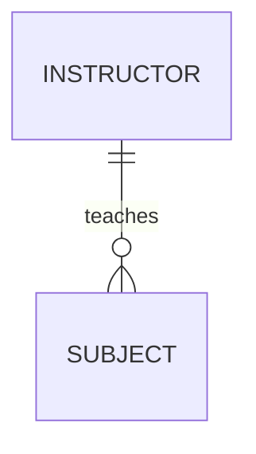
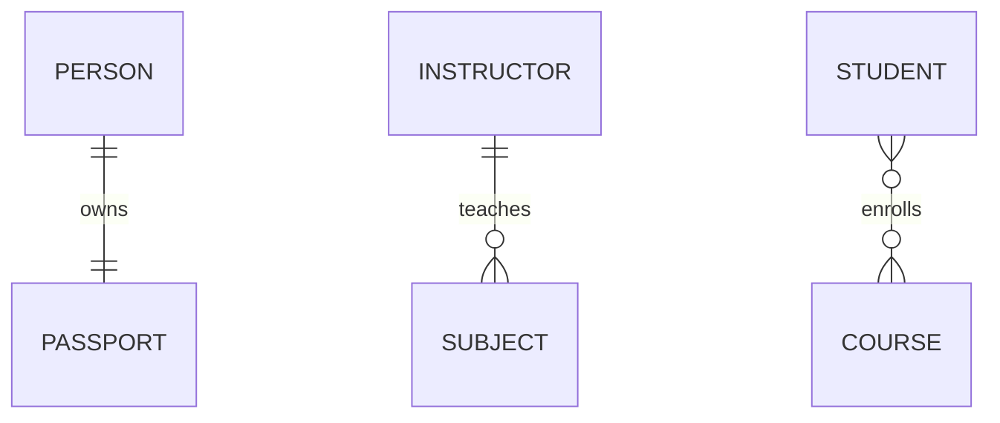
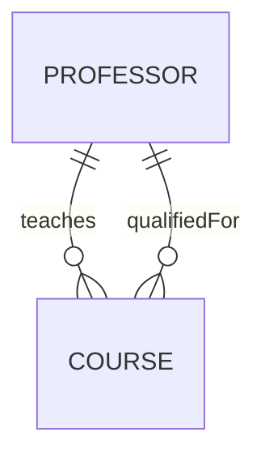
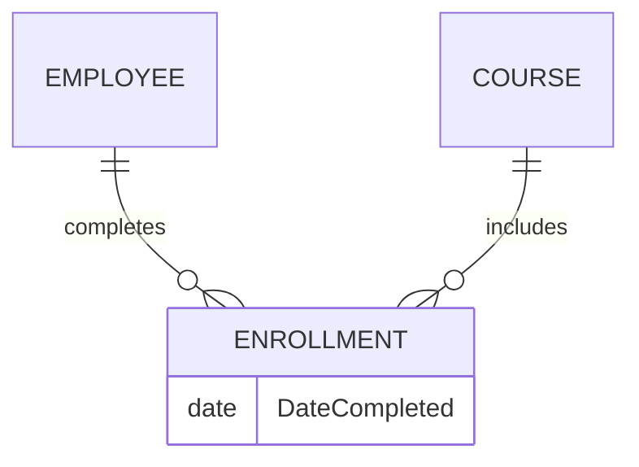
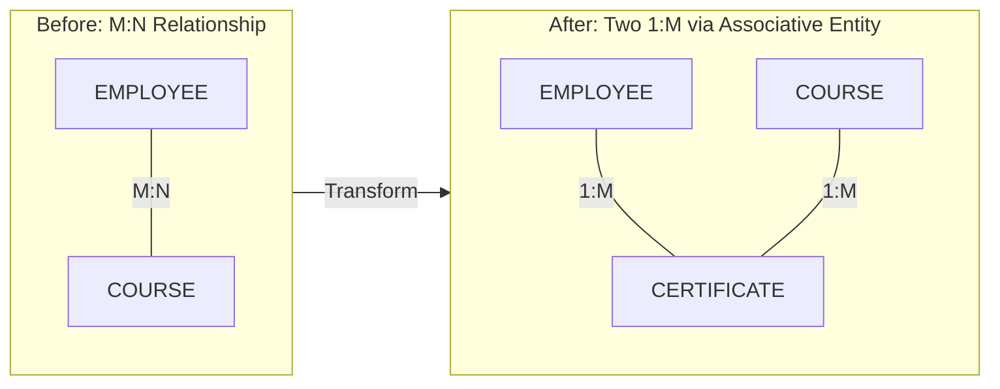
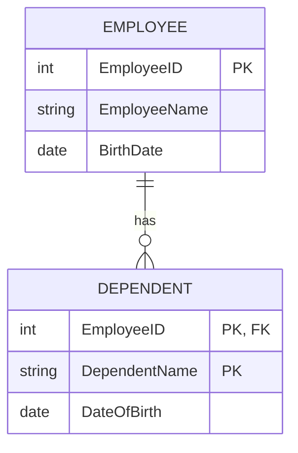
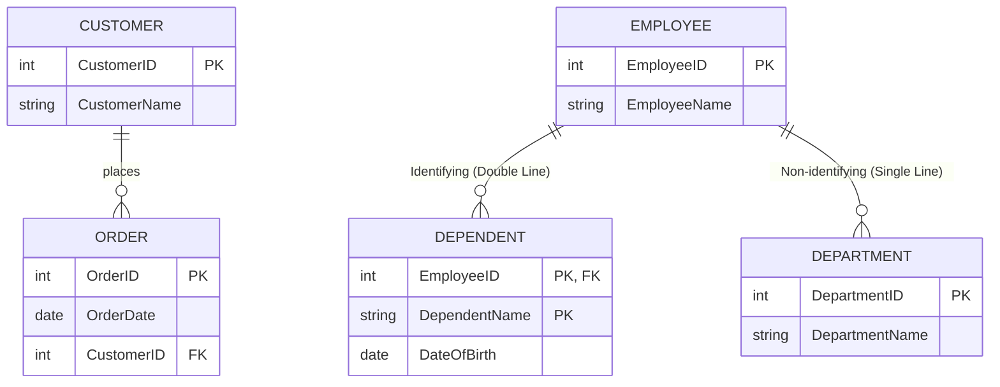
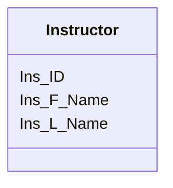

# Database Fundamentals - Summary
# 1. Introduction to DBMS and Data Modeling Part I

## 1.1 Introduction to Database Concepts

### 1. Business Rules (BR)

* Business rules define the structure and constraints of a business scenario in a database context.
* They help identify:

  * **Entities** (e.g., Member, Book)
  * **Attributes** (e.g., Title, Author)
  * **Relationships** (e.g., a member can rent many books)
  * **Identifiers** (e.g., membership number as a unique ID)

### 2. Primary Key (PK)

* A **Primary Key** uniquely identifies each record in a table.
* Example: A student’s unique ID (e.g., student number).
* In ERDs, PKs are **bolded and underlined**.

### 3. Foreign Key (FK)

* A **Foreign Key** is a reference to a Primary Key in another entity.
* It establishes **relationships** between tables (e.g., Rentals refer to both Member and Book).
* In ERDs, FKs are **implied by lines**, not listed as attributes.

### 4. Entity Relationship Diagrams (ERD)

* **Graphical representation** of a database model.
* Composed of:

  * **Entities**: collections of related attributes (e.g., Book, Member, Rental)
  * **Attributes**: individual data fields (e.g., name, DOB)
  * **Relationships**: how entities relate (e.g., a member rents a book)

---

# 2. Structured Query Language (SQL) - Data Definition Language (DDL) and Data Manipulation Language (DML)

## 2.1 DDL and DML
- **DDL commands**: CREATE, ALTER, DROP, RENAME
- **DML commands**:  INSERT, DELETE, UPDATE

### 1. Create Table and Constraints, and DROP

**Defines the structure of a table, including columns and constraints.**

```sql
CREATE TABLE Customer_T (
  CustomerID NUMERIC(4) NOT NULL,
  CustomerName VARCHAR(25),
  CustomerState CHAR(2),
  CONSTRAINT Customer_PK PRIMARY KEY (CustomerID)
);
```
A primary key constraint can be defined in two ways:
- Named constraint (out-of-line):
  - `CONSTRAINT Customer_PK PRIMARY KEY (CustomerID)`
  - This allows you to assign a custom name like Customer_PK, which is useful for clarity, maintenance, and future alterations
- Inline constraint:
  - `CustomerID NUMERIC(4) NOT NULL PRIMARY KEY`
  - This creates the constraint without a custom name. Instead, the database auto-generates a name. 
  - Less readable and harder to reference


**DROP table**

```sql
DROP TABLE Customer_T
```

### 2. Insert Data

**Adds new rows to a table.**

```sql
-- With specific columns
INSERT INTO Customer_T (CustomerID, CustomerName, CustomerState)
VALUES (1, 'Contemporary Casuals', 'NSW');

-- Without specifying columns (must match column order)
INSERT INTO Customer_T
VALUES (2, 'Home Furnishings', 'VIC');
```
- Without specify columns: Data that will be insert must match with all columns.
- With specify columns: Only specific columns will be insert. Columns that aren't define will result as "(NULL)"

### 3. Update Data

**Modifies existing data in a table.**

```sql
UPDATE Customer_T
SET CustomerName = 'Modern Interiors'
WHERE CustomerID = 2;
```


### 4. Delete Data

**Removes rows from a table.**

```sql
DELETE FROM Customer_T
WHERE CustomerID = 2;
```


### 5. Alter Table

**Modifies the structure of an existing table.**

```sql
-- Add a column
ALTER TABLE Customer_T ADD CustomerEmail VARCHAR(100);

-- Drop a column
ALTER TABLE Customer_T DROP COLUMN CustomerEmail;

-- Rename a column
ALTER TABLE Customer_T RENAME COLUMN CustomerName TO Name;

-- Change data type
ALTER TABLE Customer_T ALTER COLUMN Name TYPE VARCHAR(50);

-- Set a default value
ALTER TABLE Customer_T ALTER CustomerState SET DEFAULT 'NSW';

-- Drop default
ALTER TABLE Customer_T ALTER CustomerState DROP DEFAULT;

-- Add a unique constraint
ALTER TABLE Customer_T ADD CONSTRAINT Unique_Name_Street
UNIQUE (CustomerName, CustomerState);

-- Rename the table
ALTER TABLE Customer_T RENAME TO Customer_Main;
```


### 6. Composite Keys

**Combines multiple columns to form a single primary or foreign key.**

```sql
CREATE TABLE OrderLine_T (
  OrderID NUMERIC(5) NOT NULL,
  ProductID NUMERIC(4) NOT NULL,
  OrderedQuantity NUMERIC(10),
  PRIMARY KEY (OrderID, ProductID), -- Composite PK (auto-named)
  FOREIGN KEY (OrderID) REFERENCES Order_T(OrderID), -- FK1 (auto-named)
  FOREIGN KEY (ProductID) REFERENCES Product_T(ProductID) -- FK2 (auto-named)
);
```

- Use constraint for set the name manually
```sql
CONSTRAINT OrderLine_PK PRIMARY KEY (OrderID, ProductID),
CONSTRAINT FK_Order FOREIGN KEY (OrderID) REFERENCES Order_T(OrderID),
CONSTRAINT FK_Product FOREIGN KEY (ProductID) REFERENCES Product_T(ProductID)
```

### 7. Design Reminders

**Best practices when designing tables and relationships.**

* Create primary key tables before foreign key tables.
* Foreign key columns must match the data type of the referenced primary key.
* Use domain constraints:

```sql
State CHAR(2) CHECK (State IN ('NSW', 'VIC', 'QLD', 'SA', 'WA', 'ACT', 'NT'))
```

* Use `DEFAULT CURRENT_DATE` for automatic dates.


### 8. Foreign Key with Default Value

**Defines a foreign key and uses a default value for a column.**

```sql
CREATE TABLE Order_T (
  OrderID NUMERIC(5) NOT NULL,
  CustomerID NUMERIC(4),
  OrderDate DATE DEFAULT CURRENT_DATE,
  PRIMARY KEY (OrderID),
  FOREIGN KEY (CustomerID) REFERENCES Customer_T(CustomerID)
);
```


### 9. Querying Relationships

**Examples of retrieving data using PK–FK relationships.**

```sql
-- Retrieve all data from table
SELECT * FROM Order_T;

-- Retrieve some fields from table
SELECT field-1, field-2 FROM Order_T;

-- Retrieve all orders for CustomerID 1, allow: =, >, <, <=, >=, and, or
SELECT * FROM Order_T WHERE CustomerID = 1;

-- Count how many orders a customer has placed
SELECT COUNT(*) FROM Order_T WHERE CustomerID = 1;
```

---

# 3. Data Modeling Part II


## 3.1 Modeling Relationships

### Relationship 
<details>
<summary>1. Relationship Types vs. Relationship Instances</summary>
* **Relationship Type:** General pattern showing how two or more entities are related (e.g., "Instructor teaches Subject").
* **Relationship Instance:** Specific example of the relationship in the database (e.g., "Fahimeh teaches Database Fundamentals").
* Relationship type appears as **lines** in an ERD; instances are **rows in related tables**.

**Example**


</details>

<details>
<summary>2. Degree of Relationships</summary>
* **Degree:** Number of entity types involved in the relationship.

  * **Unary:** One entity related to itself.
  * **Binary:** Two entities involved.
  * **Ternary:** Three entities involved.

**Example**


</details>

<details>
<summary>3. Cardinality of Relationships</summary>
* **Cardinality:** Number of entity instances that can or must be associated.

  * **One-to-One (1:1):** Each record relates to only one in the other table.
  * **One-to-Many (1\:M):** One record relates to many others.
  * **Many-to-Many (M\:N):** Many records relate to many others.
* **Minimum cardinality:** Optional (0) or mandatory (1+).
* **Maximum cardinality:** Maximum allowed links.

**Example**


</details>

<details>
<summary>4. Multiple Relationships Between Entities</summary>
* Two entities can have more than one type of relationship at the same time.
* Example: A professor can **teach courses** and also be **qualified to teach** other courses.
* May include additional rules, like minimum numbers.

**Example**


</details>

<details>
<summary>5. Relationships with Attribute(s)</summary>
* A relationship can have its own attributes.
* Example: "DateCompleted" in the relationship between Employee and Course.
* These attributes describe **the association itself**, not the entities.

**Example**



</details>


### Associative Entity – Combination of Relationship and Entity
<details>
<summary>M:N Relationship -> Two 1:M relationships</summary>

* Converts an **M\:N relationship** into **two 1\:M relationships**.
  * Relational databases do not support M:N relationships directly.
  * Must break it down into two 1:M relationships using an associative entity
* Acts as both a relationship and an entity with attributes.
* Usually has a **composite primary key** from the related entities.

**Example**


</details>


### Multivalued Attributes Can be Represented as Relationships
<details>
<summary>Multivalued Attributes</summary>

* If an attribute can have multiple values, store it in a separate related table.
* Simple Multivalued Attributes:
  * 
* Composite Multivalued Attributes:
  * 

</details>


### Weak and Strong Entities – Identifying Relationship

* **Strong Entity:** Can exist independently; has its own PK.
* **Weak Entity:** Depends on a strong entity’s PK for identification; **cannot exist without it**.
* **Identifying Relationship:** Double line; connects strong to weak entity.
* Weak entity PK (Composite Key) = Strong entity PK + its own partial key.

**Example**




## 3.2 Notations

* **Crow’s Foot Notation** is commonly used in ERDs:
  * Boxes = Entities.
  * Lines = Relationships.
  * Symbols show cardinality (e.g., one, many).
* **Solid line:** Normal relationship.
* **Double line:** Identifying relationship (weak and strong entities).
* **Attributes:** Shown inside entity boxes; PKs underlined.

**Example**



---

# 4. Data Modeling Part III
## 4.1 Supertypes, Subtypes, Relationship

### Supertypes and Subtypes
* **Supertype**: general entity with common attributes.
* **Subtype**: subgroup with distinct attributes or relationships.
* **Attribute inheritance**: subtypes inherit all supertype attributes.
* Rule: create subtypes only if specific attributes/relationships exist.
* PK of supertype = also PK (and FK) in each subtype.

#### Example Cases
<details>
<summary>Vehicles: CAR, TRUCK share attributes → VEHICLE supertype</summary>


</details>


### Relationships and Subtypes

<details>
<summary>All subtypes share a relationship & Only some subtypes have unique relationships</summary>

* If all subtypes share a relationship → define at **supertype level**.
  * All `PATIENT` is cared for `RESPONSIBLE PHYSICIAN`
* If only some subtypes have unique relationships → define at **subtype level**.
  * `RESIDENT PATIENT` is (only) assigned to `BED`

</details>


### Generalization vs Specialization

* **Generalization** (bottom-up): combine similar entity sets into a more general supertype
  * `Car, Truck -> Vehicle`
* **Specialization** (top-down): create subtypes from a supertype.
  * Top-down process: start from a supertype and define one or more subtypes that capture distinct attributes/relationships.

<details>
<summary>Specialization to MANUFACTURED PART and PURCHASED PART</summary>


* Example: PART specialized into MANUFACTURED PART and PURCHASED PART.
* Issues: multivalued attributes and data duplication → solved with **associative entities** (e.g., SUPPLIES linking PART and SUPPLIER).
</details>


### Constraints in Supertype/Subtype Relationships

<details>
  <summary>Disjoint vs Overlap and Total vs Partial Specialization</summary>

- Disjoint vs Overlap:
  - **Disjoint (D)**: An entity can belong to only one subtype. Example: A Vehicle is either a Car or a Truck, not both.
  - **Overlap (O)**: An entity can belong to multiple subtypes. Example: A Person could be both a Student and an Employee.
- Total vs Partial Specialization:
  - **Total specialization (T)**: Every entity in the supertype must belong to at least one subtype. Example: Every Employee must be either a SalariedEmployee or an HourlyEmployee.
  - **Partial specialization (P)**: Some entities in the supertype may not belong to any subtype. Example: A Vehicle may be a Car, or a Truck, or just a Vehicle with no subtype.
</details>

<details>
<summary>Completeness Constraint</summary>

Determines whether every instance of a supertype must belong to a subtype.

* **Total Specialization (Double Line)**: Every supertype instance must be in at least one subtype.
  * 
* **Partial Specialization (Single Line)**: Some supertype instances may not belong to any subtype.
  * 
</details>

<details>
<summary>Disjointness Constraint</summary>

Determines whether a supertype instance can belong to one or more subtypes at the same time.

* **Disjoint Rule**: A supertype instance can be a member of only one subtype.
  * 
* **Overlap Rule**: A supertype instance can belong to multiple subtypes.
  * 
</details>

<details>
<summary>Subtype Discriminator</summary>

An attribute of the supertype used to decide which subtype(s) an instance belongs to.

* **Disjoint Case**: A simple attribute with alternative values (e.g., Type = \{Car, Truck\}).
  * 
* **Overlap Case**: A composite attribute (set of Boolean flags) where each flag shows whether the instance belongs to that subtype (e.g., Is_Student = Y/N, Is_Employee = Y/N).
  * 
  * Example: 
    * Employee_Type ∈ `{H, S, C}` tells us if EMPLOYEE is Hourly, Salaried, or Consultant
    * Example: H? S? C? with Y/N values.
    * YNY = employee is Hourly and Consultant.
    * NYN = employee is only Salaried.

</details>

---

# 5. Convert ERD to Relations
## 5.1 Relational Model
### Components of relational model

- **Data Structure**: Tables (relations), rows, and columns.
- **Data Manipulation**: SQL operations (queries, inserts, updates).
- **Data Integrity**: Rules to maintain accuracy (primary key, foreign key, constraints).

### Relations (Table)

- A relation = named table with rows and columns.
- Requirements to qualifty table as relation:
  - Unique table name.
  - Atomic attribute values (no multivalued/composite).
  - Unique rows.
  - Unique column names.
  - Order of rows/columns irrelevant.

#### Relational Model Concepts Correspond to E-R Model

<details>
  <summary>Entity to Relation</summary>

* Relations (tables) correspond with entity types and with many-to-many relationship types.
* Rows correspond with entity instances and with many-to-many relationship instances.
* Columns correspond with attributes.

**Entity types**

**Relations (tables)**

| Ins_ID | Ins_F_Name | Ins_L_Name |
|--------|------------|------------|
| 12548  | Danna      | Ramezani   |
| 45476  | Ricky      | Brown      |
| 14475  | Jack       | Cooper     |
</details>

### Integrity Constraints

#### 3 Types of Constraints
- **Domain Constraint**: Values in a column must come from the same domain (e.g., Student_ID must be 4-digit integer).
- **Entity Integrity**: PK must not be null.
- **Referential Integrity**: FK must match a valid PK value in another table.

#### Referential Integrity Rules (for deletes):
1. **Restrict** – prevent deleting parent if child rows exist.
2. **Cascade** – delete child rows automatically when parent is deleted.
3. **Set-to-Null** – set FK to null when parent is deleted (not allowed for weak/mandatory entities).

## 5.2 Transforming ERD into Relations

<details>
  <summary>Mapping ERD to Relations</summary>

- Simple attributes → direct columns.
  - 
- Composite attributes → break into component columns.
  - 
- Multivalued attributes → new table with FK back to main entity.
  - 
</details>

<details>
  <summary>Mapping Binary Relationships</summary>

- 1:M → PK of “one” side becomes FK in “many” side.
  - 
- 1:1 → PK of mandatory side becomes FK in optional side.
  - 
- M:N → Create new relation (associative entity) with composite PK from both sides.
  * 
</details>

<details>
  <summary>Mapping Ternary (and n-ary) Relationships</summary>
- 
- Create relation for each entity + one associative relation.
- Associative relation’s PK often includes multiple FKs (sometimes add surrogate key to simplify).
</details>

<details>
  <summary>Mapping Weak Entities</summary>
- 
- Weak entity becomes its own table.
- PK = Partial identifier + PK of strong entity (as FK).
- FK cannot be null (mandatory).
</details>

<details>
  <summary>Mapping Unary Relationships</summary>

- 
- 1:1 or 1:N → Recursive FK in the same table.
- M:N → Separate associative table with two FKs referencing same entity.
</details>

<details>
  <summary>Mapping Supertype/Subtype Relationships</summary>

- One table for supertype, one for each subtype.
- Supertype PK = PK for subtypes.
- Discriminator attribute indicates subtype category.
- Subtype relations hold only their specific attributes.
</details>

---

# 6. Functional Dependencies, and Normalization
## Week 5 Review "Relations":
- Show the primary key: `Underline it (bold too if want)`
- Have a composite primary key: `Underline the entire key`
- Show foreign keys: `Asterisk*`
- What if it’s a composite FK? (if the PK of the entity you’re getting it from is a composite PK): `Put them around brackets, and asterisk*`, Example: Prescription(DrugNo *, (PatID,PatCID)*,Amount) 

## 6.0 Key in Database
- Super Key: Any set of attributes that uniquely identifies a row.
  - Example: `{StudentID}, {StudentID, Email}, {StudentID, Name, DOB}`
- Candidate Key: Minimal super key (no unnecessary attributes).
  - Example: `{StudentID}, {Email}`
- Primary Key: Chosen candidate key that uniquely identifies rows. Must be unique and non-null.
  - Example: `{StudentID}`

## 6.1 Functional Dependencies
$$\text{SubjectID} \implies \text{SubjectDuration, SubjectName}$$
- Know the exact, specific, single VALUE of SubjectDuration, SubjectName if you know the VALUE of SubjectID
- Come from business rule and forms
- Values of Left Side uniquely identifies the values of the Right Side

### Partial and Transitive Functional Dependencies
- Partial Functional Dependency: depends on part of a composite key.
  - Definition: When a non-key attribute depends on part of a composite primary key, not the whole key.
  - Example:
    `OrderLine(OrderID, ProductID, Quantity, ProductName)`
    - Primary Key = `(OrderID, ProductID)`
    - `ProductName` depends only on `ProductID` (part of the key). -> This is a partial dependency.
- Transitive Functional Dependency: depends on another non-key attribute.
  - Definition: When a non-key attribute depends on another non-key attribute, not directly on the primary key.
  - Example:
    `Order(OrderID, CustomerID, CustomerName)`
    - Primary Key = `OrderID`
    - `CustomerName` depends on `CustomerID`, which depends on `OrderID`. -> This is a transitive dependency.


## 6.2 Normalising Relation: 1NF, 2NF, 3NF
### Normal Form
<details>
  <summary>A relation is in 1NF (1st Normal Form) if</summary>

- Rule:
  - No repeating groups or multi-valued attributes.
  - Every attribute must be atomic (cannot be split further).
  - No derived attributes.
- Example (Not in 1NF):
```scss
STUDENT(StudentID, Name, Subjects)
```
- Subjects might store multiple values like \{Math, Physics, English\}. That breaks 1NF because Subjects is not atomic.
- Example (1NF):
```scss
STUDENT(StudentID, Name, Subject)
```
</details>

<details>
  <summary>A relation is in 2NF (2nd Normal Form) if</summary>

- Rule:
  - Must already be in 1NF.
  - Remove **Partial Dependencies**
    - Partial Dependency: When you have dependencies on only PART of the PK
      - Can happen if you have a Composite PK  (e.g. PatID, PatCID) 
    - Every non-key attribute has to be fully functionally dependent on the ENTIRE primary key
- Example (Not in 2NF):
  - OrderDate depends only on OrderID.
  - ProductName depends only on ProductID.
  - These are partial dependencies.
```scss
ORDER_LINE(OrderID, ProductID, OrderDate, ProductName, Quantity)
PK = (OrderID, ProductID)
```
- Convert to 2NF:
  - Why: Splitting removes redundancy (e.g., product names repeated for every order line).
```scss
ORDER(OrderID, OrderDate)
PRODUCT(ProductID, ProductName)
ORDER_LINE(OrderID, ProductID, Quantity)
```
</details>

<details>
  <summary>A relation is in 3NF (3rd Normal Form) if</summary>

- Rule:
  - Must already be in 2NF.
  - Remove **transitive dependencies**
    - Transitive Dependency: When you have dependency on a NON-KEY attribute.
    - We don't want functional dependencies on non-primary-key attributes
- Example (Not in 3NF):
  - DeptName depends on DeptID (a non-key attribute). 
  - This is a transitive dependency.

```scss
EMPLOYEE(EmpID, EmpName, DeptID, DeptName)
PK = EmpID
```

- Convert to 3NF:
  - Why: Avoids repeating department names for every employee and keeps department data consistent.
```scss
EMPLOYEE(EmpID, EmpName, DeptID)
DEPARTMENT(DeptID, DeptName)
```

</details>

---

# 7. SQL I
## 7.1 Simple Query

### Subject Context
* This lecture follows earlier weeks on ERD, keys, functional dependencies, and normalization.
* It introduces SQL, focusing on **Data Manipulation Language (DML)** with queries.

### Objectives

* Understand and write simple SQL queries.
* Learn the structure and order of the `SELECT` statement.
* Use clauses: `SELECT`, `FROM`, `WHERE`, `ORDER BY`, `GROUP BY`, `HAVING`.
* Apply aggregate functions.
* Understand SQL processing order.
* Work with views.

### The SELECT Statement

#### Structure

```sql
SELECT column1, column2
FROM table_name
WHERE condition
GROUP BY column1
HAVING condition
ORDER BY column1;
```

* **SELECT** → choose columns or expressions to return.
* **FROM** → specify tables or views.
* **WHERE** → filter rows.
* **GROUP BY** → categorize results.
* **HAVING** → filter groups (like `WHERE`, but for groups).
* **ORDER BY** → sort the results.

#### Examples

* `SELECT * FROM product_t;` → returns all rows and columns.
* `SELECT productdescription, productfinish FROM product_t;` → returns selected columns.


### Eliminating Duplicates

* Use `DISTINCT` to remove duplicate values.

```sql
SELECT DISTINCT productfinish FROM product_t;
```

### WHERE Clause

* Filters rows using conditions.
* Supports operators:

  * Comparison: `=, >, <, >=, <=`
  * Range: `BETWEEN`
  * Logical: `AND, OR, NOT`
  * Pattern matching: `LIKE`
  * Null checking: `IS NOT NULL`
  * Membership: `IN`

**Examples:**

* `WHERE productstandardprice > 275`
* `WHERE productdescription LIKE '%Table'`
* `WHERE customerstate IN ('FL','TX','CA')`

### Boolean Logic

* Operator precedence:

  1. Parentheses `()`
  2. `NOT`
  3. `AND`
  4. `OR`
* Parentheses can override default precedence.

### ORDER BY

* Sort results ascending (`ASC`, default) or descending (`DESC`).
* Can sort by multiple columns.

```sql
ORDER BY customerstate ASC, customername DESC;
```

### Aggregate Functions

* Summarize data.
* Common functions: `AVG`, `SUM`, `MIN`, `MAX`, `COUNT`.

**Examples:**

* `SELECT AVG(productstandardprice) FROM product_t;`
* `SELECT COUNT(*) FROM product_t;`


### GROUP BY

* Groups rows by column(s) and applies aggregate functions.
* **Rule 1:** Columns in `SELECT` must also appear in `GROUP BY` (unless used with aggregates).
* **Rule 2:** Non-grouped columns must use aggregate functions.

**Example:**

```sql
SELECT customerstate, COUNT(customerstate)
FROM customer_t
GROUP BY customerstate;
```

### HAVING

* Filters groups after aggregation.
* Example:

```sql
SELECT customerstate, COUNT(customerstate)
FROM customer_t
GROUP BY customerstate
HAVING COUNT(customerstate) > 1;
```

### SQL Statement Processing Order

1. `FROM`
2. `WHERE`
3. `GROUP BY`
4. `HAVING`
5. `SELECT`
6. `ORDER BY`

### Views

* Virtual tables created by queries.
* **Dynamic View:** Not stored on disk, always up to date, but slower.
* **Materialized View:** Stored on disk, faster but requires refresh.

**Syntax:**

```sql
CREATE VIEW ViewName AS
SELECT * FROM product_t;
```


## 7.2 Key Takeaways

* SQL queries are built using structured clauses.
* `WHERE` filters rows; `HAVING` filters groups.
* Aggregates summarize data, often with `GROUP BY`.
* Views provide simplified or customized data access.
* Always remember the **processing order** of SQL statements.

---

# 8. SQL II
## 8.1 Formula and Explanation

### Diagram
<details>
  <summary>Diagram of JOIN</summary>


</details>

### INNER JOIN

**Formula:**

```sql
SELECT *
FROM TableA
INNER JOIN TableB
ON TableA.col = TableB.col;
```

**Explanation:**
Returns only rows where values match in both tables.

**Example:** Customers who have placed orders.

```sql
SELECT c.CustomerID, c.Name, o.OrderID
FROM Customer c
INNER JOIN Order o
ON c.CustomerID = o.CustomerID;
```

### LEFT OUTER JOIN

**Formula:**

```sql
SELECT *
FROM TableA
LEFT JOIN TableB
ON TableA.col = TableB.col;
```

**Explanation:**
All rows from the **left table** are returned. If there’s no match in the right table, `NULL` fills the missing values.

**Example:** Show all customers, even those with no orders.

```sql
SELECT c.CustomerID, c.Name, o.OrderID
FROM Customer c
LEFT JOIN Order o
ON c.CustomerID = o.CustomerID;
```

### RIGHT OUTER JOIN

**Formula:**

```sql
SELECT *
FROM TableA
RIGHT JOIN TableB
ON TableA.col = TableB.col;
```

**Explanation:**
All rows from the **right table** are returned, with `NULL` for missing left-side matches.

**Example:** Show all orders, even if some do not have a customer record.

```sql
SELECT c.CustomerID, c.Name, o.OrderID
FROM Customer c
RIGHT JOIN Order o
ON c.CustomerID = o.CustomerID;
```

### FULL OUTER JOIN

**Formula:**

```sql
SELECT *
FROM TableA
FULL OUTER JOIN TableB
ON TableA.col = TableB.col;
```

**Explanation:**
Returns all rows from both tables. Matches are combined; unmatched rows show `NULL`.

**Example:** Show all customers and all orders, matched where possible.

```sql
SELECT c.CustomerID, c.Name, o.OrderID
FROM Customer c
FULL OUTER JOIN Order o
ON c.CustomerID = o.CustomerID;
```

### CROSS JOIN (Cartesian Product)

**Formula:**

```sql
SELECT *
FROM TableA
CROSS JOIN TableB;
```

**Explanation:**
Pairs every row in the first table with every row in the second. Can generate very large results.

**Example:** Combine every customer with every product.

```sql
SELECT c.Name, p.ProductName
FROM Customer c
CROSS JOIN Product p;
```

#### 2 style of queries for CROSS JOIN

1. Using CROSS JOIN
```sql
SELECT s1.stafName, s1.stalname, s1.staCSalary
FROM staff s1
CROSS JOIN staff s2
WHERE s2.staId = 'S632'
  AND s1.staCSalary > s2.staCSalary;
```
2. Using comma (old-style join syntax)
```
SELECT s1.stafName, s1.stalname, s1.staCSalary
FROM staff s1, staff s2
WHERE s2.staId = 'S632'
  AND s1.staCSalary > s2.staCSalary;
```

### SELF JOIN

**Formula:**

```sql
SELECT e.EmployeeID, e.Name, m.Name AS Manager
FROM Employee e
INNER JOIN Employee m
ON e.ManagerID = m.EmployeeID;
```

**Explanation:**
A table joins with itself using aliases. Useful for hierarchical data.

**Example:** Employees with their managers.


### NATURAL JOIN (not recommended)

**Formula:**

```sql
SELECT *
FROM TableA
NATURAL JOIN TableB;
```

**Explanation:**
Automatically joins on columns with the same name. Can cause unexpected results. Explicit `INNER JOIN` is safer.

### UNION

**Formula:**

```sql
SELECT col1, col2 FROM TableA
UNION
SELECT col1, col2 FROM TableB;
```

**Explanation:**
Combines the results of two queries. Removes duplicates unless `UNION ALL` is used.

**Example:** List all customer IDs from two different tables.

```sql
SELECT CustomerID FROM OnlineCustomer
UNION
SELECT CustomerID FROM StoreCustomer;
```

---

# 9. SQL III
## 9.1 Subquery

### Subquery definition
* A subquery is a query inside another query. Also called nested queries.
* Only appear inside from below clauses:
  * `FROM` → acts like a temporary table.
  * `WHERE` → used as a condition.
  * `HAVING` → used to filter groups.

* Types of subqueries
  * Uncorrelated (simple) → runs once, result is reused by the outer query.
  * Correlated (advanced, next week) → runs once for every row in the outer query.

### Example of Subquery

* SQL runs the innermost subquery first, then moves outward.
* Example:

```sql
SELECT ProductName
FROM ProductTable
WHERE ProductPrice = (SELECT MAX(ProductPrice) FROM ProductTable);
```

  * Step 1: Find highest price.
  * Step 2: Use that number in the outer query to return the product.

### Subquery operators
* When a subquery returns multiple values, special operators are needed:
  * `IN` → checks if a value is in the list (`X IN (subquery)`)
  * `ANY` → true if at least one value matches (`X = ANY (subquery)`)
  * `ALL` → must match all values (`X >= ALL (subquery)`)

* Rules to remember:
  * `IN` = `ANY`
  * `NOT IN` = `<> ALL`
  * `ALL`/`ANY` work with comparisons `(<, >, =)`, but `IN` does not.

### Subquery vs. JOIN
* Use a JOIN → when you need columns from multiple tables at the same time.
* Use a subquery → when you want to filter using conditions, or find max/min.
* Subqueries are often simpler and more efficient, but not always.

### What should you take away from Week 9?

* By the end of this week, you should know:
  * ✅ What an uncorrelated subquery is.
  * ✅ Which parts of a query (FROM, WHERE, HAVING) can contain subqueries.
  * ✅ How to handle subqueries that return more than one row (using IN, ANY, ALL).
  * ✅ The execution order (inside → out).
  * ✅ When to use a subquery vs. join.

---

# 10. SQL IV
## 10.1 Correlated Subqueries

### Definition

* A **correlated subquery** is a subquery that depends on data from the outer query. 
* Unlike a simple (uncorrelated) subquery, which runs once and reuses its result, a correlated subquery executes **once for every row** in the outer query.

### Purpose

* Correlated subqueries are used when each row of the main query requires a **different calculation or comparison**.
* Such as comparing each staff member’s salary with the average salary in their own state.

**Example Comparison:**

1. *Show all staff with a salary above the average staff salary* → uses a **simple subquery** (same average for all).
2. *Show all staff with a salary above the average salary for the state where they live* → uses a **correlated subquery** (average differs by state).

### Step-by-Step Construction

**Example:** Show all staff with a salary above the average for their state.

1. **Alias the outer table**

   ```sql
   SELECT StaFName, StaLName, StaSalary, StaState  
   FROM Staff S1
   ```

   * The alias `S1` allows the outer table to be referenced inside the subquery.

2. **Create a simple subquery**

   ```sql
   WHERE StaSalary > (SELECT AVG(StaSalary) FROM Staff)
   ```

   * Calculates one overall average (not yet correlated).

3. **Add correlation (reference outer table)**

   ```sql
   WHERE StaSalary > (SELECT AVG(StaSalary)  
                      FROM Staff  
                      WHERE StaState = S1.StaState)
   ```

   * The subquery now recalculates the average salary **for each state** by using `S1.StaState` from the outer query.

**Full example of correlated subqueries**
```sql
SELECT 
    StaFName, 
    StaLName, 
    StaSalary, 
    StaState
FROM 
    Staff S1
WHERE 
    StaSalary > (
        SELECT AVG(StaSalary)
        FROM Staff
        WHERE StaState = S1.StaState
    );
```

### How It Works

* The SQL engine processes each row in the outer table.
* For each row, it substitutes that row’s state (e.g., `'VIC'`) into the subquery and calculates the average salary for that state.
* The comparison checks if the staff member’s salary is above the state’s average.
* This process repeats for every row.

**Example Result:**
Only staff with salaries higher than their state’s average are returned.

| StaFName | StaLName | StaSalary | StaState |
| -------- | -------- | --------- | -------- |
| Jordan   | Tuckson  | 170000    | VIC      |

