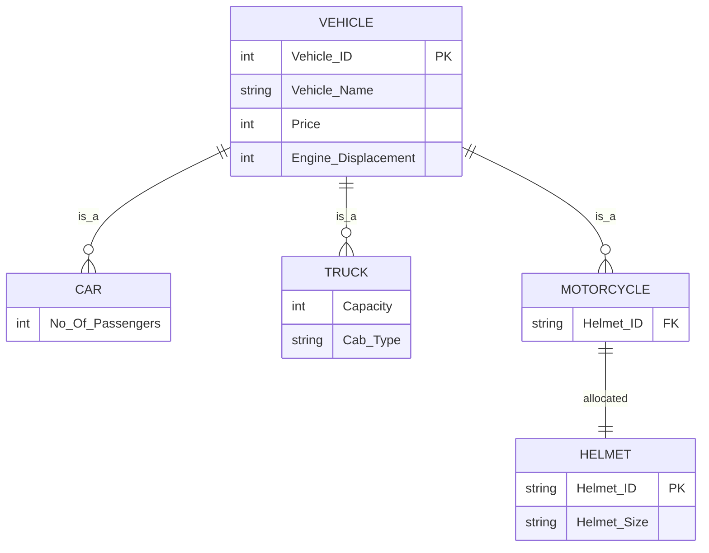
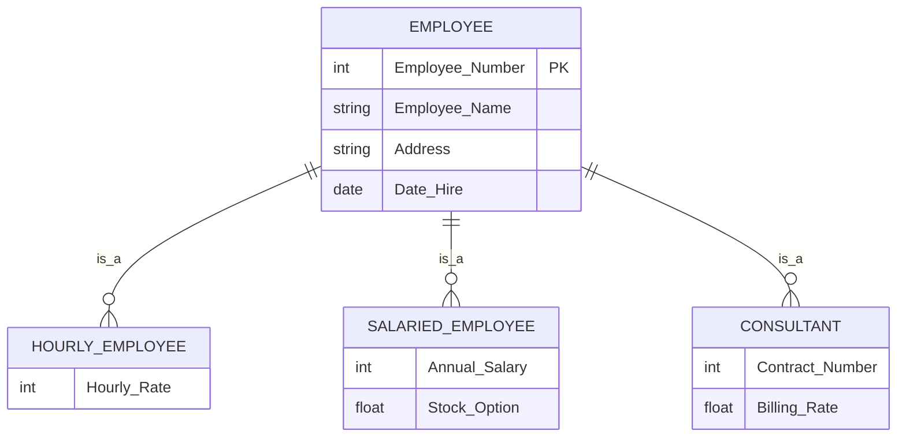
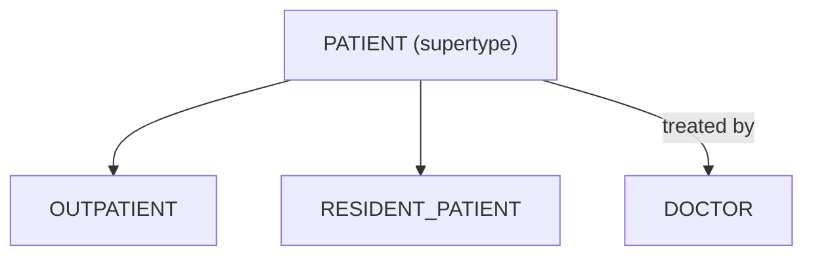
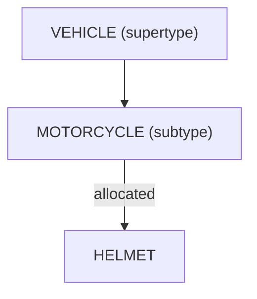
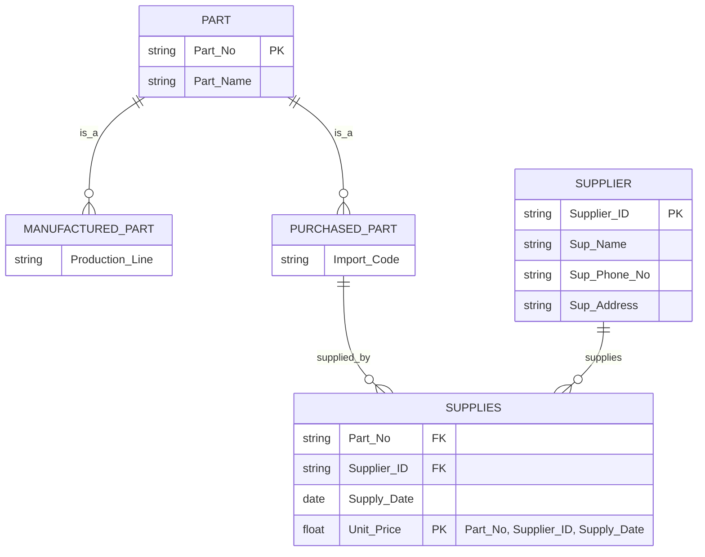

# Database Fundamentals - Summary
# 1. Introduction to DBMS and Data Modeling Part I

## Introduction to Database Concepts

### 1. Business Rules (BR)

* Business rules define the structure and constraints of a business scenario in a database context.
* They help identify:

  * **Entities** (e.g., Member, Book)
  * **Attributes** (e.g., Title, Author)
  * **Relationships** (e.g., a member can rent many books)
  * **Identifiers** (e.g., membership number as a unique ID)

### 2. Primary Key (PK)

* A **Primary Key** uniquely identifies each record in a table.
* Example: A student’s unique ID (e.g., student number).
* In ERDs, PKs are **bolded and underlined**.

### 3. Foreign Key (FK)

* A **Foreign Key** is a reference to a Primary Key in another entity.
* It establishes **relationships** between tables (e.g., Rentals refer to both Member and Book).
* In ERDs, FKs are **implied by lines**, not listed as attributes.

### **4. Entity Relationship Diagrams (ERD)**

* **Graphical representation** of a database model.
* Composed of:

  * **Entities**: collections of related attributes (e.g., Book, Member, Rental)
  * **Attributes**: individual data fields (e.g., name, DOB)
  * **Relationships**: how entities relate (e.g., a member rents a book)

---

# 2. Structured Query Language (SQL) - Data Definition Language (DDL) and Data Manipulation Language (DML)

## DDL and DML
- **DDL commands**: CREATE, ALTER, DROP, RENAME
- **DML commands**:  INSERT, DELETE, UPDATE

### 1. Create Table and Constraints, and DROP

**Defines the structure of a table, including columns and constraints.**

```sql
CREATE TABLE Customer_T (
  CustomerID NUMERIC(4) NOT NULL,
  CustomerName VARCHAR(25),
  CustomerState CHAR(2),
  CONSTRAINT Customer_PK PRIMARY KEY (CustomerID)
);
```
A primary key constraint can be defined in two ways:
- Named constraint (out-of-line):
  - `CONSTRAINT Customer_PK PRIMARY KEY (CustomerID)`
  - This allows you to assign a custom name like Customer_PK, which is useful for clarity, maintenance, and future alterations
- Inline constraint:
  - `CustomerID NUMERIC(4) NOT NULL PRIMARY KEY`
  - This creates the constraint without a custom name. Instead, the database auto-generates a name. 
  - Less readable and harder to reference


**DROP table**

```sql
DROP TABLE Customer_T
```

### 2. Insert Data

**Adds new rows to a table.**

```sql
-- With specific columns
INSERT INTO Customer_T (CustomerID, CustomerName, CustomerState)
VALUES (1, 'Contemporary Casuals', 'NSW');

-- Without specifying columns (must match column order)
INSERT INTO Customer_T
VALUES (2, 'Home Furnishings', 'VIC');
```
- Without specify columns: Data that will be insert must match with all columns.
- With specify columns: Only specific columns will be insert. Columns that aren't define will result as "(NULL)"

### 3. Update Data

**Modifies existing data in a table.**

```sql
UPDATE Customer_T
SET CustomerName = 'Modern Interiors'
WHERE CustomerID = 2;
```


### 4. Delete Data

**Removes rows from a table.**

```sql
DELETE FROM Customer_T
WHERE CustomerID = 2;
```


### 5. Alter Table

**Modifies the structure of an existing table.**

```sql
-- Add a column
ALTER TABLE Customer_T ADD CustomerEmail VARCHAR(100);

-- Drop a column
ALTER TABLE Customer_T DROP COLUMN CustomerEmail;

-- Rename a column
ALTER TABLE Customer_T RENAME COLUMN CustomerName TO Name;

-- Change data type
ALTER TABLE Customer_T ALTER COLUMN Name TYPE VARCHAR(50);

-- Set a default value
ALTER TABLE Customer_T ALTER CustomerState SET DEFAULT 'NSW';

-- Drop default
ALTER TABLE Customer_T ALTER CustomerState DROP DEFAULT;

-- Add a unique constraint
ALTER TABLE Customer_T ADD CONSTRAINT Unique_Name_Street
UNIQUE (CustomerName, CustomerState);

-- Rename the table
ALTER TABLE Customer_T RENAME TO Customer_Main;
```


### 6. Composite Keys

**Combines multiple columns to form a single primary or foreign key.**

```sql
CREATE TABLE OrderLine_T (
  OrderID NUMERIC(5) NOT NULL,
  ProductID NUMERIC(4) NOT NULL,
  OrderedQuantity NUMERIC(10),
  PRIMARY KEY (OrderID, ProductID), -- Composite PK (auto-named)
  FOREIGN KEY (OrderID) REFERENCES Order_T(OrderID), -- FK1 (auto-named)
  FOREIGN KEY (ProductID) REFERENCES Product_T(ProductID) -- FK2 (auto-named)
);
```

- Use constraint for set the name manually
```sql
CONSTRAINT OrderLine_PK PRIMARY KEY (OrderID, ProductID),
CONSTRAINT FK_Order FOREIGN KEY (OrderID) REFERENCES Order_T(OrderID),
CONSTRAINT FK_Product FOREIGN KEY (ProductID) REFERENCES Product_T(ProductID)
```

### 7. Design Reminders

**Best practices when designing tables and relationships.**

* Create primary key tables before foreign key tables.
* Foreign key columns must match the data type of the referenced primary key.
* Use domain constraints:

```sql
State CHAR(2) CHECK (State IN ('NSW', 'VIC', 'QLD', 'SA', 'WA', 'ACT', 'NT'))
```

* Use `DEFAULT CURRENT_DATE` for automatic dates.


### 8. Foreign Key with Default Value

**Defines a foreign key and uses a default value for a column.**

```sql
CREATE TABLE Order_T (
  OrderID NUMERIC(5) NOT NULL,
  CustomerID NUMERIC(4),
  OrderDate DATE DEFAULT CURRENT_DATE,
  PRIMARY KEY (OrderID),
  FOREIGN KEY (CustomerID) REFERENCES Customer_T(CustomerID)
);
```


### 9. Querying Relationships

**Examples of retrieving data using PK–FK relationships.**

```sql
-- Retrieve all data from table
SELECT * FROM Order_T;

-- Retrieve some fields from table
SELECT field-1, field-2 FROM Order_T;

-- Retrieve all orders for CustomerID 1, allow: =, >, <, <=, >=, and, or
SELECT * FROM Order_T WHERE CustomerID = 1;

-- Count how many orders a customer has placed
SELECT COUNT(*) FROM Order_T WHERE CustomerID = 1;
```

---

# 3. Data Modeling Part II


## 3.1 Modeling Relationships


### 1. Relationship Types vs. Relationship Instances

* **Relationship Type:** General pattern showing how two or more entities are related (e.g., "Instructor teaches Subject").
* **Relationship Instance:** Specific example of the relationship in the database (e.g., "Fahimeh teaches Database Fundamentals").
* Relationship type appears as **lines** in an ERD; instances are **rows in related tables**.

**Example**


### 2. Degree of Relationships

* **Degree:** Number of entity types involved in the relationship.

  * **Unary:** One entity related to itself.
  * **Binary:** Two entities involved.
  * **Ternary:** Three entities involved.

**Example**


### 3. Cardinality of Relationships

* **Cardinality:** Number of entity instances that can or must be associated.

  * **One-to-One (1:1):** Each record relates to only one in the other table.
  * **One-to-Many (1\:M):** One record relates to many others.
  * **Many-to-Many (M\:N):** Many records relate to many others.
* **Minimum cardinality:** Optional (0) or mandatory (1+).
* **Maximum cardinality:** Maximum allowed links.

**Example**


### 4. Multiple Relationships Between Entities

* Two entities can have more than one type of relationship at the same time.
* Example: A professor can **teach courses** and also be **qualified to teach** other courses.
* May include additional rules, like minimum numbers.

**Example**


### 5. Relationships with Attribute(s)

* A relationship can have its own attributes.
* Example: "DateCompleted" in the relationship between Employee and Course.
* These attributes describe **the association itself**, not the entities.

**Example**


### 6. Associative Entity – Combination of Relationship and Entity

* Converts an **M\:N relationship** into **two 1\:M relationships**.
* Acts as both a relationship and an entity with attributes.
* Usually has a **composite primary key** from the related entities.

**Example**


### 7. Multivalued Attributes Can be Represented as Relationships

* If an attribute can have multiple values, store it in a separate related table.
* Example: Employee skills.

**Example**


### 8. Weak and Strong Entities – Identifying Relationship

* **Strong Entity:** Can exist independently; has its own PK.
* **Weak Entity:** Depends on a strong entity’s PK for identification; **cannot exist without it**.
* **Identifying Relationship:** Double line; connects strong to weak entity.
* Weak entity PK (Composite Key) = Strong entity PK + its own partial key.

**Example**


## 3.2 Notations

* **Crow’s Foot Notation** is commonly used in ERDs:
  * Boxes = Entities.
  * Lines = Relationships.
  * Symbols show cardinality (e.g., one, many).
* **Solid line:** Normal relationship.
* **Double line:** Identifying relationship (weak and strong entities).
* **Attributes:** Shown inside entity boxes; PKs underlined.

**Example**


# 4. Data Modeling Part III

## Supertypes and Subtypes
* **Supertype**: general entity with common attributes.
* **Subtype**: subgroup with distinct attributes or relationships.
* **Attribute inheritance**: subtypes inherit all supertype attributes.
* Rule: create subtypes only if specific attributes/relationships exist.
* PK of supertype = also PK (and FK) in each subtype.

### Example Cases

* Vehicles: CAR, TRUCK, MOTORCYCLE share attributes → VEHICLE supertype.


* EMPLOYEE: Hourly, Salaried, Consultant → separate subtypes to avoid nulls in a single table.


## Relationships and Subtypes


* If all subtypes share a relationship → define at **supertype level**.


* If only some subtypes have unique relationships → define at **subtype level**.

---

## 6. Generalization vs Specialization

* **Generalization** (bottom-up): combine similar entity sets into a more general supertype
* **Specialization** (top-down): create subtypes from a supertype.
  * Top-down process: start from a supertype and define one or more subtypes that capture distinct attributes/relationships.


* Example: PART specialized into MANUFACTURED PART and PURCHASED PART.
* Issues: multivalued attributes and data duplication → solved with **associative entities** (e.g., SUPPLIES linking PART and SUPPLIER).

---

## 7. Constraints in Supertype/Subtype Relationships

* **Completeness Constraint**:

  * Total specialization → every supertype instance must belong to a subtype.
    * Every supertype entity must be in at least one subtype.
    * Example: Every EMPLOYEE must be either Hourly, Salaried, or Consultant.
    * No employee exists outside these three.
  * Partial specialization → some may not belong to any subtype.
    * Some supertype entities may not belong to any subtype.
    * Example: VEHICLE supertype with subtypes CAR and TRUCK.
    * A MOTORCYCLE might exist but not have special attributes → it stays only in VEHICLE.
* **Disjointness Constraint**:

  * Disjoint → instance belongs to only one subtype.
    * Example: An employee is either Hourly or Salaried or Consultant — but not two at once.
  * Overlapping → instance may belong to multiple subtypes.
    * Example: An employee can be both Salaried and a Consultant at the same time.
* **Subtype Discriminator**:

  * Attribute that decides subtype membership.
  * Can be simple (disjoint) or composite (overlapping).
  * Simple discriminator (for disjoint cases)
    * A single attribute in the supertype indicates the subtype.
    * Example: `Employee_Type ∈ {H, S, C}` tells us if EMPLOYEE is Hourly, Salaried, or Consultant.
  * Composite discriminator (for overlapping cases)
    * Multiple boolean attributes indicate membership in subtypes.
    * Example: `H? S? C?` with Y/N values.
    * `YNY` = employee is Hourly and Consultant.
    * `NYN` = employee is only Salaried.