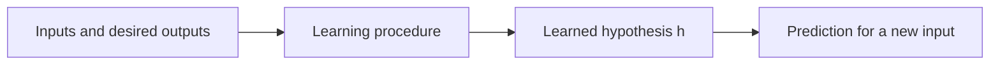

# Module 1 - Summary

# 1. Learning Models and the AI Trust Paradox

## 1.1 Main question and purpose

Purpose of this module

Machine learning can solve tasks that are difficult to program directly. This module asks what it means for a program to learn, why a learned function can work on new data, why its failures may still be difficult to trust, and when using ML is a good choice.

## 1.2 Good benchmark results do not settle the trust question

The notes contrast strong measured performance with hesitation to rely on learned systems. Autonomous driving and medical-image diagnosis are the main examples: a system may achieve impressive accident or detection metrics while users and clinicians remain skeptical. The point is about the *type* of error, not just the average error rate.

| Question | What a benchmark can show | What it may leave unanswered |
| --- | --- | --- |
| Reliability | How often the system errs on evaluated cases | Which new situations will cause an error |
| Severity | How costly an observed error is | Whether the same kind of error will recur |
| Explanation | Which output the model produced | Why it produced that output |

Illustrative performance and survey claims in this discussion lack complete citations. Treat them as motivation, not as independently verified facts.

## 1.3 Unpredictable and unexplainable failures

- **Unpredictable failure conditions:** a model may handle difficult cases yet fail after a small change, noise, or perturbation that a person would ignore.
- **Unexplainable failure reasons:** learned rules come from data, so a mistaken output may not map cleanly to one faulty component or one human-readable cause.
- **Downward spiral:** if a failure's cause is unclear, it is hard to identify when it will happen again or make a targeted, modular fix.

Learned systems can be strong but brittle, with limited causal understanding, hard-to-explain decisions, and no automatic formal guarantee of correct behavior in every case. A high average score does not remove these limits.

## 1.4 Why use learning-based solutions?

For many real-world tasks, we recognize a desired answer but cannot write a practical set of rules to produce it. A human can identify a cat, interpret a sentence, or notice an unusual sea or weather scene after experience, yet a list of pixel- or word-based `if/else` rules would be unwieldy.

Examples include visual recognition, natural-language understanding, medical diagnosis, game playing, and predicting currents, waves, or weather. Some tasks have known rules or physical laws but are too difficult or expensive to solve explicitly at the required scale. ML offers a way to learn a useful approximation from examples.

---

# 2. The Machine Learning Problem

## 2.1 Traditional programming versus supervised ML

| Traditional programming | Supervised machine learning |
| --- | --- |
| Humans specify rules or an algorithm | Humans specify the task, examples, and a model/learning procedure |
| Data and rules produce answers | Input-answer pairs help produce a learned function |
| The computation is designed directly | Parameters or rules are inferred from experience |

Learning the function does **not** mean the machine receives no design choices. We still choose the representation, learning procedure, data, and performance measure.

## 2.2 Task, performance measure, and experience

Tom Mitchell's framework describes learning with three elements:

- **Task $T$:** the activity to perform, such as classification, regression, or clustering. This module mainly develops the supervised input-to-output case.
- **Performance measure $P$:** the criterion used to decide whether performance improves. A learner needs a way to distinguish a useful function from a poor one.
- **Experience $E$:** data from previous instances of the task.

A program learns from $E$ with respect to $T$ and $P$ when its measured performance on $T$ improves with experience.

## 2.3 Supervised learning notation

- **Input space $\mathcal X$:** possible observed inputs, such as image pixels, text tokens, speech waveforms, sensor readings, or medical records.
- **Output space $\mathcal Y$:** desired targets, such as a cat/dog label, diagnosis, bounding box, or numerical value.
- **Training data $D$:** a finite set of paired examples.
- **Hypothesis $h$:** the learned function that maps an input to a predicted output.

$$
D=\{(x_i,y_i)\}_{i=1}^{N},
\qquad
h:\mathcal X\rightarrow\mathcal Y,
\qquad
h(x)\approx y.
$$

The goal is to predict correctly on inputs **not already in $D$**. Memorizing the pairs alone is not enough. A duck example conveys the same intuition: several observed cues help infer a label for a new animal.

## 2.4 The core difficulty: finite data to a function

The examples say what output is wanted at some locations in the input space, but they do not supply the full computational recipe or the output everywhere. Many different functions can agree on the observed examples and disagree elsewhere. To infer a useful function, a learner needs additional structure: a restricted family of hypotheses, regularity assumptions, or both.

### Three analogies for learning from sparse observations

1. **The sine function:** $\sin(x)$ can be described geometrically as the height of a point on the unit circle at angle $x$. This specifies the desired mapping without listing the arithmetic steps of an implementation.
2. **The heated disc:** boundary temperatures are known around a metal disc, while interior temperatures are unknown. Physics supplies a regularity principle: an interior temperature is related to the average of nearby temperatures. The boundary is a very small subset of the whole area, so extrapolating inward depends on that principle and boundary conditions. Without the physical assumptions, existence or uniqueness of an interior solution is not obvious. This local averaging principle connects to the Laplace/Poisson equations for heat diffusion.
3. **The spine pinned to a wall:** nailed points provide sampled $(x,y)$ positions, but many curves pass through them. Smoothness and material stiffness help determine a plausible shape between the points. Inferring the spine's height at an unobserved $x$ is a function-fitting problem.

These examples show that data specifies **desired values**, while regularity helps determine what happens between or beyond the observations.

## 2.5 Choosing a hypothesis from examples

Learning can be pictured as evaluating candidate hypotheses on the training set and selecting one that performs well. In practice, the candidate family and evaluation rule matter: a function that fits the available pairs may still behave badly on unseen inputs. The weighted-bits example in Section 4 shows a candidate family whose parameters can be estimated from data.

---

# 3. The Statistical Nature of Learning

## 3.1 An arbitrary function has too many possibilities

A function assigning an independent value to each of 11 inputs has 11 degrees of freedom. Refining the grid to 101 inputs gives 101 degrees of freedom. Over a continuous interval, an unrestricted function has infinitely many possible values. A finite dataset cannot pin down such a function without further assumptions.

Likewise, a mathematical formula or computer program must have a finite description. That finite description limits the functions it can represent. Different ML methods explore different subsets of all possible functions. The statistical approach is rigorous when its assumptions, performance criterion, and uncertainty bounds are stated clearly.

## 3.2 Regularity and hypothesis choice

Common choices favor functions with useful structure: smoothness, simple relationships, or similar outputs for similar inputs. The training pairs fix desired behavior at sampled locations; the chosen structure guides the behavior elsewhere.

An explicit formula or algorithm can be thought of as a compact description of behavior throughout the input space. A data-driven method instead describes behavior at finitely many points and uses its assumptions to extend beyond them. Both approaches impose structure; neither obtains an arbitrary function from finite information.

## 3.3 Training error, unseen-data error, and PAC learning

- **Training error $E_{\mathrm{in}}$:** mistakes on the examples used for learning.
- **Unseen-data error $E_{\mathrm{out}}$:** mistakes on new examples from the task setting.
- **Generalization:** achieving small unseen-data error rather than only small training error.

**PAC learning** means “Probably Approximately Correct.” An error tolerance $\epsilon$ says how accurate a learned function should be; a probability bound $\delta$ says how unlikely a bad result should be. One introductory expression is:

$$
P\bigl(\operatorname{error}(\hat h)>\epsilon\bigr)<\delta.
$$

A related expression concerns the gap between training and unseen-data error:

$$
P\bigl(\lvert E_{\mathrm{out}}-E_{\mathrm{in}}\rvert>\epsilon\bigr)
<\delta(N,\epsilon;\Theta).
$$

Here $N$ is the sample count and $\Theta$ denotes model or complexity parameters in this illustrative bound. A bound on the **gap** does not alone say that either error is small; the learner also needs good training performance. These formulas are an introduction to statistical learning theory, not a universal guarantee. Such guarantees require assumptions about the data, hypothesis class, and learning procedure.

---

# 4. A Concrete Example: Learning From Binary Strings

## 4.1 The task and examples

Consider labeled 16-bit binary strings. The input is a 16-bit string, and the output is a single bit, $0$ or $1$. At first, the rows look like opaque symbols to a machine.

A human splits each string into two 8-bit parts and interprets them as numbers, $x_0$ and $x_1$. Plotting the resulting number pairs reveals the label pattern: the boundary is a comparison between the two numbers.

## 4.2 The hand-discovered rule and the “cheat”

A hand-written program returns $0$ if $x_0<x_1$, and $1$ otherwise. This appears to learn a program from examples, but a person supplied the crucial insight: split the bits into two numbers, then compare them. The example asks how a learner can discover useful behavior without being handed that interpretation.

## 4.3 Representing the rule with weights

The comparison can be expressed as a weighted sum of all 16 input bits:

$$
s=\sum_{i=0}^{15}w_i x_i.
$$

If the first 8 bits encode $x_0$ and the last 8 encode $x_1$, one exact hand-derived weight vector is:

$$
w=(128,64,32,16,8,4,2,1,\ -128,-64,-32,-16,-8,-4,-2,-1).
$$

Then $s=x_0-x_1$, so $s<0$ means $x_0<x_1$. A learner can use the same weighted-sum form while estimating $w$ from examples instead of inserting the exact values by hand.

## 4.4 What the learned weights teach us

A plot of learned weights roughly separates positive contributions from the first half and negative contributions from the second half. The learned weights need not exactly match the expected powers of two; some important positions can appear weak or have surprising signs, while small weights may matter less to decisions.

The lesson is that the **model form** and the **learned parameters** are different things. A finite dataset can support a function that predicts the observed labels without recovering the precise human rule. This also connects back to interpretability: working predictions do not necessarily reveal a clean explanation of the underlying mechanism.

---

# 5. Conditions for Using Machine Learning

## 5.1 The three basic conditions

| Condition | Check before using ML | Counterexample |
| --- | --- | --- |
| A pattern exists | Is there a relationship between input and output that examples can reveal? | The next roll of a fair die or the next lottery number |
| Suitable data is available | Are there enough useful examples, and do they cover situations expected after deployment? | A dataset missing important deployment conditions |
| An explicit solution is difficult or impractical | Would writing or running known rules be too difficult, costly, or brittle? | Sorting a list with an established algorithm |

A task can be called “mechanical” when a pattern can be learned from examples, even if perfect prediction is impossible. Weather prediction, stock-price forecasting, and game strategy can be learnable without being certain. Astrology is an example without a dependable predictive pattern. $\sin(x)$ has an explicit mathematical definition, so learning an approximation would usually add little value. Data availability alone cannot make pure noise predictable.

ML can be computationally expensive and hard to interpret. Its benefits justify those costs when the three conditions hold.

## 5.2 Example scenarios

| Task | Example input | Desired output | Why ML may or may not fit |
| --- | --- | --- | --- |
| Cat detection | Image pixels, e.g. a $224\times224\times3$ RGB array | “Cat” or “Not Cat” | Cats have visual patterns and labeled images exist; raw pixel rules are too complex to enumerate. |
| Steering control | Camera images, LiDAR points, speed, and current steering state | Steering, throttle, or braking adjustment | Driving has patterns and logged or simulated examples; decisions in changing traffic are context-dependent. |
| Spam detection | An email represented as word or subword token IDs | “Spam” or “Not Spam” | Language and intent have patterns, but simple keyword rules are brittle and spammers adapt. |
| Next-day temperature | Recent time-series measurements of temperature, pressure, humidity, wind, and cloud cover (roughly $7\times24\times5=840$ measurements) | A temperature value 24 hours ahead | Weather has physical and historical structure; solving the full equations at high resolution can be costly. |
| Sorting | An array of numbers | The ordered array | A clear, efficient, provably correct algorithm already exists; learning an approximation adds no useful benefit. |

For each candidate task, first define the actual input and target output, then ask whether the examples cover the intended use. A model trained on unrepresentative cases may generalize poorly even when it performs well on its training data.

---

# 6. Cheat Sheet and Key Takeaway

| Term | Remember |
| --- | --- |
| ML | Experience produces a task-performing function. |
| $T,P,E$ | Task, performance measure, experience. |
| $D=\{(x_i,y_i)\}$ | Finite labeled examples in supervised learning. |
| $h:\mathcal X\rightarrow\mathcal Y$ | Hypothesis mapping inputs to predicted outputs. |
| Regularity | Structure that helps infer values beyond observed points. |
| Generalization | Performance on new examples. |
| PAC | A framework for high-probability, approximate correctness under stated assumptions. |
| Three use conditions | Pattern, suitable data, and no practical explicit solution. |

Machine learning turns examples into a function for a task. Its central challenge is extending finite observations to new cases. Its central practical decision is whether the data and learnable pattern are strong enough to justify a learned solution and its limits.
