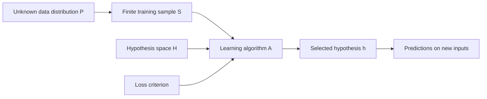

# Module 2 - Summary

# 1. The Statistical Learning Framework

## 1.1 Main question and purpose

Purpose of this module

Module 1 explained why learning from examples can be useful. Module 2 turns that idea into a mathematical and computational system: where examples come from, which functions may be learned, how candidate functions are scored, and how a learning algorithm searches for one.

## 1.2 Four components of a learning system

| Component | Example symbol | Role |
| --- | --- | --- |
| Data distribution and sample | $P_D$ or $P$; training set $S$ | Source of input-output examples |
| Hypothesis space | $\mathcal H$ | Candidate functions the learner may choose |
| Criterion or loss | $\ell$ | Measures the cost of predictions |
| Learning algorithm | $\mathcal A$ | Searches for a candidate with low measured loss |

The distribution belongs to the task setting. The learner observes samples from it rather than directly inspecting or setting the entire distribution. The hypothesis family, loss, and algorithm are design choices.

## 1.3 Three connected challenges

1. **Expressivity:** Does $\mathcal H$ contain functions rich enough to capture the relevant relationship?
2. **Generalization:** Will the selected function work on new examples from the task setting, rather than only on $S$?
3. **Optimization:** Can $\mathcal A$ efficiently find a good candidate according to the chosen loss?

Making the hypothesis family more expressive can fit complex patterns but also make overfitting or optimization harder. A more nuanced loss may better reflect the task while making the search more difficult. These choices interact.

---

# 2. Component One: Data and Distribution

## 2.1 Define input and output spaces

A learning problem begins by specifying its domain and codomain:

$$
f:\mathcal X\rightarrow\mathcal Y.
$$

- **Input space $\mathcal X$:** all valid inputs. A fixed-size color image may be modeled as a $256\times256\times3$ array; a house-price input with 10 numerical features may be modeled in $\mathbb R^{10}$. In a computer, the chosen format also determines how an input is encoded as bits.
- **Output space $\mathcal Y$:** all valid targets. Binary classification may use $\{0,1\}$, while scalar regression may use $\mathbb R$.
- **More complex outputs:** multi-class labels may use $\{1,\ldots,K\}$. Structured prediction may produce a word sequence, parse tree, or image, with dependencies and constraints inside the output.

Choosing $\mathcal X$ and $\mathcal Y$ is a modeling decision. It determines what the learned function can receive and produce.

## 2.2 The unknown joint distribution

Assume an unknown joint distribution $P$ over input-output pairs in $\mathcal X\times\mathcal Y$. It describes how cases arise in the intended task setting, including common cases and ambiguity.

- **Marginal distribution $P(x)$:** which inputs are likely. Natural images occupy a structured part of the space of all possible pixel arrays; random static is typically different.
- **Conditional distribution $P(y\mid x)$:** which outputs are likely for a given input. A clear cat image may strongly support “cat,” while a blurry image may admit uncertainty between labels.

The target relation need not be perfectly deterministic. Noise and ambiguous cases can remain even with a well-designed learner.

## 2.3 A finite training set is a sample, not the population

In practice, we do not see the whole distribution. We observe a finite sample:

$$
S=\{(x_i,y_i)\}_{i=1}^{m}.
$$

The introductory framework usually assumes the pairs are drawn **independently and identically distributed (i.i.d.)** from $P$. This is an assumption about how the sample relates to the wider task setting, not a fact guaranteed merely by collecting data.

- The **training set** is used to fit a model.
- An **unseen test set** estimates performance on new examples.
- The goal is performance on the distribution that matters after training.

A model can memorize $S$ and still fail on new examples. This resembles a student who memorizes a practice exam but cannot solve the final exam. Representative sampling and attention to deployment conditions are essential to generalization.

---

# 3. A Motivating Example: From Bits to a Program

## 3.1 Raw observations

The example supplies 16-bit binary inputs and 1-bit labels. The task is to infer a function that predicts a label for a new 16-bit string. Raw rows do not reveal their meaning immediately. This is the learning problem: observations are provided, but the generating rule is not.

## 3.2 Manual interpretation

A person hypothesizes that each input consists of two 8-bit numbers, $a_0$ and $a_1$. Converting the halves to decimal exposes a pattern:

| First number $a_0$ | Second number $a_1$ | Label $Y$ |
| ---: | ---: | ---: |
| 6 | 19 | 0 |
| 28 | 14 | 1 |
| 10 | 7 | 1 |
| 28 | 20 | 1 |
| 6 | 25 | 0 |

Plotting $a_0$ against $a_1$ gives a dividing line. The discovered rule is:

$$
Y=
\begin{cases}
1,&a_0\ge a_1,\\
0,&a_0<a_1.
\end{cases}
$$

A human can convert the observations into executable code by splitting the string, converting both halves to integers, and comparing them.

## 3.3 What manual discovery assumes

The person supplied prior knowledge of binary representation, arithmetic, and the 8+8 split. This is feature engineering and logic design. It works for the example, but it does not show how a machine would infer useful behavior without that insight, especially in a very high-dimensional problem.

## 3.4 “Lifting” the comparison into a numeric model

An 8-bit integer with bits $b_0,\ldots,b_7$ is:

$$
\operatorname{value}(b)=\sum_{j=0}^{7}b_j2^{7-j}.
$$

For input bits $x_0,\ldots,x_{15}$, the comparison score can be written as a weighted sum:

$$
s=a_0-a_1=\sum_{i=0}^{15}w_i x_i,
$$

with exact hand-derived weights:

$$
w=(128,64,32,16,8,4,2,1,\ -128,-64,-32,-16,-8,-4,-2,-1).
$$

Predict $1$ when $s\ge0$ and $0$ when $s<0$. This numeric representation contains the same comparison rule, including the tie case.

## 3.5 The template becomes a hypothesis family

The form $s=\sum_iw_ix_i$ can be used with many different weight vectors. The exact comparator is one member of that family; different weights give different functions. Statistical learning keeps the **template** but treats the weights as unknowns to infer from examples.

A generic fitting objective is:

$$
\hat w\in\operatorname*{arg\,min}_{w}
\sum_{i=1}^{m}\ell\bigl(f(x_i;w),y_i\bigr).
$$

Here $f(x_i;w)$ is the prediction and $\ell$ penalizes a mistake. Perceptron and logistic regression are two possible learning procedures for this sort of model; their algorithms are developed elsewhere.

## 3.6 Why learned weights may differ from logical weights

The example data contains small numbers, so the highest bit positions are always zero in the observed sample. Their weights do not affect the training predictions and may be left arbitrary by optimization. A model can fit the observed data while failing on a later input that uses those high bits, such as comparing 200 with 10.

The distinction is between **recovering an exact rule from prior knowledge** and **finding a function that fits the observed distribution**. The latter may generalize within a representative task distribution, but behavior outside the observed range is less constrained.

---

# 4. Component Two: The Hypothesis Space

## 4.1 Define the candidate functions

A hypothesis $h$ maps inputs to outputs. The hypothesis space $\mathcal H$ is the set of candidates a learning system is allowed to select:

$$
\mathcal H=\{h:\mathcal X\rightarrow\mathcal Y\text{ allowed by the chosen model form}\}.
$$

For a linear numerical model, an illustrative family is:

$$
\mathcal H=
\{h_{w,b}(x)=w\cdot x+b\mid w\in\mathbb R^d,\ b\in\mathbb R\}.
$$

The model form is chosen before fitting its parameters. This choice is a major source of structure in the learning problem.

## 4.2 Why restrict the family?

### Finite representation

An arbitrary mapping over a continuous domain can require infinitely many independent values. A computer has finite memory, so a learned function needs a finite description, such as program code or a finite vector of weights. A linear model, a decision-tree depth, or a neural-network architecture specifies a function template with a finite representation.

### Inductive bias

Restricting $\mathcal H$ assumes that the target has certain structure, such as linearity or smoothness. This is **inductive bias**: prior assumptions that help extrapolate beyond the sample. A constrained family is less able to memorize arbitrary examples, but it may also exclude the true relationship.

| Family choice | Possible benefit | Possible failure |
| --- | --- | --- |
| Too narrow | Simpler search and stronger structure | Underfitting: cannot express the relationship |
| Too broad | Can represent complicated patterns | Overfitting: may memorize $S$ and fail on new cases |

This tension connects to bias versus variance and underfitting versus overfitting. Choosing the family is a trade-off, not a guarantee that the true function lies inside it.

## 4.3 Examples of hypothesis spaces

- **Linear models:** relatively simple and interpretable, but limited for complex relationships.
- **Neural networks:** can express complex patterns; training and interpretation can be harder.
- **Decision trees:** capture nonlinear feature interactions; depth and tuning affect overfitting.
- **Other examples named:** kernel methods, nearest neighbors, and ensembles.

---

# 5. Component Three: Criterion, Loss, and Risk

## 5.1 Point-wise loss

A loss function measures the penalty for one prediction $h(x)$ against its target $y$:

$$
\ell(h(x),y).
$$

Two examples are:

$$
\ell_{0\text{-}1}(h(x),y)=
\begin{cases}
0,&h(x)=y,\\
1,&h(x)\ne y,
\end{cases}
\qquad
\ell_{\mathrm{sq}}(h(x),y)=(h(x)-y)^2.
$$

Zero-one loss counts classification mistakes. Squared loss is common for numeric regression and penalizes large deviations more strongly.

## 5.2 True risk: what we want to minimize

Point-wise losses can be combined into an expected score over the task distribution:

$$
R(h)=\mathbb E_{(x,y)\sim P}\left[\ell(h(x),y)\right].
$$

This **true risk** is the ideal criterion for generalization. Because $P$ is unknown, we normally cannot calculate it exactly. Even if it were known, the best function in $\mathcal H$ could still have nonzero risk because the family may be limited or outputs may be ambiguous.

## 5.3 Empirical risk: what the data lets us measure

The training set provides a sample average:

$$
\hat R_S(h)=\frac{1}{m}\sum_{i=1}^{m}\ell(h(x_i),y_i).
$$

This is **empirical risk**, often called training error for zero-one loss. It is a practical proxy for true risk, but it is measured on the same finite sample used to choose the model.

## 5.4 Empirical Risk Minimization (ERM)

ERM selects a candidate with the smallest empirical risk:

$$
\hat h\in\operatorname*{arg\,min}_{h\in\mathcal H}\hat R_S(h).
$$

The hope is that a well-chosen family, suitable sample, and enough examples make low empirical risk correspond to low true risk. Merely minimizing training error is not sufficient: an overly flexible family can overfit, and an unrepresentative sample can mislead the learner.

---

# 6. Component Four: Learning Algorithms and Optimization

## 6.1 The algorithm performs the search

The hypothesis space says **where** to search; the loss or risk says **which candidates look good**; the learning algorithm says **how to find one**:

$$
\mathcal A:S\rightarrow h_{\mathrm{final}}.
$$

The algorithm may find an exact minimum or an approximation. Its effectiveness depends on both the candidate family and the objective.

## 6.2 Choose a search strategy for the problem

- Some simple models have analytic solutions, such as a linear-regression normal equation under its usual conditions.
- A space may be **continuous**, such as real-valued neural-network weights, or **discrete**, such as tree rules.
- A loss landscape may be **convex**, where every local minimum is global, or **non-convex**, where many local minima or other difficult regions can occur.
- Possible techniques include simplex, interior-point methods, and evolutionary strategies; their mechanics are left for later topics.

There is no single optimization procedure suitable for every hypothesis space and objective.

## 6.3 Gradient descent as an iterative search

Gradient descent can be pictured as a hiker following the downhill slope of a loss landscape:

1. **Initialize** parameters at a starting point.
2. **Evaluate** the gradient, which indicates a local direction of increasing loss.
3. **Update** parameters by a small step in the opposite direction.
4. **Repeat** until a stopping condition is reached.

For differentiable empirical risk and parameter vector $w$, the standard update is:

$$
w_{t+1}=w_t-\eta\nabla_w\hat R_S(w_t),
$$

where $\eta$ is the step size. Gradients avoid enumerating every possible weight vector. In a non-convex landscape, reaching a flat point does not by itself prove that the global minimum was found.

---

# 7. Cheat Sheet and Key Takeaway

| Term | Remember |
| --- | --- |
| $\mathcal X,\mathcal Y$ | Defined input and output spaces |
| $P$ | Unknown joint distribution of task examples |
| $S$ | Finite observed training sample |
| $P(x),P(y\mid x)$ | Which inputs occur and how outputs depend on an input |
| i.i.d. | Introductory sampling assumption linking $S$ to $P$ |
| $\mathcal H$ | Candidate functions; chosen before fitting |
| Inductive bias | Structural assumption used to generalize |
| $\ell$ | Penalty for one prediction |
| $R(h)$ | Expected loss on the task distribution |
| $\hat R_S(h)$ | Average loss on the training sample |
| ERM | Choose a candidate that minimizes empirical risk |
| $\mathcal A$ | Procedure that searches for a learned hypothesis |
| Gradient descent | Repeated steps opposite the loss gradient |
| Three challenges | Expressivity, generalization, and optimization |

A statistical learning system is defined by its **data setting, hypothesis space, criterion, and algorithm**. The binary-string example shows why a model template helps turn a hand-written rule into a parameter-learning problem. The final goal remains low risk on new cases, not simply a perfect fit to the rows already observed.
