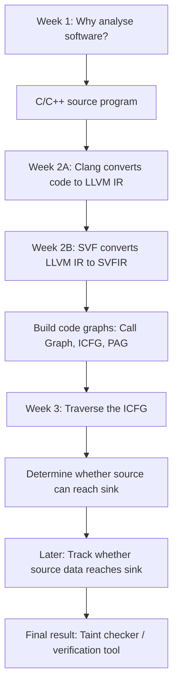
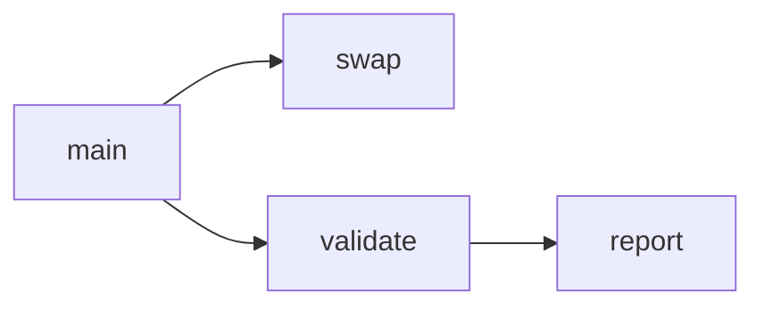
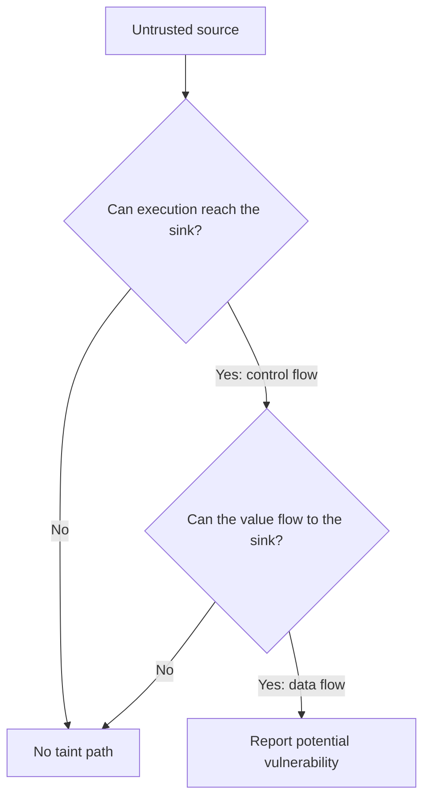

# 41128 - Summary
# 1. Introduction to Software Analysis and Verification
## 1.1 Main question and Purpose
<details>
    <summary>Week 1 - 3</summary>



</details>

<details>
    <summary>Purpose</summary>

* Main question
    * Why do we need software analysis?
* Large programs can contain problems such as:  
    * memory leaks
    * buffer overflows
    * uninitialised variables
    * use-after-free errors
    * security vulnerabilities
* It is difficult for developers to manually examine every possible path in a program containing thousands or millions of lines.
* Software analysis therefore uses algorithms and tools to automatically reason about program behaviour.
</details>

## 1.2 Static analysis versus dynamic analysis

| Static analysis                         | Dynamic analysis                                    |
| --------------------------------------- | --------------------------------------------------- |
| Examines code without running it        | Examines the program while it runs                  |
| Attempts to consider all possible paths | Only observes paths executed by the test inputs     |
| Can find problems before deployment     | Finds problems that actually occur during execution |
| May produce false alarms                | May miss untested problems                          |
| Used heavily in this subject            | Examples include testing, fuzzing and sanitizers    |

* A helpful way to remember this:
    * Static: “What might happen?”
    * Dynamic: “What happened during this execution?”

## 1.3 Software analysis versus software verification
* The slides distinguish them by their goal:
    * Software analysis: tries to find whether a bug may exist.
    * Software verification: tries to prove that a program satisfies its specification and that certain bugs cannot occur.

For example:
```c++
assert(x > 0);
```

The assertion is a small specification saying:

“Whenever execution reaches this line, x must be greater than zero.”

A static verification tool attempts to determine whether this assertion can ever fail without actually running the program.
## The two larger subject projects

<details>
    <summary>Project 1: Static taint checker</summary>

It tracks untrusted information from a source to a sink.

It needs:
1. C/C++ programming
2. LLVM IR
3. graph representations
4. control-flow analysis
5. data-flow analysis
6. taint-path detection and visualisation
</details>

<details>
    <summary>Project 2: Static symbolic execution</summary>

It reasons about possible values and program conditions to determine whether assertions can fail.

It needs:
1. LLVM IR and code graphs
2. control-flow reachability
3. constraint generation
4. a constraint or assertion solver
</details>

---
# 2. LLVM and SVF
## Purpose of 2A and 2B
<details>
    <summary>Purpose 2A</summary>

* Main question
    * How can an analysis tool understand C or C++ code consistently?
    * Directly analysing source code is difficult because source languages contain many complicated constructs.
    * Therefore, Clang translates C/C++ into a simpler, standard representation called LLVM Intermediate Representation, or LLVM IR.


</details>

<details>
    <summary>Purpose 2B</summary>

* Main question
    * How do we turn LLVM instructions into structures that analysis algorithms can easily use?
* LLVM IR is more manageable than C++, but it still contains many instruction types and compiler details.
* SVF provides another abstraction called SVFIR:

```
LLVM IR → SVFIR → code graphs → analysis algorithms
```

* SVFIR is built from LLVM IR. It does not independently replace LLVM IR.
</details>

## 2A. LLVM Compiler and LLVM IR
### What is LLVM IR?
LLVM IR is:

lower-level than C/C++
higher-level than machine code
strongly typed
language-independent
structured into modules, functions, basic blocks and instructions
designed to support compiler optimisation and program analysis

For example, a source-code expression:
```c++
a = b + c * d;
```
might be separated into simpler instructions:
```
t = c * d
a = b + t
```
Each instruction performs a small operation. That makes relationships between values easier for an analysis tool to follow.

### Static Single Assignment — SSA
LLVM IR generally uses Static Single Assignment form.

It means each LLVM variable is assigned only once.

Normal code:
```c++
x = 1;
x = x + 2;
```

SSA-style representation:
```
x1 = 1
x2 = x1 + 2
```

### LLVM IR Scopes and Identifier

<details>
    <summary>1. LLVM IR structure and scopes</summary>


```
Module
├── Global variables
└── Functions
    ├── Arguments
    └── Basic blocks
        └── Instructions
```

---
*  Module
    * A module represents one complete LLVM IR file or compilation unit.
    * It contains:
        * Global variables
        * Function definitions
        * Function declarations

<details>
    <summary>Example</summary>

```llvm
@counter = global i32 0

define i32 @main() {
    ret i32 0
}
```
Here, @counter and @main belong to the module.
</details>

---

* Function
    * A function contains:
        * Function parameters
        * One or more basic blocks
        * Local identifiers used by its instructions

```llvm
define i32 @add(i32 %x, i32 %y) {
entry:
    %result = add i32 %x, %y
    ret i32 %result
}
```

* In this example:
    * @add is the function.
    * %x and %y are arguments.
    * entry is a basic block.
    * %result is a local identifier.

---

* Basic block
    * A basic block is a continuous sequence of instructions.
    * A basic block:
        * Has one entry point
        * Runs instructions from top to bottom
        * Ends with a terminating instruction such as ret, br, or switch

```llvm
entry:
    %result = add i32 %x, %y
    ret i32 %result
```

* Both instructions belong to the entry block.

</details>

<details>
    <summary>2. LLVM identifiers: `@` versus `%`</summary>

* LLVM uses prefixes to show the scope of an identifier.

| Prefix             | Meaning           | Scope            | Examples                     |
| ------------------ | ----------------- | ---------------- | ---------------------------- |
| `@`                | Global identifier | Entire module    | `@main`, `@swap`, `@counter` |
| `%`                | Local identifier  | Current function | `%a`, `%b`, `%result`        |
| No prefix with `:` | Basic-block label | Current function | `entry:`, `if.then:`         |

---

* Global identifiers: @
    * Functions and global variables normally use @.
```llvm
@number = global i32 10

define i32 @main() {
    ret i32 0
}
```
* @number is a global variable.
* @main is a global function name.
They can be referenced from other functions in the module.

---

* Local identifiers: %
    * Function parameters and instruction results use %.

```llvm
define i32 @double(i32 %value) {
entry:
    %result = mul i32 %value, 2
    ret i32 %result
}
```

* `%value` and `%result` only exist inside @double.
* Another function may also have a `%result`; this is allowed because each function has its own local scope.
</details>

<details>
    <summary>Common LLVM IR instructions</summary>

* You do not need to memorise the entire LLVM language, but you should recognise:
| LLVM instruction | Simplified meaning                                |
| ---------------- | ------------------------------------------------- |
| `alloca`         | Create stack storage                              |
| `load`           | Read from memory                                  |
| `store`          | Write to memory                                   |
| `call`           | Call a function                                   |
| `ret`            | Return from a function                            |
| `br`             | Branch to another basic block                     |
| `icmp`           | Compare integer values                            |
| `phi`            | Combine values arriving from different paths      |
| `getelementptr`  | Calculate the address of a field or array element |

</details>


## 2B. SVFIR and Code Graphs
### Main question and What is SVFIR?
<details>
    <summary>Main question</summary>

* Main question
    * How do we turn LLVM instructions into structures that analysis algorithms can easily use?
* LLVM IR is more manageable than C++, but it still contains many instruction types and compiler details.
* SVF provides another abstraction called SVFIR:
```
LLVM IR → SVFIR → code graphs → analysis algorithms
```
* SVFIR is built from LLVM IR. It does not independently replace LLVM IR.
</details>

<details>
    <summary>What is SVFIR?</summary>

```
SVFIR = SVFValue + SVFVar + SVFStmt + Code Graphs
```
* In simpler language:
    * SVFValue: wrapper around an LLVM value
    * SVFVar: a program variable or memory object
    * SVFStmt: a relationship or operation between variables
    * Code graph: puts those items into a graph that an algorithm can traverse
* SVFIR simplifies complicated LLVM operations into a smaller number of analysis-friendly statements.
</details>

### Important SVF statements

| SVF statement | Simplified meaning                             |
| ------------- | ---------------------------------------------- |
| `AddrStmt`    | `p = &object`                                  |
| `CopyStmt`    | `p = q`                                        |
| `LoadStmt`    | `p = *q`                                       |
| `StoreStmt`   | `*p = q`                                       |
| `GepStmt`     | Address of an array element or structure field |
| `PhiStmt`     | Value comes from one of several paths          |
| `BranchStmt`  | Conditional control flow                       |
| `CallPE`      | Pass actual arguments into function parameters |
| `RetPE`       | Pass a returned value back to the caller       |


### The three most important graphs: "Call Graph", "Control-Flow Graph and ICFG", "Program Assignment Graph — PAG"

<details>
    <summary>1. Call Graph</summary>

A call graph provides a function-level view.


* Node = function
* Edge = one function may call another
---

* It answers:
    * “Which functions can call which other functions?”
* It does not show every statement inside the functions.
</details>

<details>
    <summary>2. Control-Flow Graph and ICFG</summary>

* A CFG describes the possible execution order of statements inside one function.
* An Interprocedural Control-Flow Graph, or ICFG, connects control flow across functions.
    * Node = instruction or statement
    * Edge = possible next execution step
* It answers:
    * “Can execution move from statement A to statement B?”

The ICFG is the graph used in Week 3.
</details>

<details>
    <summary>3. Program Assignment Graph — PAG</summary>

* The PAG represents relationships between variables and memory objects.
    * Node = variable or memory object
    * Edge = assignment, load, store, address relationship, etc.
* It helps answer:
    * “How can a value move from one variable or memory location to another?”

The PAG becomes particularly important for data-flow and pointer analysis.
</details>


---

# 3. Control-Flow Reachability
## 3.1 Main question
<details>
    <summary>Main question</summary>

* Main question
    * Given an ICFG, can one program statement reach another?
* Week 2 constructed the graph. Week 3 runs a graph traversal algorithm over it.

Suppose we have:
```c++
int bar(int value) {
    return value;
}

int main() {
    int a = source();

    if (a > 0) {
        int p = bar(a);    // call1
        sink(p);           // sink1
    } else {
        int q = bar(a);    // call2
        sink(q);           // sink2
    }
}
```
`bar()` is called from two different locations.

* The ICFG contains:
    * an edge from call1 into bar
    * an edge from call2 into bar
    * a return edge from bar back to ret1
    * a return edge from bar back to ret2

The key difficulty is ensuring that each call returns to the correct place.
</details>

## 3.2 Context-insensitive reachability and Context-sensitive reachability
### Context-insensitive reachability
<details>
    <summary>Context-insensitive reachability</summary>

* Context-insensitive analysis performs ordinary graph traversal, such as DFS.
* It asks:
    * “Is there any graph path from the source node to the sink node?”
* It does not remember which call site was used to enter a function.
* Therefore, it may incorrectly accept:
```
call1 → bar → ret2
```

or:

```
call2 → bar → ret1
```

* These paths exist in the general graph structure, but cannot happen during a real execution.
* They are called:
    * infeasible paths
    * invalid paths
    * spurious paths

---

* Advantages
    * simpler
    * faster
    * uses less memory
* Disadvantage
    * less precise
    * can report paths that cannot happen
    * can therefore produce false alarms
</details>

### Context-sensitive reachability

<details>
    <summary>Context-sensitive reachability</summary>

Context-sensitive analysis remembers the calling context.

It uses an abstract call stack:
```
Encounter call1 → push call1
Enter bar
Encounter return → it must match call1
Return through ret1
Pop call1
```

For the second call:
```
Encounter call2 → push call2
Enter bar
Encounter return → it must match call2
Return through ret2
Pop call2
```

Therefore:
| Path                 | Result   |
| -------------------- | -------- |
| `call1 → bar → ret1` | Feasible |
| `call2 → bar → ret2` | Feasible |
| `call1 → bar → ret2` | Rejected |
| `call2 → bar → ret1` | Rejected |

This is exactly how Week 3 connects to the ICFG created in Week 2.
---

Why the visited state includes the call stack
* In ordinary DFS, the visited set might contain only:
```
visited = {node}
```

* In context-sensitive analysis, it needs:
```
visited = {(node, call stack)}
```
* The same node inside bar() can be reached from different call sites. Therefore:
```
(bar node, [call1])
```
and:
```
(bar node, [call2])
```
* represent different analysis situations.

</details>

## 3.3 How everything connects to the taint checker
