# 41128 - Summary
# 1. Introduction to Software Analysis and Verification
## 1.1 Main question and Purpose
<details>
    <summary>Week 1 - 3</summary>

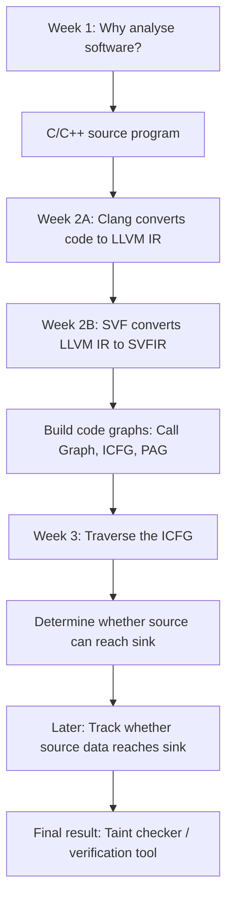

</details>

<details>
    <summary>Purpose</summary>

* Main question
    * Why do we need software analysis?
* Large programs can contain problems such as:  
    * memory leaks
    * buffer overflows
    * uninitialised variables
    * use-after-free errors
    * security vulnerabilities
* It is difficult for developers to manually examine every possible path in a program containing thousands or millions of lines.
* Software analysis therefore uses algorithms and tools to automatically reason about program behaviour.
</details>

## 1.2 Static analysis versus dynamic analysis

| Static analysis                         | Dynamic analysis                                    |
| --------------------------------------- | --------------------------------------------------- |
| Examines code without running it        | Examines the program while it runs                  |
| Attempts to consider all possible paths | Only observes paths executed by the test inputs     |
| Can find problems before deployment     | Finds problems that actually occur during execution |
| May produce false alarms                | May miss untested problems                          |
| Used heavily in this subject            | Examples include testing, fuzzing and sanitizers    |

* A helpful way to remember this:
    * Static: “What might happen?”
    * Dynamic: “What happened during this execution?”

## 1.3 Software analysis versus software verification
* The slides distinguish them by their goal:
    * Software analysis: tries to find whether a bug may exist.
    * Software verification: tries to prove that a program satisfies its specification and that certain bugs cannot occur.

For example:
```c++
assert(x > 0);
```

The assertion is a small specification saying:

“Whenever execution reaches this line, x must be greater than zero.”

A static verification tool attempts to determine whether this assertion can ever fail without actually running the program.
## The two larger subject projects

<details>
    <summary>Project 1: Static taint checker</summary>

It tracks untrusted information from a source to a sink.

It needs:
1. C/C++ programming
2. LLVM IR
3. graph representations
4. control-flow analysis
5. data-flow analysis
6. taint-path detection and visualisation
</details>

<details>
    <summary>Project 2: Static symbolic execution</summary>

It reasons about possible values and program conditions to determine whether assertions can fail.

It needs:
1. LLVM IR and code graphs
2. control-flow reachability
3. constraint generation
4. a constraint or assertion solver
</details>

---
# 2. LLVM and SVF
## Purpose of 2A and 2B
<details>
    <summary>Purpose 2A</summary>

* Main question
    * How can an analysis tool understand C or C++ code consistently?
    * Directly analysing source code is difficult because source languages contain many complicated constructs.
    * Therefore, Clang translates C/C++ into a simpler, standard representation called LLVM Intermediate Representation, or LLVM IR.


</details>

<details>
    <summary>Purpose 2B</summary>

* Main question
    * How do we turn LLVM instructions into structures that analysis algorithms can easily use?
* LLVM IR is more manageable than C++, but it still contains many instruction types and compiler details.
* SVF provides another abstraction called SVFIR:

```
LLVM IR → SVFIR → code graphs → analysis algorithms
```

* SVFIR is built from LLVM IR. It does not independently replace LLVM IR.
</details>

## 2A. LLVM Compiler and LLVM IR
### What is LLVM IR?
LLVM IR is:

lower-level than C/C++
higher-level than machine code
strongly typed
language-independent
structured into modules, functions, basic blocks and instructions
designed to support compiler optimisation and program analysis

For example, a source-code expression:
```c++
a = b + c * d;
```
might be separated into simpler instructions:
```
t = c * d
a = b + t
```
Each instruction performs a small operation. That makes relationships between values easier for an analysis tool to follow.

### Static Single Assignment — SSA
LLVM IR generally uses Static Single Assignment form.

It means each LLVM variable is assigned only once.

Normal code:
```c++
x = 1;
x = x + 2;
```

SSA-style representation:
```
x1 = 1
x2 = x1 + 2
```

### LLVM IR Scopes and Identifier

<details>
    <summary>1. LLVM IR structure and scopes</summary>


```
Module
├── Global variables
└── Functions
    ├── Arguments
    └── Basic blocks
        └── Instructions
```

---
*  Module
    * A module represents one complete LLVM IR file or compilation unit.
    * It contains:
        * Global variables
        * Function definitions
        * Function declarations

<details>
    <summary>Example</summary>

```llvm
@counter = global i32 0

define i32 @main() {
    ret i32 0
}
```
Here, @counter and @main belong to the module.
</details>

---

* Function
    * A function contains:
        * Function parameters
        * One or more basic blocks
        * Local identifiers used by its instructions

```llvm
define i32 @add(i32 %x, i32 %y) {
entry:
    %result = add i32 %x, %y
    ret i32 %result
}
```

* In this example:
    * @add is the function.
    * %x and %y are arguments.
    * entry is a basic block.
    * %result is a local identifier.

---

* Basic block
    * A basic block is a continuous sequence of instructions.
    * A basic block:
        * Has one entry point
        * Runs instructions from top to bottom
        * Ends with a terminating instruction such as ret, br, or switch

```llvm
entry:
    %result = add i32 %x, %y
    ret i32 %result
```

* Both instructions belong to the entry block.

</details>

<details>
    <summary>2. LLVM identifiers: `@` versus `%`</summary>

* LLVM uses prefixes to show the scope of an identifier.

| Prefix             | Meaning           | Scope            | Examples                     |
| ------------------ | ----------------- | ---------------- | ---------------------------- |
| `@`                | Global identifier | Entire module    | `@main`, `@swap`, `@counter` |
| `%`                | Local identifier  | Current function | `%a`, `%b`, `%result`        |
| No prefix with `:` | Basic-block label | Current function | `entry:`, `if.then:`         |

---

* Global identifiers: @
    * Functions and global variables normally use @.
```llvm
@number = global i32 10

define i32 @main() {
    ret i32 0
}
```
* @number is a global variable.
* @main is a global function name.
They can be referenced from other functions in the module.

---

* Local identifiers: %
    * Function parameters and instruction results use %.

```llvm
define i32 @double(i32 %value) {
entry:
    %result = mul i32 %value, 2
    ret i32 %result
}
```

* `%value` and `%result` only exist inside @double.
* Another function may also have a `%result`; this is allowed because each function has its own local scope.
</details>

<details>
    <summary>Common LLVM IR instructions</summary>

* You do not need to memorise the entire LLVM language, but you should recognise:
| LLVM instruction | Simplified meaning                                |
| ---------------- | ------------------------------------------------- |
| `alloca`         | Create stack storage                              |
| `load`           | Read from memory                                  |
| `store`          | Write to memory                                   |
| `call`           | Call a function                                   |
| `ret`            | Return from a function                            |
| `br`             | Branch to another basic block                     |
| `icmp`           | Compare integer values                            |
| `phi`            | Combine values arriving from different paths      |
| `getelementptr`  | Calculate the address of a field or array element |

</details>


## 2B. SVFIR and Code Graphs
### Main question and What is SVFIR?
<details>
    <summary>Main question</summary>

* Main question
    * How do we turn LLVM instructions into structures that analysis algorithms can easily use?
* LLVM IR is more manageable than C++, but it still contains many instruction types and compiler details.
* SVF provides another abstraction called SVFIR:
```
LLVM IR → SVFIR → code graphs → analysis algorithms
```
* SVFIR is built from LLVM IR. It does not independently replace LLVM IR.
</details>

<details>
    <summary>What is SVFIR?</summary>

```
SVFIR = SVFValue + SVFVar + SVFStmt + Code Graphs
```
* In simpler language:
    * SVFValue: wrapper around an LLVM value
    * SVFVar: a program variable or memory object
    * SVFStmt: a relationship or operation between variables
    * Code graph: puts those items into a graph that an algorithm can traverse
* SVFIR simplifies complicated LLVM operations into a smaller number of analysis-friendly statements.
</details>

### Important SVF statements

| SVF statement | Simplified meaning                             |
| ------------- | ---------------------------------------------- |
| `AddrStmt`    | `p = &object`                                  |
| `CopyStmt`    | `p = q`                                        |
| `LoadStmt`    | `p = *q`                                       |
| `StoreStmt`   | `*p = q`                                       |
| `GepStmt`     | Address of an array element or structure field |
| `PhiStmt`     | Value comes from one of several paths          |
| `BranchStmt`  | Conditional control flow                       |
| `CallPE`      | Pass actual arguments into function parameters |
| `RetPE`       | Pass a returned value back to the caller       |


### The three most important graphs: "Call Graph", "Control-Flow Graph and ICFG", "Program Assignment Graph — PAG"

<details>
    <summary>1. Call Graph</summary>

A call graph provides a function-level view.
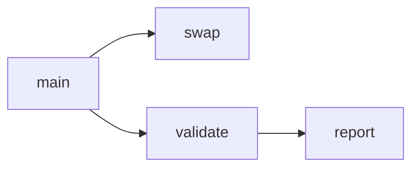

* Node = function
* Edge = one function may call another
---

* It answers:
    * “Which functions can call which other functions?”
* It does not show every statement inside the functions.
</details>

<details>
    <summary>2. Control-Flow Graph and ICFG</summary>

* A CFG describes the possible execution order of statements inside one function.
* An Interprocedural Control-Flow Graph, or ICFG, connects control flow across functions.
    * Node = instruction or statement
    * Edge = possible next execution step
* It answers:
    * “Can execution move from statement A to statement B?”

The ICFG is the graph used in Week 3.
</details>

<details>
    <summary>3. Program Assignment Graph — PAG</summary>

* The PAG represents relationships between variables and memory objects.
    * Node = variable or memory object
    * Edge = assignment, load, store, address relationship, etc.
* It helps answer:
    * “How can a value move from one variable or memory location to another?”

The PAG becomes particularly important for data-flow and pointer analysis.
</details>


---
# 3. Control Flow and Interprocedural Analysis
## 3.1 Main question and Purpose
<details>
    <summary>Purpose</summary>

* Main question
    * Where can program execution go?
* Before analysing data, we need the possible execution paths through a program.

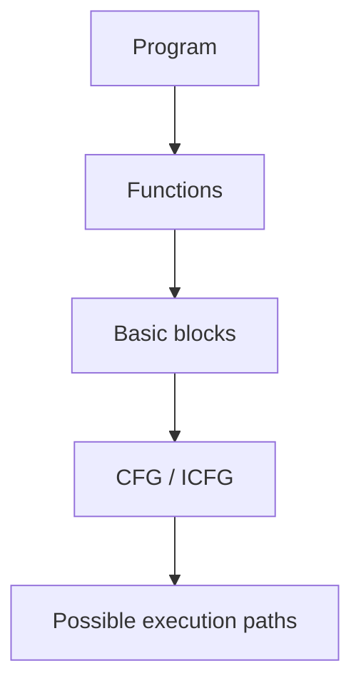

</details>

## 3.2 Control Flow Graph (CFG)
A **CFG** represents possible execution paths **inside one function**.

* Node = instruction or basic block
* Edge = possible execution transition

For example:
```c++
if (x > 0)
    y = 10;
else
    y = 20;

print(y);
```

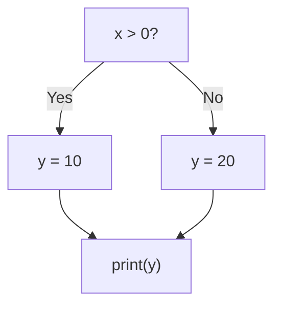

## 3.3 Intra-procedural versus interprocedural analysis
| Intra-procedural | Interprocedural |
| ---------------- | --------------- |
| Stays inside one function | Crosses function boundaries |
| Uses a CFG | Needs a call graph and an ICFG |
| Enough for local control flow | Needed for real programs that call other functions |

<details>
    <summary>Intra-procedural</summary>

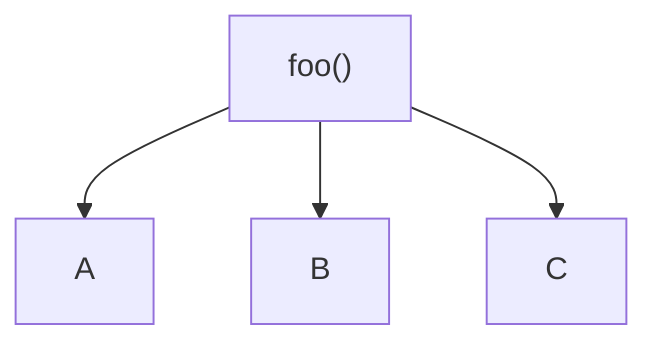

</details>

<details>
    <summary>Interprocedural</summary>

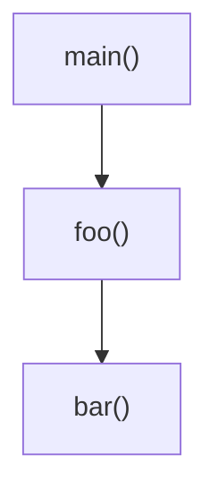

</details>

## 3.4 Call Graph
A call graph shows which functions may call other functions. Week 2B already introduces it as the function-level view. Week 3 uses it for interprocedural analysis.

It answers:

* “Which functions can call which other functions?”

For example:
```c++
main() {
    foo();
}

foo() {
    bar();
}
```

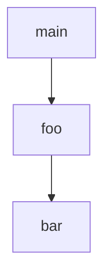

<details>
    <summary>Indirect calls</summary>

Sometimes the target is not obvious:

```c++
fp();
```

If pointer analysis determines `pts(fp) = {foo, bar}`, the possible call targets are:

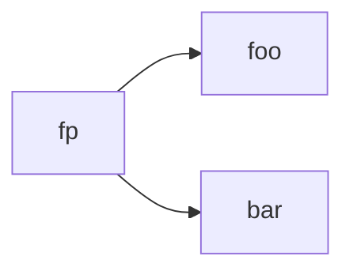

</details>

## 3.5 ICFG
**ICFG = Interprocedural Control Flow Graph.**

It extends control-flow analysis across functions.

```c++
main() {
    foo();
}
```

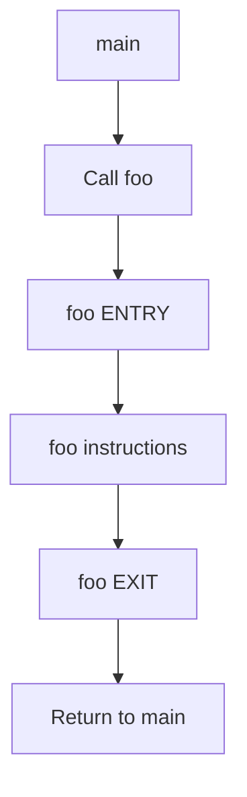

Important SVF ICFG nodes:

| Node | Purpose |
| ---- | ------- |
| `FunEntryICFGNode` | Function entry |
| `FunExitICFGNode` | Function exit |
| `CallICFGNode` | Function call |
| `RetICFGNode` | Return site |
| `IntraICFGNode` | Normal instruction |

* Key takeaway
    * CFG → control flow inside a function
    * Call graph → relationships between functions
    * ICFG → detailed control flow across functions


---
# 4. Data Dependence and Pointer Analysis
## 4.1 Main question and Purpose
<details>
    <summary>Purpose</summary>

* Main question
    * Where can data go?
* Week 3 asked where execution can go. Week 4 asks how values move, especially through pointers and memory.

For example:
```c++
x = 10;
y = x;
```

There is a data dependence because `y` uses the value defined by `x`:

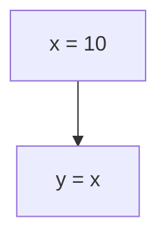

</details>

## 4.2 Why pointers make data dependence difficult
```c++
*p = 50;
x = *q;
```

Does `x` depend on the first statement? We do not know until we know whether `p` and `q` could point to the same memory.

If `p` and `q` both point to `A`:

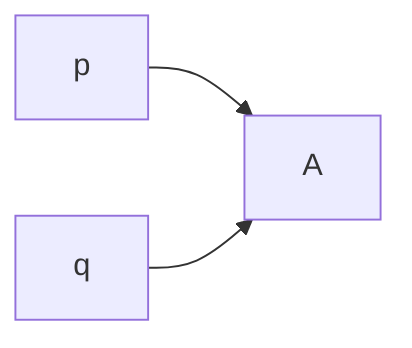

then the store through `p` can affect the load through `q`, so there is a possible data dependence.

## 4.3 Pointer basics
```c++
int a = 10;
int *p = &a;
```

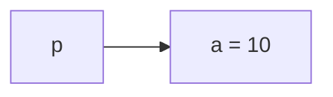

| Expression | Meaning |
| ---------- | ------- |
| `a` | value of `a` |
| `&a` | address of `a` |
| `p` | address stored in `p` |
| `*p` | value at the address `p` points to |

* Therefore:
    * `a` and `*p` are values
    * `&a` and `p` are addresses

## 4.4 The four important pointer operations

| Code | Operation | Meaning |
| ---- | --------- | ------- |
| `p = &a` | Address | `p` points to `a` |
| `q = p` | Copy | copy address from `p` to `q` |
| `q = *p` | Load | read the value or pointer stored through `p` |
| `*p = q` | Store | write a value or pointer through `p` |

* Easy memory rule
    * `p = &a` → address
    * `q = p` → copy address
    * `q = *p` → read / load
    * `*p = q` → write / store

<details>
    <summary>`q = p` versus `q = *p`</summary>

```c++
int a = 10;
int *p = &a;
```

Copy copies the **address**:

```c++
int *q = p;
```

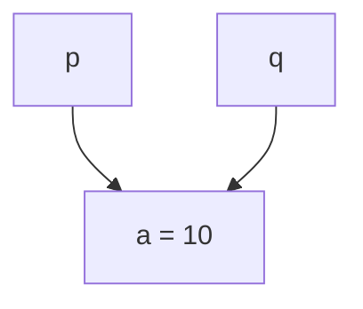

Both `p` and `q` point to `a`.

Load copies the **value**:

```c++
int q = *p;
```

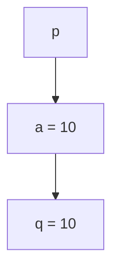

So:

* `q = p` → copy address
* `q = *p` → read value

</details>

<details>
    <summary>Store</summary>

```c++
int a = 10;
int *p = &a;
int q = 50;

*p = q;
```

Because `p` points to `a`, `*p = q` means `a = q`.

* Before: `p → a = 10`, `q = 50`
* After: `p → a = 50`, `q = 50`

</details>

## 4.5 Points-to sets and alias analysis
A **points-to set** contains the possible memory objects a pointer may reference.

* `pts(p) = {a}` means `p` may point to `a`.
* `pts(p) = {a, b}` means `p` may point to `a` or `b`.

Two pointers **may alias** if they may reference the same memory object.

If:

* `pts(p) = {A, B}`
* `pts(q) = {B, C}`

then `pts(p) ∩ pts(q) = {B}`, so they may alias.

* General rule
    * If `pts(p) ∩ pts(q) ≠ ∅`, they may alias.
* This helps determine whether a store through one pointer can affect a load through another.

## 4.6 PAG / SVFIR
The **Pointer Assignment Graph (PAG)** / SVFIR represents pointer and value constraints. Week 2B already introduces the PAG; Week 4 uses it for pointer analysis.

```c++
p = &a;
q = p;
```

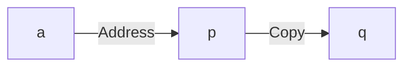

After pointer analysis:

* `pts(p) = {a}`
* `pts(q) = {a}`

Therefore `p` and `q` may alias.

## 4.7 Andersen's pointer analysis
Andersen analysis calculates what each pointer can possibly point to.

It processes the constraints in the PAG / SVFIR and propagates points-to information.

```c++
p = &a;
q = p;
r = q;
```

* Start
    * `pts(p) = {a}`
    * `pts(q) = {}`
    * `pts(r) = {}`
* Propagate along `p → q → r`
* Final
    * `pts(p) = {a}`
    * `pts(q) = {a}`
    * `pts(r) = {a}`

<details>
    <summary>Flow insensitivity</summary>

Classic Andersen analysis is **flow-insensitive**.

```c++
p = &a;
q = &b;

r = p;
r = q;
```

At actual runtime, `r = p` makes `r` point to `a`, then `r = q` overwrites that, so `r` ends pointing to `b`.

Andersen generally collects both possibilities:

* `pts(r) = {a, b}`

because it does not distinguish statement order in its overall points-to result. It says: somewhere in the analysed program, `r` may receive the address of `a` or `b`.

</details>

## 4.8 Fixed point
Andersen repeatedly propagates information until nothing new can be added.

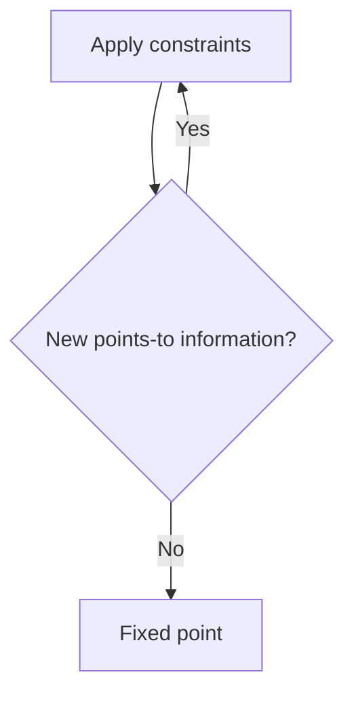

When nothing new can be added, it has reached a **fixed point**.

## 4.9 Week 4 summary

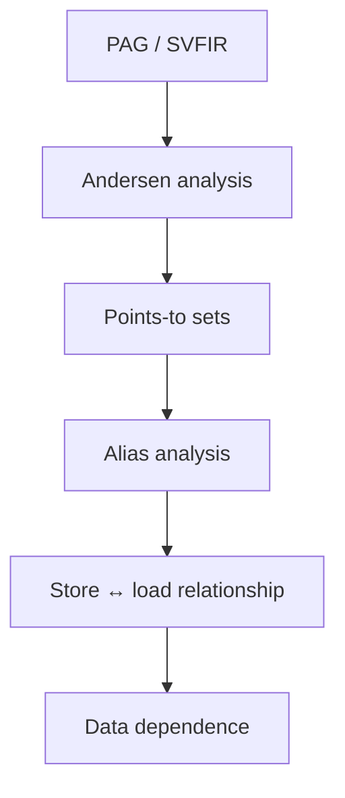

Week 4’s purpose is to determine how values can flow, especially through pointers and memory.


---
# 5. Information Flow Tracking and Taint Analysis
## 5.1 Main question and Purpose
<details>
    <summary>Purpose</summary>

* Main question
    * Can a particular piece of information flow from a source to a sink?
* Week 5 combines Weeks 3 and 4. This is **information-flow tracking**.

</details>

## 5.2 Source, tainted data, and sink
A **source** is where interesting or untrusted data originates.

Examples include user input, network input, file input, and environment data.

```c++
x = getUserInput();
```

If `getUserInput()` is a source, `x` becomes **tainted**.

Tainted data is data originating from a source that we want to track.

```c++
x = source();
y = x;
z = y;
```

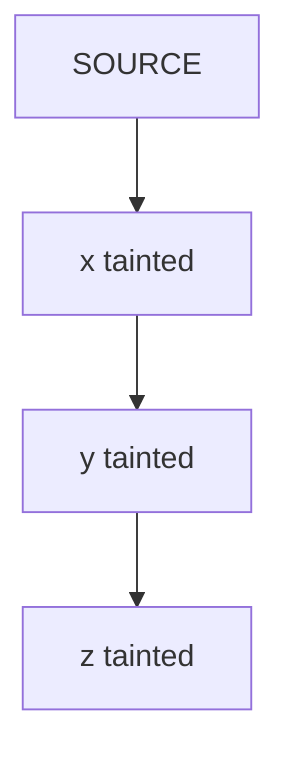

A **sink** is a sensitive operation where tainted data may be dangerous.

Examples include SQL execution, OS command execution, file operations, and network output.

```c++
system(x);
```

If a valid flow from source to sink exists, the analyser may report a potential vulnerability.

<details>
    <summary>Simple taint analysis</summary>

```c++
x = source();
y = x;
sink(y);
```

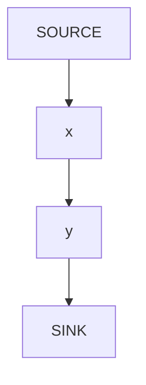

Therefore the source can reach the sink.

</details>

## 5.3 Why Weeks 3 and 4 are needed
<details>
    <summary>Why Week 4 is needed</summary>

Pointers hide data movement through memory:

```c++
int input = source();

int a;
int *p = &a;
int *q = p;

*p = input;

int x = *q;

sink(x);
```

Week 4 determines:

* `pts(p) = {a}`
* `pts(q) = {a}`

so `p` and `q` alias. Week 5 can then find:

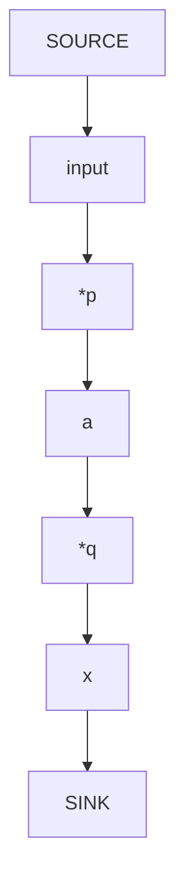

Without pointer analysis, the analyser may not know that the store through `p` can affect the load through `q`.

</details>

<details>
    <summary>Why Week 3 is needed</summary>

Real programs contain function calls.

```c++
void process(int x) {
    sink(x);
}

int main() {
    int input = source();
    process(input);
}
```

```mermaid
flowchart TD
    main["main()"] --> src["source()"]
    src --> input
    input --> call["process(input)"]
    call --> process["process()"]
    process --> sink["sink(x)"]
```

Week 3’s call graph and ICFG tell us how execution moves between these functions.

</details>

## 5.4 Context sensitivity
Suppose the same function is called multiple times:

```c++
foo(tainted);
foo(safe);
```

```mermaid
flowchart LR
    callA["Call A"] --> foo
    callB["Call B"] --> foo
```

A context-sensitive analysis remembers which call led into the function.

* Correct
    * Call A → `foo` → return A
    * Call B → `foo` → return B
* Incorrect
    * Call A → `foo` → return B

The incorrect matching creates an impossible execution path and may cause **false positives**.

<details>
    <summary>Call stack</summary>

Context can be understood using a stack.

```c++
main() {
    foo();
}

foo() {
    bar();
}
```

* Call `foo` → stack `[foo]`
* `foo` calls `bar` → stack `[foo, bar]`
* `bar` returns → `[foo]`
* `foo` returns → `[]`

This helps match calls with their correct returns.

</details>

## 5.5 SVFG
**SVFG = Sparse Value-Flow Graph.**

It represents relevant value-flow relationships:

* Where was a value defined?
* Where can that value flow?
* Where can it be used?

The SVFG lets analyses such as taint analysis traverse value-flow paths.

<details>
    <summary>Direct versus indirect value flow</summary>

Direct:

```c++
x = source();
y = x;
```

```mermaid
flowchart LR
    x --> y
```

Indirect through memory:

```c++
*p = x;
y = *q;
```

If Week 4 determines that both `p` and `q` point to `A`:

```mermaid
flowchart TD
    x --> store["*p"]
    store --> A
    A --> load["*q"]
    load --> y
```

This is an indirect memory-based flow.

</details>

## 5.6 Analysis process
A simplified taint-analysis process:

```mermaid
flowchart TD
    src["Find SOURCE"] --> mark["Mark value as tainted"]
    mark --> follow["Follow value-flow edges"]
    follow --> prop["Propagate taint"]
    prop --> reached{"Reached SINK?"}
    reached -->|No| follow
    reached -->|Yes| report["Report"]
```

For interprocedural analysis, the traversal must also respect valid call/return contexts.

## 5.7 Connecting Weeks 3, 4 and 5

```mermaid
flowchart TD
    w3["Week 3 — Control flow<br/>Where can execution go?<br/>CFG → Call Graph → ICFG"] --> w4["Week 4 — Data dependence<br/>Where can data go?<br/>PAG/SVFIR → Andersen → points-to → alias"]
    w4 --> w5["Week 5 — Information flow<br/>Can this data reach there?<br/>Source → taint → SVFG → sink"]
```

| | Week 3 | Week 4 | Week 5 |
| - | ------ | ------ | ------ |
| **Focus** | Control flow | Data dependence | Information flow |
| **Question** | Where can execution go? | Where can data and pointers go? | Can source reach sink? |
| **Main graph** | CFG / ICFG | PAG / SVFIR | SVFG |
| **Important analysis** | Interprocedural analysis | Andersen pointer analysis | Taint analysis |
| **Key concepts** | Call, return, entry, exit | Points-to, alias, load/store | Source, sink, taint |
| **Purpose** | Find valid execution paths | Find data dependencies | Find security / information flows |

* One sentence per week
    * Week 3: find the possible **execution paths** through and between functions.
    * Week 4: find how **data and pointers relate**, including hidden memory dependencies caused by aliasing.
    * Week 5: use those relationships to determine whether **specific information can flow from a source to a sink**.

## 5.8 Complete example
```c++
void process(int *q) {
    int x = *q;
    sink(x);
}

int main() {
    int input = source();
    int a;
    int *p = &a;
    *p = input;
    process(p);
}
```

<details>
    <summary>Week 3 — Control flow</summary>

```mermaid
flowchart TD
    main --> src["source()"]
    src --> store["*p = input"]
    store --> call["process(p)"]
    call --> entry["process ENTRY"]
    entry --> load["x = *q"]
    load --> sink["sink(x)"]
```

Execution can reach `process()` and the sink.

</details>

<details>
    <summary>Week 4 — Data dependence</summary>

```c++
int *p = &a;
```

gives `pts(p) = {a}`. When `p` is passed to `process`, `q` can point to the same object:

```mermaid
flowchart LR
    p --> a
    q --> a
```

Therefore:

```mermaid
flowchart TD
    input --> store["*p"]
    store --> a
    a --> load["*q"]
    load --> x
```

</details>

<details>
    <summary>Week 5 — Information flow</summary>

```mermaid
flowchart TD
    src["SOURCE / source()"] --> input
    input --> store["*p"]
    store --> a["memory a"]
    a --> call["function call"]
    call --> load["*q"]
    load --> x
    x --> sink["sink(x) / SINK"]
```

There is a valid source-to-sink information flow.

</details>


---
# 6. Program Verification Against Software Vulnerabilities
## 6.1 Main question and Purpose
<details>
    <summary>Purpose</summary>

* Main question
    * What real software vulnerabilities can happen, why they happen, and what conditions should be checked to prevent them?
* The lecture groups vulnerabilities into memory-safety errors, arithmetic errors, tainted-input problems, injection problems, and side-channel attacks.
* The slides repeatedly use **assertions** to check important safety conditions before continuing execution.

```mermaid
flowchart TD
    unsafe["Unsafe program state or input"] --> op["Dangerous operation"]
    op --> vuln["Vulnerability"]
    vuln --> check["Add validation / assertion"]
    check --> safer["Safer program"]
```

</details>

## 6.2 Memory leak
A **memory leak** occurs when dynamically allocated memory is not freed along a program execution path.

```c++
List *list = new List();
```

If the program never properly deletes all allocated memory, the leak remains.

```mermaid
flowchart TD
    alloc["Allocate memory"] --> use["Use memory"]
    use --> forget["Forget to free it"]
    forget --> leak["MEMORY LEAK"]
```

* Why it matters
    * Over time, the program may consume more and more memory.
* Secure idea
    * Make sure every allocated object is eventually freed.

```mermaid
flowchart TD
    alloc2["new / malloc"] --> use2["use"]
    use2 --> free2["delete / free"]
```

<details>
    <summary>Relation to Week 3</summary>

Memory leaks depend on **execution paths**. Week 3 asks where execution can go.

```mermaid
flowchart TD
    malloc["malloc()"] --> pathA["Path A → free()"]
    malloc --> pathB["Path B → no free()"]
```

Control-flow analysis can help determine whether there is some path where allocated memory is never released.

</details>

## 6.3 Null pointer dereference
A null-pointer dereference happens when the program dereferences a pointer whose value is `NULL` or `nullptr`, often causing a crash.

```c++
Student* student = findStuRecord(id);

printf("%s", student->name);
```

`findStuRecord()` may return `nullptr`. Then `student->name` tries to access memory through an invalid pointer.

```mermaid
flowchart TD
    student --> valid["valid object → dereference ✓"]
    student --> null["nullptr → dereference ✗"]
```

* Secure idea
    * Check before dereferencing:

```c++
assert(student != nullptr);
```

<details>
    <summary>Relation to Week 4</summary>

Week 4 asks what a pointer can point to. Week 6 adds: is the pointer valid before we dereference it?

Week 4’s pointer analysis is directly useful here.

</details>

## 6.4 Dangling pointer / use-after-free
A **dangling pointer** is a pointer that no longer refers to a valid memory object, often because that object has already been freed.

```c++
char *ptr = malloc(SIZE);

free(ptr);

logError(ptr);
```

After `free(ptr)`, the memory object is gone. Using `ptr` again is **use-after-free**.

```mermaid
flowchart LR
    before["Before free: ptr → Memory A"] --> after["After free: ptr → invalid memory"]
```

* Secure idea
    * A defensive pattern shown in the lecture is:

```c++
free(ptr);
ptr = nullptr;
```

<details>
    <summary>Relation to Week 4</summary>

Week 4 understands `ptr → object A`. Week 6 adds **object lifetime**:

```mermaid
flowchart TD
    pts["ptr → A"] --> freeA["free(A)"]
    freeA --> invalid["ptr → invalid"]
```

Knowing where a pointer points is not enough; we also care whether the object still exists.

</details>

## 6.5 Buffer overflow
A **buffer overflow** occurs when the program writes more data than a buffer can hold and overwrites adjacent memory.

```c++
char *p = malloc(n);
int y = n;

p[y] = 'a';
```

If the buffer has `n` elements, valid indexes are `0 ... n-1`. `p[n]` is outside the allocated area.

```mermaid
flowchart LR
    p0["p[0] ✓"] --> p1["p[1] ✓"] --> p2["p[2] ✓"] --> p3["p[3] ✓"] --> p4["p[4] ✓"] --> p5["p[5] ✗ overflow"]
```

* Secure idea
    * Check the index before writing:

```c++
assert(y < n);
```

<details>
    <summary>Relation to Weeks 3 and 4</summary>

* Week 3 helps determine whether execution can reach the dangerous access.
* Week 4 helps reason about the memory object being accessed.
* Week 6 asks: is the actual memory access valid?

</details>

## 6.6 Integer overflow
An **integer overflow** occurs when a calculation produces a value outside the range that the integer type can represent.

Easy definition: the result is too large to fit inside the integer type.

For unsigned integers, the lecture shows wrap-around behaviour:

* `UINT_MAX + 1 = 0`
* `UINT_MAX + 2 = 1`
* `UINT_MAX + 3 = 2`

```mermaid
flowchart TD
    max["Maximum number + 1"] --> wrap["Wrap around"]
```

<details>
    <summary>Why it is dangerous</summary>

```c++
size = nresp * sizeof(char*);
```

If the real result is huge but the multiplication overflows:

```mermaid
flowchart TD
    large["Large intended size"] --> overflow["Integer overflow"]
    overflow --> small["Small incorrect size"]
    small --> alloc["Small buffer allocated"]
    alloc --> write["Too much data written"]
    write --> buf["Buffer overflow"]
```

The lecture gives an OpenSSH example where multiplication overflow leads to a heap buffer overflow.

</details>

* Secure idea
    * Check the value before the dangerous arithmetic or allocation:

```c++
assert(nresp <= userDefinedSize / sizeof(char*));
```

The lecture recommends checking the size before allocation.

## 6.7 Division by zero
A division-by-zero error occurs when the divisor becomes zero.

```c++
return totalTime / numRequests;
```

If `numRequests = 0`, the operation is invalid.

* Secure idea

```c++
assert(numRequests > 0);
```

before performing the division.

```mermaid
flowchart TD
    before["Before dangerous operation"] --> check["Check required condition"]
    check --> perform["Perform operation"]
```

## 6.8 Tainted information flow
**Tainted data** means data that comes from an untrusted source, such as user or network input.

Week 6 explains that malicious input can cause unexpected behaviour, information leakage, or attacks.

```c++
char *pMsg = packet_get_string();

ParseMsg((LOGIN_MSG_BODY *)pMsg);
```

```mermaid
flowchart TD
    pkt["packet_get_string()"] --> pMsg
    pMsg --> parse["ParseMsg()"]
    parse --> later["used later in the program"]
```

```mermaid
flowchart TD
    src["SOURCE"] --> tainted["tainted input"]
    tainted --> prop["propagation"]
    prop --> use["dangerous use"]
```

The lecture example shows attacker-controlled data influencing a loop bound and recommends checking it against a safe limit.

<details>
    <summary>Relation to Week 5</summary>

This is a **direct continuation of Week 5**.

Week 5 tracks `SOURCE → taint → value flow → sink`.

Week 6 asks: what vulnerability can occur if that tainted value reaches an unsafe operation?

</details>

## 6.9 Code injection
**Code injection** happens when input that should only be treated as data becomes part of executable code or a command.

```c++
cin >> user_id;

system(command + user_id);
```

Expected: `user_id = "05"` produces `cat user_info/05`. If malicious command syntax is included in the user input, `system()` may execute unintended commands. The lecture identifies lack of validation before `system()` as the problem.

```mermaid
flowchart TD
    input["User input"] --> data["should be DATA"]
    data --> cmd["combined into command"]
    cmd --> sys["system()"]
    sys --> exec["executed as COMMAND"]
```

* Secure idea
    * Validate the input before passing it to `system()`.
    * The lecture checks that the user ID contains numeric input before execution.

<details>
    <summary>Relation to Week 5</summary>

This is another source-to-sink problem:

```mermaid
flowchart TD
    src["SOURCE / user input"] --> tainted["tainted data"]
    tainted --> sys["system()"]
    sys --> sink["SINK"]
```

* Week 5 detects: tainted flow → `system()`
* Week 6 interprets: possible code injection

</details>

## 6.10 Format string vulnerability
A **format string vulnerability** occurs when user input is interpreted as formatting instructions rather than ordinary data.

Easy definition: user-controlled data becomes `printf` instructions.

Safe:

```c++
printf("%s", userInput);
```

* `"%s"` → format
* `userInput` → data

Vulnerable:

```c++
printf(userInput);
```

Now `userInput` is treated as format instructions. If the user provides `%s%s%s%s`, `printf()` may interpret those sequences as instructions to read string arguments that were never supplied. This can cause invalid memory access or a crash.

<details>
    <summary>Relation to Week 5</summary>

```mermaid
flowchart TD
    argv["argv / user input"] --> src["SOURCE"]
    src --> tainted["tainted string"]
    tainted --> printf["printf(userInput)"]
    printf --> use["dangerous use"]
```

</details>

## 6.11 SQL injection
SQL injection happens when user input is directly combined into an SQL query and changes the query’s meaning.

```c++
txtUserId = getRequestString("UserId");

txtSQL =
    "SELECT * FROM Users WHERE UserId = "
    + txtUserId;
```

The slides show that specially crafted input can modify the condition so that the database returns unintended records.

```mermaid
flowchart TD
    input["User input"] --> sql["SQL string"]
    sql --> db["Database executes altered query"]
```

<details>
    <summary>Relation to Week 5</summary>

```mermaid
flowchart TD
    src["SOURCE / user request"] --> tainted["tainted data"]
    tainted --> sql["SQL query"]
    sql --> sink["SINK / database execution"]
```

SQL injection is another practical consequence of unsafe information flow.

</details>

## 6.12 Side-channel / timing attack
A **side-channel attack** occurs when secret information leaks through some observable program behaviour rather than through normal program output.

A timing attack uses **how long the program takes** as the observable information.

```c++
for (...) {
    if (guess[i] != password[i])
        return false;
}
```

Suppose the password is `CAT123`. An attacker may infer that more characters are correct because the program takes longer before returning:

* `XXXXXX` → fails quickly
* `CXXXXX` → slightly slower
* `CAXXXX` → even slower
* `CATXXX` → slower again

```mermaid
flowchart TD
    secret["Secret"] --> behaviour["Program behaviour"]
    behaviour --> time["Execution time"]
    time --> measure["Attacker measures time"]
    measure --> leak["Information leak"]
```

* Secure idea
    * Compare all characters instead of returning immediately:

```c++
for (i = 0; i < length; i++)
    result &= (ca[i] == cb[i]);
```

The goal is a **constant-time comparison** for a fixed input length.

<details>
    <summary>Relation to Week 5</summary>

Week 5 mainly studies explicit value flow: `variable → variable → sink`.

Timing attacks show that information can also escape **indirectly**:

```mermaid
flowchart TD
    secret["secret"] --> behaviour["execution behaviour"]
    behaviour --> timing["timing"]
    timing --> attacker
```

This extends information flow beyond normal data-flow edges.

</details>

## 6.13 Role of assertions
Assertions state: this condition must be true before continuing.

```c++
assert(student != nullptr);
assert(y < n);
assert(numRequests > 0);
assert(nresp <= safeLimit);
```

```mermaid
flowchart TD
    a["assert(condition)"] --> t{true?}
    t -->|true| continue["continue"]
    t -->|false| stop["stop"]
```

The important idea is not just the word `assert`, but the **safety condition being checked**.

## 6.14 Connecting Weeks 3–6

| Week | Main question | How Week 6 uses it |
| ---- | ------------- | ------------------ |
| **Week 3** | Where can execution go? | Find paths that reach dangerous operations or miss cleanup |
| **Week 4** | Where can pointers / data go? | Understand memory objects, pointer accesses and aliases |
| **Week 5** | Can information flow from source to sink? | Track tainted input into dangerous operations |
| **Week 6** | What vulnerability can happen? | Identify real bugs and the safety checks needed |

<details>
    <summary>Week 3 → Week 6</summary>

```mermaid
flowchart TD
    malloc["malloc()"] --> freePath["free() ✓"]
    malloc --> leakPath["return without free() ✗"]
```

Week 3 gives the paths. Week 6 identifies a **memory leak**.

</details>

<details>
    <summary>Week 4 → Week 6</summary>

Week 4 understands `p → memory A`. Then:

```c++
free(p);
*p = 10;
```

Week 6 identifies **use-after-free**.

</details>

<details>
    <summary>Week 5 → Week 6</summary>

```c++
input = source();
system(input);
```

Week 5 finds `SOURCE → input → SINK`. Week 6 interprets the unsafe tainted flow as **code injection**.

</details>

```mermaid
flowchart TD
    w3["Week 3 — Control flow<br/>Where can execution go?<br/>CFG / ICFG / Call Graph"] --> w4["Week 4 — Data dependence<br/>Where can pointers / data go?<br/>PAG / Andersen / points-to / alias"]
    w4 --> w5["Week 5 — Information flow<br/>Can important data reach a sink?<br/>Source → taint → sink"]
    w5 --> w6["Week 6 — Software vulnerabilities<br/>What can go wrong?"]
```

## 6.15 Cheat sheet

| Vulnerability | Remember |
| ------------ | -------- |
| **Memory leak** | Allocated memory is never freed |
| **Null dereference** | Use `*p` when `p == nullptr` |
| **Use-after-free** | Use memory after it has been freed |
| **Buffer overflow** | Write outside buffer bounds |
| **Integer overflow** | Number does not fit its integer range |
| **Division by zero** | Divisor becomes `0` |
| **Tainted information flow** | Untrusted data travels through the program |
| **Code injection** | User data becomes executable command or code |
| **Format string** | User data becomes `printf` instructions |
| **SQL injection** | User input changes an SQL query |
| **Timing attack** | Secrets leak through execution time |

Weeks 3–5 teach you how to follow program execution and data. Week 6 uses that knowledge to recognise unsafe program behaviour and software vulnerabilities.


---
# 7. Code Verification and Predicate Logic
## 7.1 Main question and Purpose
<details>
    <summary>Purpose</summary>

* Main question
    * Given a pre-condition and a program, can we **prove** that a safety assertion always holds?
* Weeks 3–6 analyse what a program can do. Week 7 checks whether what it does is **correct / safe**.
* The slides take program paths and SVF statements, translate them into logical formulas, and check each path.

```mermaid
flowchart TD
    w6["Week 6<br/>This should be true for safety"] --> a["assert(condition)"]
    a --> w7["Week 7<br/>Can we prove this condition always holds?"]
```

</details>

| Week | Main question | Connection to Week 7 |
| ---- | ------------- | -------------------- |
| **Week 3 — Control flow** | Where can execution go? | Gives the program paths that can be checked |
| **Week 4 — Data dependence** | Where can data / pointers go? | Gives relationships between values along those paths |
| **Week 5 — Information flow** | Can data flow from source to sink? | Identifies important flows that may need verification |
| **Week 6 — Vulnerabilities** | What can go wrong? | Introduces safety conditions such as `assert(index < size)` |
| **Week 7 — Verification** | Can we prove the safety condition holds? | Converts paths + assertions into logic and checks them |

## 7.2 Formal verification
**Formal verification** means proving whether code satisfies a given **specification** using mathematical logic.

```mermaid
flowchart TD
    spec["Specification<br/>What should happen?"] --> specF["Logical formula"]
    impl["Code implementation<br/>What actually happens?"] --> implF["Logical formula"]
    specF --> compare["Compare / verify"]
    implF --> compare
    compare --> solver["Solver"]
```

The lecture describes this as translating the specification and implementation into logical formulas, then using theorem-proving tools to check them.

## 7.3 Specification: pre-condition and post-condition
In this subject, specifications are embedded in the source code using **assume** and **assert**. The slides express this with **Hoare logic**:

```text
P { prog } Q
```

| Part | Meaning |
| ---- | ------- |
| `P` | **Pre-condition** — assumption before the program |
| `prog` | Program being checked |
| `Q` | **Post-condition** — assertion that should hold afterward |

```c++
assume(x > 0);    // P

y = x + 1;        // program

assert(y > 0);    // Q
```

> If `x > 0` before execution, running the program should guarantee `y > 0`.

## 7.4 Main verification question
Week 7 asks:

> **Given the pre-condition and the program, will the assertion always hold?**

```c++
assume(100 > x && x > 0);

if (x > 10) {
    y = x + 1;
}
else {
    y = 10;
}

assert(y >= x + 1);
```

Here:

* `P = 100 > x > 0`
* `Q = y >= x + 1`

## 7.5 Check each program path
This is where **Week 3 control flow** becomes important. The example has two paths:

```mermaid
flowchart TD
    q{"x > 10?"} -->|Yes| p1["y = x + 1"]
    q -->|No| p2["y = 10"]
```

<details>
    <summary>Path 1</summary>

```text
x > 10
y = x + 1
```

Assertion: `y >= x + 1`

Because `y = x + 1`, the assertion holds on this path.

</details>

<details>
    <summary>Path 2</summary>

```text
x <= 10
y = 10
```

Try `x = 10`. Then `y = 10`, but:

```text
y >= x + 1
10 >= 11  ✗
```

So `x = 10` is a **counterexample**. The lecture identifies this same counterexample for the else path.

</details>

## 7.6 Counterexample
A **counterexample** is:

> A valid input that makes the required assertion fail.

Instead of trying every possible input (`x = 1`, `x = 2`, …, `x = 99`), we ask a solver:

> Does **any** valid input exist that breaks the assertion?

That question becomes the logical verification formula.

## 7.7 Convert code into logical formulas
Each program path is translated into constraints. The slides state that the `SVFStmt`s from each program path are translated into a logical formula `ϕ`, then each path is checked.

```mermaid
flowchart TD
    path["Program path"] --> constraints["Logical constraints"]
    constraints --> solver["Solver"]
```

<details>
    <summary>Path 1 formula</summary>

```text
P
AND
x > 10
AND
y = x + 1
```

</details>

<details>
    <summary>Path 2 formula</summary>

```text
P
AND
x <= 10
AND
y = 10
```

</details>

## 7.8 How we search for a bug
The required property is:

```text
P ∧ Program → Q
```

> If the pre-condition holds and the program executes, then the post-condition should hold.

To search for a bug, the lecture instead looks for:

```text
P ∧ Program ∧ ¬Q
```

```mermaid
flowchart TD
    p["P<br/>Valid input"] --> and["AND"]
    prog["Program<br/>Valid execution"] --> and
    nq["¬Q<br/>Assertion is FALSE"] --> and
    and --> q["Can a valid execution exist<br/>where the assertion fails?"]
```

## 7.9 SAT and UNSAT
A solver checks whether a logical formula has a solution.

<details>
    <summary>SAT — Satisfiable</summary>

There is at least one set of values that makes the formula true.

Example: `x > 5 AND x < 10` has a solution `x = 7`, so the formula is **SAT**.

The lecture says an automated prover returns a **model** when a formula is satisfiable.

</details>

<details>
    <summary>UNSAT — Unsatisfiable</summary>

No values can satisfy the formula.

Example: `x > 10 AND x < 5` is impossible, so the formula is **UNSAT**.

</details>

For the bug formula `P ∧ Program ∧ ¬Q`:

```mermaid
flowchart TD
    formula["P ∧ Program ∧ ¬Q"] --> solver["Solver"]
    solver --> sat["SAT"]
    solver --> unsat["UNSAT"]
    sat --> cex["Counterexample exists"]
    cex --> fail["Assertion can fail"]
    unsat --> none["No counterexample"]
    none --> holds["Property holds for the checked case"]
```

## 7.10 Propositional logic
Before predicate logic, Week 7 reviews **propositional logic**.

A proposition is a statement that is either **TRUE** or **FALSE**.

Example:

* `P = "x > 10"`
* `Q = "y < 5"`

| Logic | Meaning | Code equivalent |
| ----- | ------- | --------------- |
| `P ∧ Q` | AND | `P && Q` |
| `P ∨ Q` | OR | `P \|\| Q` |
| `¬P` | NOT | `!P` |
| `P → Q` | If P then Q | implication |

<details>
    <summary>Inference example</summary>

```c++
if (x > 10 && y < 5)
    z = 15;
```

Let:

* `P1 = x > 10`
* `P2 = y < 5`
* `Q = z = 15`

Then `(P1 ∧ P2) → Q`:

```text
P1
P2
──────
Q
```

This is a basic inference pattern.

</details>

## 7.11 Why propositional logic is not enough
Propositional logic treats `x > 10` as one whole statement `P`. It does not analyse the internal relationship between `x`, `>`, and `10`.

The slides explain that propositional logic has limited ability to represent properties, relationships, or statements about **all** or **some** objects.

Programs contain many relationships:

* `x > 10`
* `y < x`
* `index < size`
* `result = x + 1`

Therefore we need something more expressive: **predicate logic**.

## 7.12 Predicate logic / first-order logic
Predicate logic extends propositional logic with:

* variables
* predicates
* relationships
* quantifiers

<details>
    <summary>One-variable predicate</summary>

```text
R(x): x > 5
```

* `x` is a variable
* `x > 5` is a predicate / property

If `x = 6`, then `R(6)` is `6 > 5`, which is **TRUE**.

</details>

<details>
    <summary>Two-variable predicate</summary>

```text
R(x, y): x > y
```

`R(10, 5)` is `10 > 5`, which is **TRUE**.

This is why predicate logic is useful for analysing program variables.

</details>

## 7.13 Quantifiers
Predicate logic introduces two important symbols.

<details>
    <summary>∀ — Universal</summary>

Means **for all / every**. `∀x` = for every `x`.

In verification:

> The assertion should hold for **all valid inputs**.

</details>

<details>
    <summary>∃ — Existential</summary>

Means **there exists / at least one**. `∃x` = there exists some `x`.

In bug finding:

> Does **one input exist** that breaks the assertion?

</details>

The slides define `∀` as all / every and `∃` as some / there exists.

```text
Safety:
∀ valid inputs → assertion holds

Bug finding:
∃ input → assertion fails
```

## 7.14 Knowledge base — KB
The Predicate Logic slides use `KB` for **Knowledge Base**:

> The collection of logical constraints / facts extracted from the program.

Example:

```text
KB:
x > 10
y = x + 1

Q:
y > 10
```

We ask `KB ⊢ Q ?`

> Given everything in `KB`, must `Q` also be true?

The lecture describes this as asking whether `Q` is true in every situation that satisfies the constraints in `KB`.

## 7.15 Theorem provers
Doing this manually becomes impractical because programs contain too many paths, variables, logical relationships, and assertions.

The subject therefore focuses on automated theorem-prover tools rather than manual mathematical proofs.

```mermaid
flowchart TD
    code["Code"] --> paths["Program paths"]
    paths --> formulas["Logical formulas"]
    formulas --> prover["Theorem prover"]
    prover --> result["SAT / UNSAT"]
```

## 7.16 SAT versus SMT solver

| Solver | Handles | Example |
| ------ | ------- | ------- |
| **SAT** | Boolean / propositional formulas | `P ∧ Q`, `P ∨ ¬Q` |
| **SMT** | Richer expressions with values and arithmetic | `x > 10`, `y = x + 1`, `index < size` |

The slides describe SMT as an extension / generalisation of SAT for richer formulas, and identify **Z3** as the SMT solver used in this subject.

```mermaid
flowchart TD
    z3["Z3"] --> smt["SMT solver"]
    smt --> check["Checks logical constraints from code"]
```

## 7.17 Week 7 overall process

```mermaid
flowchart TD
    prev["Previous weeks"] --> paths["Find program paths<br/>Week 3"]
    paths --> stmts["Program statements"]
    stmts --> assertQ["Week 6 safety requirement<br/>assert(Q)"]
    assertQ --> w7["Week 7"]
    w7 --> combo["Pre-condition P<br/>+ Program path<br/>+ Post-condition Q"]
    combo --> logic["Translate into logic"]
    logic --> bug["Check counterexample formula<br/>P ∧ Program ∧ ¬Q"]
    bug --> solver["SAT / SMT solver"]
    solver --> sat["SAT"]
    solver --> unsat["UNSAT"]
    sat --> cex["Counterexample exists"]
    cex --> fail["Assertion can fail"]
    unsat --> none["No valid counterexample"]
```

## 7.18 Cheat sheet

| Concept | Meaning |
| ------- | ------- |
| **Formal verification** | Use logic to verify program correctness |
| **Specification** | What the program should guarantee |
| **Pre-condition `P`** | Assumption before execution |
| **Post-condition `Q`** | Assertion after execution |
| **Hoare form** | `P {prog} Q` |
| **Counterexample** | Input that makes `Q` fail |
| **Proposition** | Statement that is true or false |
| **Predicate** | Property / relation involving variables |
| `∧` | AND |
| `∨` | OR |
| `¬` | NOT |
| `→` | implies |
| `∀` | for all |
| `∃` | there exists |
| **KB** | Known program constraints |
| **SAT** | Formula has a solution |
| **UNSAT** | Formula has no solution |
| **SMT** | Solver for richer arithmetic / logic constraints |
| **Z3** | SMT solver used in this subject |

<details>
    <summary>Most important thing to remember</summary>

```text
Weeks 3–6:
Find paths, data flows and vulnerabilities.

Week 7:
Turn those program behaviours and
safety requirements into logic
and check whether they can fail.
```

> **Week 7 = Path + Program Constraints + Assertion → Logical Formula → Solver → Counterexample or no counterexample.**

</details>

---
# 8. Software Verification and Z3 Theorem Prover
## 8.1 Main question and Purpose
<details>
    <summary>Purpose</summary>

* Main question
    * How do we turn **program code into logical constraints**, then use **Z3** to check whether those constraints can actually happen?
* The slides focus on manually translating source code into Z3 expressions, understanding the Z3 solver, and using the provided `Z3Mgr` APIs.

```mermaid
flowchart TD
    code["C / C++ code"] --> llvm["LLVM / SVFIR"]
    llvm --> z3c["Translate statements<br/>into Z3 constraints"]
    z3c --> solver["Z3 solver"]
    solver --> result["SAT / UNSAT / UNKNOWN"]
```

</details>

## 8.2 What is Z3?
**Z3** is an **SMT solver** developed by Microsoft Research. It is used for software verification, static checking, testing, and other analysis tasks.

> Give me some logical rules, and I will check whether there is any possible solution.

<details>
    <summary>Slide example</summary>

Constraints:

```text
x > 10
y = x + 1
```

Z3 can choose `x = 11`, `y = 12`. Those values are possible, so the result is `sat`.

</details>

## 8.3 SAT, UNSAT and UNKNOWN
Z3 returns one of these results when checking a formula.

| Result | Easy meaning |
| ------ | ------------ |
| `sat` | At least one solution exists |
| `unsat` | No solution can satisfy all constraints together |
| `unknown` | Z3 cannot determine the answer |

```text
SAT   = possible
UNSAT = impossible
```

<details>
    <summary>SAT example</summary>

```text
x = 10
x > 5
```

Possible, so `sat`.

</details>

<details>
    <summary>UNSAT example</summary>

```text
x = 10
x = 20
```

Impossible, so `unsat`.

</details>

## 8.4 Important Z3 commands

| Command | Meaning |
| ------- | ------- |
| `declare-const` | Create a variable |
| `declare-fun` | Create a function |
| `assert` | Add a constraint |
| `check-sat` | Check if constraints are satisfiable |
| `get-model` | Show one possible solution |
| `eval` | Evaluate a value using the solution |

<details>
    <summary>Example</summary>

```lisp
(declare-const x Int)
(assert (> x 10))
(check-sat)
```

Meaning:

* create integer `x`
* require `x > 10`
* ask Z3 whether this is possible

Answer: `sat`.

</details>

## 8.5 Understanding Z3 syntax
Z3 usually writes expressions as `(operator value1 value2)` instead of normal C/C++ style.

| C/C++ | Z3 |
| ----- | --- |
| `x > 10` | `(> x 10)` |
| `x == 10` | `(= x 10)` |
| `x + 1` | `(+ x 1)` |
| `x != y` | `(not (= x y))` |

```lisp
(assert (= y (+ x 1)))
```

simply means `y = x + 1`.

## 8.6 `assert`
In Z3, `assert` means:

> Add a rule that must be true.

```lisp
(assert (> x 10))
(assert (= y (+ x 1)))
```

Z3 now needs to satisfy both:

```text
x > 10
AND
y = x + 1
```

Every new `assert` adds another condition.

## 8.7 Uninterpreted functions
An **uninterpreted function** is a function where Z3 does not know its internal implementation.

For `f(x)`, Z3 may only know that `f` accepts an `Int` and returns an `Int`. It does not care about the code inside `f`.

<details>
    <summary>Same input, one output — SAT</summary>

```text
f(10) = 1
```

Possible, so `sat`.

</details>

<details>
    <summary>Same input, two outputs — UNSAT</summary>

```text
f(10) = 1
f(10) = 2
```

Impossible, because the same function with the same input cannot return two different values. Result: `unsat`.

</details>

<details>
    <summary>Different inputs, same output — SAT</summary>

```text
x != y
f(x) = f(y)
```

This can still be `sat`, because different inputs are allowed to produce the same output.

</details>

## 8.8 Arithmetic and types
Z3 supports common arithmetic and comparison operations such as `+`, `-`, `*`, `/`, `<`, `>`, `<<`, `>>`, `&`, and `|`.

Operands should use compatible types. The slides warn against mixing types without explicit conversion.

If `a` is `Int` and `b` is `Float`, combining them directly may cause a **sort mismatch**.

This is similar to LLVM IR, where types such as `i32`, `i64`, `float`, and `double` matter.

## 8.9 `ite` — if then else
Z3 represents conditional expressions using `ite(condition, trueValue, falseValue)`.

```c++
if (condition)
    result = trueValue;
else
    result = falseValue;
```

```text
ite(x > 10, 20, 0)
```

means: if `x > 10` then `result = 20`, else `result = 0`.

The slides use `ite` for comparisons and branches.

<details>
    <summary>Connection to control flow</summary>

Earlier weeks modelled a branch as two paths. Week 8 can represent that mathematically:

```mermaid
flowchart TD
    q{"if (x)"} -->|true| t["trueValue"]
    q -->|false| f["falseValue"]
```

```text
ite(x, trueValue, falseValue)
```

</details>

## 8.10 Arrays — `store` and `select`
Z3 arrays are important because they can be used to represent memory.

| Operation | Meaning | C-like | Z3 idea |
| --------- | ------- | ------ | ------- |
| `store` | Write a value into an array / memory location | `a[x] = y` | `store(a, x, y)` |
| `select` | Read a value from an array / memory location | `z = a[x]` | `select(a, x)` |

```text
STORE  = write
SELECT = read
```

## 8.11 `push` and `pop`
Think of these as:

* `push` = **save** the current solver state
* `pop` = **restore** the previous solver state

The slides explain that `push` creates a new scope and `pop` removes the assertions added since the matching `push`.

<details>
    <summary>Temporary constraint</summary>

```text
x > 0

PUSH
    x = 10
    check-sat
POP

Back to:
x > 0
```

The temporary constraint `x = 10` disappears after `pop`.

</details>

<details>
    <summary>Why this is useful for branches</summary>

You can analyse true and false paths separately so constraints from different paths are not mixed together:

```text
PUSH
assert(x > 10)
analyse TRUE path
POP

PUSH
assert(x <= 10)
analyse FALSE path
POP
```

```mermaid
flowchart TD
    q{"if (x > 10)"} -->|true| t["PUSH true-path constraints"]
    q -->|false| f["PUSH false-path constraints"]
    t --> pop1["POP"]
    f --> pop2["POP"]
```

</details>

## 8.12 `Z3Mgr`
The subject provides a wrapper called `Z3Mgr` to make Z3 easier to use from the assignment code.

| API | Meaning |
| --- | ------- |
| `getZ3Expr(...)` | Create a Z3 expression |
| `getMemObjAddress(...)` | Create / address a memory object |
| `getGepObjAddress(...)` | Create an address with an offset |
| `addToSolver(...)` | Add a constraint |
| `resetSolver()` | Clear constraints |
| `solver.check()` | Check SAT / UNSAT |
| `getEvalExpr(...)` | Evaluate an expression |
| `printExprValues()` | Print expression values |

`getEvalExpr()` checks the solver, retrieves a model if the constraints are satisfiable, and evaluates the requested expression in that model.

## 8.13 Main translation rules
The slides show how SVF statements map into Z3 constraints.

| SVF statement | C-like meaning | Z3 idea |
| ------------- | -------------- | ------- |
| `AddrStmt` | `p = &a` | give `p` an address |
| `CopyStmt` | `p = q` | `p == q` |
| `LoadStmt` | `p = *q` | load value from memory |
| `StoreStmt` | `*p = q` | store value into memory |
| `GepStmt` | `p = &q[i]` | address + offset |
| `PhiStmt` | merge path values | choose value from executed path |
| `BranchStmt` | `if` / `else` | use `ite(...)` |
| `UnaryOp` | `!p` | unary logic |
| `BinaryOp` | `r = p + q` | equivalent Z3 operation |
| `CmpStmt` | `p > q` etc. | comparison |
| Call / Return | function call | use scope + value passing |

<details>
    <summary>Important examples</summary>

```text
p = q
→ p == q

r = p + q
→ r == p + q

if (x)
    r = p
else
    r = q
→ r == ite(x, p, q)
```

</details>

## 8.14 Why SSA is important
The slides state that code being translated should be in **SSA form**, such as SVFIR.

```c++
a = 1;
a = 2;
```

If Z3 sees both assignments as the same variable, it interprets them as `a` must equal `1` **and** `a` must equal `2`, which is `unsat`.

SSA gives each assignment its own version:

```text
a1 = 1
a2 = 2
```

This is why earlier LLVM / SVFIR work matters in Week 8.

## 8.15 Scalar translation example
The slides use:

```c++
int a;
int b;

a = 0;
b = a + 1;

assert(b > 0);
```

This becomes approximately:

```text
a = 0
b = a + 1
b > 0
```

Z3 checks whether all of these conditions can be true. Yes: `a = 0`, `b = 1`, so `sat`.

The slides show the full flow from C code → `Z3Mgr` → Z3 formulas → solver.

```mermaid
flowchart TD
    c["C code"] --> t["Translator"]
    t --> z["Z3 constraints"]
    z --> s["Z3 solver"]
```

## 8.16 Memory example
The slides also use:

```c++
int* p;
int x;

p = malloc(...);
*p = 5;
x = *p;

assert(x == 5);
```

The logic is:

* `p` points to a memory location
* `*p = 5` writes `5` into the memory pointed to by `p`
* `x = *p` reads that value from memory
* therefore `x = 5`, and `assert(x == 5)` is consistent with the constraints

The slides model memory using a Z3 array and use store / load operations around that memory map.

```mermaid
flowchart TD
    p["p"] --> mem["memory: 5"]
    mem --> load["*p"]
    load --> x["x"]
    x --> five["5"]
```

## 8.17 How Week 8 connects to previous weeks

```mermaid
flowchart TD
    c["C / C++"] --> llvm["LLVM IR"]
    llvm --> svf["SVFIR / SSA"]
    svf --> graphs["ICFG + PAG"]
    graphs --> cfg["Control-flow analysis"]
    cfg --> ptr["Pointer / data-flow analysis"]
    ptr --> z3c["Translate operations<br/>into logical constraints"]
    z3c --> z3["Z3"]
    z3 --> result["SAT / UNSAT"]
```

| Earlier concept | Connection to Week 8 |
| --------------- | -------------------- |
| LLVM / SVFIR | Provides the program representation to translate |
| SSA | Makes assignments suitable for logical formulas |
| ICFG | Helps identify executable paths |
| Pointer analysis | Helps reason about addresses and memory |
| Load / Store | Become Z3 memory operations |
| Branches | Can become `ite` expressions / path constraints |
| Data / taint flow | Determines how information moves |
| Assertions | Become properties that can be checked using constraints |

So Week 8 is where many earlier concepts start coming together.

## 8.18 Cheat sheet

| Concept | Meaning |
| ------- | ------- |
| **Z3** | SMT solver used to solve logical constraints |
| **SAT** | A solution exists |
| **UNSAT** | No solution exists |
| **UNKNOWN** | Z3 cannot determine the result |
| `assert` | Add a constraint |
| `check-sat` | Ask Z3 if all constraints can be satisfied |
| `get-model` | Show one solution |
| `ite` | if-then-else |
| `select` | Read from array / memory |
| `store` | Write to array / memory |
| `push` | Save solver state |
| `pop` | Restore solver state |
| **SSA** | Each variable definition has its own version |
| **Z3Mgr** | Wrapper used in this subject to interact with Z3 |

<details>
    <summary>Main translations</summary>

```text
p = q
→ p == q

r = p + q
→ r == p + q

if / else
→ ite(...)

*p = q
→ store to memory

p = *q
→ load from memory

a[i]
→ select

a[i] = value
→ store
```

The slides finish by asking you to understand the Z3 formula format, understand `Z3Mgr`, review the Assignment 3 examples, complete the quizzes, and implement manual code-to-Z3 translation.

> **Week 8 is about translating program behaviour into logical constraints so Z3 can determine whether that behaviour is possible.**

</details>

