# 48433 - Summary
# 1. Introduction to Software Architecture
## 1.1 Introduction

### What Is Software Architecture?

**Definition:** the set of structures needed to reason about a system — its elements, their relations, and their properties (Bass, Clements & Kazman, 2022).

**In short:** it's the system's blueprint — not the code itself, but the map of what parts exist and how they connect, so you can understand the system without reading every line of code.

* **Not vague decisions**: it's *not* just "early decisions" or "major decisions" — those labels are too fuzzy to define.
* **An abstraction**: shows the public interface of each part, hides the private implementation.
* **Multiple views, one system**: like the human body — skeletal, muscular, nervous, and circulatory systems are different diagrams, but all describe the same body.

### Three Kinds of Architectural Structures

Every system needs three different diagram types, each answering a different question:

| Structure | Shows | Answers |
|---|---|---|
| **Component-and-Connector** | What's running, and how the pieces talk to each other | What talks to what? What's shared/replicated? |
| **Module** | How the code is split into classes/packages | Who owns what code? What depends on what? |
| **Allocation** | How software maps onto hardware/teams/files | Where does it run? Who builds it? |

#### Component-and-Connector


#### Module elements


#### Deployment structure


### Why Architecture Matters

Architecture is cheap to change on paper, and very expensive to change once built — so getting it right early matters more than almost anything else in a project.

* **Cheap to explore, expensive to change** — test ideas on the model before building the real thing.
* **Shared language** — lets business owners, architects, and developers discuss the same system.
* **Reusable abstraction** — a good architecture can guide future, similar systems.


#### Three Key Effects

1. **Lasts a long time** — hard to change once built.
2. **Determines what's possible** later — constraints lock in early.
3. **Determines quality** (performance, security, maintainability) — can't easily bolt these on afterward.

> **Trade-off:** systems built for speed are hard to maintain; systems built for easy maintenance are hard to speed up. You usually can't optimise for both.

### SOLID Principles

Five rules for designing classes so a codebase stays easy to change as it grows. Each one follows the same pattern: **Rule → Problem it prevents → Fix.**

<details>
<summary><strong>S — Single Responsibility</strong></summary>

* **Rule:** One class = one job.
* **Problem:** A class that both formats a report **and** saves it to disk has two reasons to change — a formatting update and a storage update both touch the same class.
* **Fix:** Split it into two classes — one for content, one for output — so each only changes for one reason.

</details>

<details>
<summary><strong>O — Open/Closed</strong></summary>

* **Rule:** Add new behaviour without editing existing, working code.
* **Problem:** A `LogOn` function is hard-coded per modem type (`DialHayes`, `DialCourrier`...), so it needs editing every time a new modem is released.
* **Fix:** Introduce an abstract `Modem` interface. New modems just implement it — `LogOn` itself never changes again.

</details>

<details>
<summary><strong>L — Liskov Substitution</strong></summary>

* **Rule:** If code expects a parent type, you must be able to swap in a child type and nothing breaks.
* **Plain English:** A child class is only allowed if it can do **everything the parent promised**, the same way.

> LSP does not "auto-fix" your code. It is a **design rule**. When inheritance breaks callers, LSP tells you: *stop inheriting that way — redesign so the child keeps the parent's promises.*

---

#### Easy example: Birds

Imagine a function written for any `Bird`:

```python
def make_it_fly(bird: Bird):
    bird.fly()       # promise: every Bird can fly
    print("Flying!")
```

**Bad design (breaks LSP):**

```python
class Bird:
    def fly(self):
        print("flap flap")

class Penguin(Bird):           # ❌ real life: penguin is a bird
    def fly(self):             # ❌ code life: cannot keep the fly() promise
        raise Exception("Can't fly!")

make_it_fly(Penguin())         # 💥 crashes
```

Real-world "is-a" lied. Callers expected `fly()` to work. Penguin broke that.

**How LSP tells you to fix it:**

Don't put `fly()` on a parent that not all children can honour. Split the types:

```python
class Bird:                    # shared stuff only (eat, sleep, ...)
    def eat(self):
        print("eating")

class FlyingBird(Bird):        # only birds that CAN fly
    def fly(self):
        print("flap flap")

class Sparrow(FlyingBird):
    pass

class Penguin(Bird):           # penguin is still a Bird — just not a FlyingBird
    def swim(self):
        print("swim swim")

def make_it_fly(bird: FlyingBird):   # now only flying birds are accepted
    bird.fly()
    print("Flying!")

make_it_fly(Sparrow())         # ✅ works
# make_it_fly(Penguin())       # ✅ type system / design stops this mistake
```

**What changed?**
* Before: parent promised something some children can't do → crash.
* After (LSP fix): parent only promises what **all** children can do. Flying is moved to `FlyingBird`.

---

#### Same idea: Circle / Ellipse (lecture example)

* **Problem:** `Circle extends Ellipse` looks right in maths, but Ellipse promises "set width and height separately." Circle can't keep that promise → wrong results.
* **LSP fix:** Don't make Circle inherit Ellipse. Give both a shared parent like `Shape` with only shared behaviour (e.g. `area()`).

---

**Remember:** LSP = *swap the child in, and old code still works.* If it doesn't, inheritance is wrong — redesign the hierarchy.

</details>

<details>
<summary><strong>I — Interface Segregation</strong></summary>

* **Rule:** Many small, client-specific interfaces beat one big one.
* **Problem:** One large `Service` interface serves every client — a change made for Client A risks breaking Clients B and C too, even though they never use that part.
* **Fix:** Split it into small, client-specific interfaces so each client only depends on what it actually uses.


</details>

<details>
<summary><strong>D — Dependency Inversion</strong></summary>

* **Rule:** Depend on abstractions, never on concrete classes.
* **Problem:** In procedural code, high-level modules depend directly on low-level details — a change to a detail can ripple all the way up.
* **Fix:** Both high-level and low-level code depend on a shared abstract interface instead, so details can change freely without touching the high-level logic.


</details>

#### Quick Reference

| | Principle | Core Idea |
|---|---|---|
| **S** | Single Responsibility | One class = one job. |
| **O** | Open/Closed | Extend without modifying. |
| **L** | Liskov Substitution | Subclass must be a drop-in replacement. |
| **I** | Interface Segregation | Small, focused interfaces. |
| **D** | Dependency Inversion | Depend on abstractions, not concretions. |

### Common Challenges Today

* **Systems outgrew simple diagrams** — boxes-and-arrows aren't precise enough anymore.
* **More legacy/packaged systems** need integrating, not building from scratch.
* **Loosely-coupled components** (e.g. microservices) are now the norm.
* **Modelling is essential** — too costly to experiment on real systems directly, so solutions are tested on models first.

> **TL;DR:** Architecture = structures for reasoning about a system, seen through C&C / module / allocation views. It matters because it's cheap to explore early but locks in quality and flexibility later. SOLID gives concrete rules for keeping class design flexible. Modern systems demand more rigorous modelling due to scale and complexity.

## 1.2 C4 model
<details>
    <summary><strong>C4 model</strong></summary>


The C4 model is a framework for visualizing software architecture. It acts like a set of maps that help software developers navigate large or complex codebases by zooming in from a high-level overview down to the specific code.

More Information: ![ProcessOn C4 model][https://www.processon.io/blog/c4-model-for-software-architecture]

---
It is structured into four levels of abstraction:
* **Level 1: System Context:** This provides the "overview first" by showing the entire software system, its users, and its dependencies on other systems.
* **Level 2: Containers:** This level zooms in to show the overall shape of the architecture and your technology choices. In the C4 model, a software system is made up of one or more "containers" (such as a client-side web app, server-side web app, mobile app, microservice, or database schema).
* **Level 3: Components:** Zooming in further, this level displays the logical components and their interactions within a single container.
* **Level 4: Code:** This is the most granular level, providing "details on demand" by showing the specific implementation details of the components, such as individual classes.

</details>

<details>
    <summary><strong>Example - Internal Banking System</strong></summary>

<detail>
    <summary><strong>Level 1: System Context</strong></summary>
    
</detail>

<detail>
    <summary><strong>Level 2: Containers</strong></summary>

</detail>

<detail>
    <summary><strong>Level 3: Components</strong></summary>

</detail>

<detail>
    <summary><strong>Level 4: Code</strong></summary>

</detail>

</details>
---

# 2. Application Architecture

## 2.1 Architecture Context

Architecture must consider:

* **Functional requirements:** What the system must do.
* **Stakeholder goals:** What users, customers, developers, and regulators need.
* **Constraints:** Time, budget, skills, technology, and regulations.
* **Enablers:** Existing skills, systems, or technologies that can help delivery.
* **Risks:** Events that may prevent success.
* **Opportunities:** Potential benefits to pursue.

**Usage narrative:** A short story describing who uses the system, what they do, and their expected outcome.

## 2.2 Requirements, Quality Attributes, and Risk Management

### Functional Requirements

**Functional requirements (FRs)** describe **what the system must do**.

> Example: The system must allow customers to place online orders.

Functions are assigned to components such as modules, services, databases, and interfaces.

### Non-Functional Requirements

**Non-functional requirements (NFRs)** describe **how well the system should work**. Quality attributes are a major type of NFR.

* **FR:** Process an online order.
* **NFR:** Process it securely within two seconds.

NFRs should be specific, measurable, and prioritised. They often conflict: better security can reduce usability, higher availability can increase costs, and better performance can make modification harder.

### Quality Attributes

```mermaid
flowchart TB
    subgraph QualityAttributes["QUALITY ATTRIBUTES"]
        direction TB
        NFR["NON-FUNCTIONAL REQUIREMENTS"]

        subgraph QualityRowOne
            direction LR
            AV["Availability"] ~~~ DE["Deployability"] ~~~ EE["Energy Efficiency"] ~~~ MO["Modifiability"]
        end

        subgraph QualityRowTwo
            direction LR
            PE["Performance"] ~~~ SE["Security"] ~~~ TE["Testability"] ~~~ US["Usability"]
        end
    end

    style NFR fill:#DBEAFE,stroke:#2563EB,stroke-width:2px
    style QualityAttributes fill:#EAF3FF,stroke:#2563EB,stroke-width:4px
    style QualityRowOne fill:none,stroke:none,color:transparent
    style QualityRowTwo fill:none,stroke:none,color:transparent
    style AV fill:#FFFFFF,stroke:#2563EB,stroke-width:2px
    style DE fill:#FFFFFF,stroke:#2563EB,stroke-width:2px
    style EE fill:#FFFFFF,stroke:#2563EB,stroke-width:2px
    style MO fill:#FFFFFF,stroke:#2563EB,stroke-width:2px
    style PE fill:#FFFFFF,stroke:#2563EB,stroke-width:2px
    style SE fill:#FFFFFF,stroke:#2563EB,stroke-width:2px
    style TE fill:#FFFFFF,stroke:#2563EB,stroke-width:2px
    style US fill:#FFFFFF,stroke:#2563EB,stroke-width:2px
```

| Quality attribute | Meaning | Common approaches |
|---|---|---|
| **Availability** | The system is accessible and recovers from failure. | Redundancy, retry, circuit breaker |
| **Deployability** | The system can be released and rolled back safely. | CI/CD, blue-green, canary deployment |
| **Energy efficiency** | The system minimises energy consumption. | Power monitoring, disabling unused resources |
| **Modifiability** | The system is easy and inexpensive to change. | Low coupling, high cohesion, layers |
| **Performance** | The system meets speed and resource requirements. | Load balancing, throttling |
| **Security** | The system protects data and access. | Validation, intrusion prevention |
| **Testability** | Faults are easy to find and diagnose. | Dependency injection, strategy pattern |
| **Usability** | Users can complete tasks easily. | Feedback, undo, progress indicators, MVC |

#### Important Concepts

* **CIA security triad:** Confidentiality, Integrity, and Availability.
* **Deployment pipeline:** Development → Integration → Staging → Production.
* **Low coupling:** Modules have fewer dependencies.
* **High cohesion:** Each module has one focused responsibility.
* **Performance measures:** Latency, response time, throughput, and memory efficiency.

### NFRs and Risk Management

#### Agile Scrum and DevOps

* **Scrum:** Develops software through short sprints.
* **DevOps:** Supports continuous testing, deployment, and monitoring.
* Sprint planning covers requirements, design, NFRs, and risks.

#### Product Backlog

The product backlog tracks user stories, priorities, sprint allocation, progress, NFRs, and risks. It is continuously updated.

#### Common NFRs

| NFR | Meaning |
|---|---|
| **Performance** | System response speed |
| **Scalability** | Ability to handle more workload |
| **Security** | Protection of data and access |
| **Usability** | Ease of use |
| **Maintainability** | Ease of updating and supporting the system |

#### Risk Identification and Assessment

* **Identify:** Find and classify potential risks.
* **Assess:** Measure probability and impact.
* **Prioritise:** Handle the most serious risks first.
* **Record:** Add risks to the risk matrix.

#### Expected Monetary Value

Expected Monetary Value (EMV) estimates the financial effect of a risk:

$$
\text{EMV} = \text{Probability} \times \text{Impact}
$$

For multiple outcomes:

$$
\text{Total EMV} = \sum(\text{Probability} \times \text{Impact})
$$

Example:

$$
(0.98 \times \$25{,}000) - (0.02 \times \$5{,}000) = \$24{,}400
$$

A positive EMV means the expected financial outcome is favourable.

#### Risk Response and Monitoring

* **Avoid:** Remove the risk.
* **Mitigate:** Reduce the risk.
* **Accept:** Monitor the risk.
* **Transfer:** Move the risk to another party.

Assign an owner and response plan, then continuously update the risk matrix.

---

# 3. Data Architecture

## 3.1 Data Modelling

Data modelling designs how data and its relationships should be represented. There are three levels.

### Conceptual Data Model

This is the big-picture business view. It defines:

* Key entities
* Their relationships
* Business rules

For a university system, the entities may include `Student`, `Subject`, `Lecturer`, and `Enrolment`.

At this level, we may say that a student can enrol in many subjects, and a subject can have many students. We do not yet decide on tables, column names, or database technology.

### Logical Data Model

This is more detailed but still independent of a particular database system. It defines:

* Tables or entities
* Attributes
* Primary keys
* Foreign keys
* Mandatory fields
* Relationship rules

| Table | Important fields |
| --- | --- |
| Student | StudentID, Name, Email |
| Subject | SubjectCode, SubjectName |
| Enrolment | StudentID, SubjectCode, EnrolmentDate |

It explains what the data should look like logically, but not whether a field is `VARCHAR(100)` or which index will be created.

### Physical Data Model

This is the implementation-level database design. It includes:

* Exact data types, such as `VARCHAR`, `INT`, and `DATE`
* Tables and associative tables
* Primary and foreign keys
* Indexes
* Database-specific performance settings

## 3.2 Data Ingestion

Data ingestion means moving data from its original sources into a destination where it can be stored, processed, or analysed.


### ETL and ELT

#### ETL: Extract, Transform, Load

ETL is the traditional approach:

1. Extract data from source systems.
2. Transform it by cleaning, standardising, validating, and combining it.
3. Load the prepared data into a data warehouse.

For example, customer names and dates can be cleaned before being loaded into a reporting database.

The limitation is that data often needs a defined structure before it enters the warehouse. This makes ETL less flexible for real-time, image, video, log, or other unstructured data.

#### ELT: Extract, Load, Transform

ELT changes the order:

1. Extract data.
2. Load it in raw form into a central repository, usually a data lake.
3. Transform it later when a particular use case needs it.

The main advantage is that the original data is retained. This is useful because:

* Raw history and lineage are preserved.
* Structured, semi-structured, unstructured, and streaming data can all be kept.
* Teams can use data for new purposes later.
* Data can be accessed before it is fully transformed.

### ETL vs ELT

| ETL | ELT |
| --- | --- |
| Transform before storage in a warehouse | Store raw data first, then transform it |
| Less flexible | More flexible |
| Traditionally batch-based | Better suited to cloud and diverse data |
| Raw data may not be retained | Raw data and history are retained |

## 3.3 Data Management Systems

### Data Warehouse

A data warehouse is centralised storage designed for analytics, reporting, and business intelligence. It stores curated, structured, cleaned data.

For example, a retail company’s warehouse may combine sales, customer, product, and inventory data to create company-wide reports. It is optimised for large analytical queries, not daily transactional activity such as placing an order.

### Data Mart

A data mart is a smaller, focused part of a data warehouse for one business area. Examples include finance, marketing, and HR data marts.

Types of data mart:

* **Dependent:** Created from an existing data warehouse.
* **Independent:** Created directly from source systems without a warehouse.
* **Hybrid:** Combines warehouse data with other operational data.

### Data Lake

A data lake stores large quantities of raw data in its original format. It can contain:

* Tables
* JSON or XML
* PDFs
* Images and videos
* Logs
* Sensor data

A warehouse uses more structure before analysis. A lake accepts raw data first and applies structure later when needed.

### Warehouse vs Lake vs Mart

| Feature | Data warehouse | Data lake | Data mart |
| --- | --- | --- | --- |
| Data type | Mostly curated and structured | Any type, including raw files and media | Focused subset, usually structured |
| Main purpose | BI, reports, dashboards | Exploration, ML, large-scale analytics | Department-specific analysis |
| Users | Organisation-wide analysts and teams | Engineers, data scientists, analysts | One department or business group |
| Data schema | Usually schema-on-write | Usually schema-on-read | Usually predefined |
| Example | Company-wide sales reporting | Raw logs, images, sensor streams | Marketing campaign dashboard |

### Schema-on-Write vs Schema-on-Read

* **Schema-on-write:** Define the structure before storing data. This is common in data warehouses.
* **Schema-on-read:** Store data first, then decide its structure when analysing it. This is common in data lakes.

### Large Organisations Often Use All Three

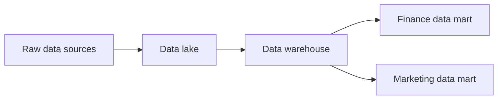

## 3.4 Types of Data Architectures

### Data Fabric

A data fabric is an architecture that connects data across many systems, clouds, databases, data lakes, warehouses, APIs, and applications.

Its goal is to make data easier to find, access, govern, and use, even when it is physically stored in many places. Key features include:

* **Data integration:** Connects different sources.
* **Data virtualisation:** Lets users access data without knowing its physical location.
* **Data governance:** Enforces security, privacy, quality, and compliance rules.
* **Data orchestration:** Automates pipelines and workflows.
* **Metadata management:** Records datasets’ meaning, ownership, and lineage.

Think of data fabric as an intelligent connecting layer over an organisation’s distributed data environment.

### Data Mesh

A data mesh is a decentralised approach in which each business domain owns and manages its own data.

For example:

* Marketing owns marketing data products.
* Sales owns sales data products.
* Customer service owns support data products.

Instead of one central data team becoming responsible for every dataset, domain teams take responsibility for making their data useful, documented, secure, and shareable.

Key principles:

* **Domain-oriented ownership:** Teams own data from their business area.
* **Data as a product:** Data should be reliable, documented, discoverable, and usable by others.
* **Self-service platform:** Teams receive shared tools for storage, access, monitoring, and governance.
* **Federated governance:** Shared organisation-wide rules exist, while data ownership remains distributed.

### Data Fabric vs Data Mesh

| Data fabric | Data mesh |
| --- | --- |
| Focuses on connecting and integrating data technically | Focuses on distributing ownership organisationally |
| Uses automation, metadata, virtualisation, and orchestration | Uses domain teams and data-product thinking |
| Answers: “How can all our data work together?” | Answers: “Who should own and maintain each dataset?” |

## 3.5 Big Data Solutions

### Architectural Shifts in the Big Data Era

| Area | Traditional approach | Modern approach |
| --- | --- | --- |
| Data generation | Mostly relational, structured, batch data | Relational + NoSQL, structured + unstructured, batch + real time |
| Ingestion | On-premises ETL | Cloud ELT and streaming |
| Storage | Centralised warehouse | Cloud warehouses, distributed storage, data lakes |
| Analytics | Historical reports and data mining | Predictive/prescriptive analytics, AI/ML, real-time insights |
| Consumption | Central dashboards and reports | Self-service tools and AI-driven insights |

**Polyglot persistence** means using different database technologies for different needs, rather than forcing every type of data into one relational database.

### NoSQL Databases

NoSQL databases were developed for data that is massive, distributed, rapidly changing, or not neatly structured in tables.

Relational databases are still very important, especially when strong consistency and complex transactions are needed. However, they can be less suitable for huge amounts of sparse, semi-structured, or globally distributed internet-scale data.

Common NoSQL characteristics:

* Can scale across many machines
* Support fast reads and writes
* Often have flexible or schema-less structures
* Support replication and distribution
* May accept trade-offs in strict ACID transactions for speed and scalability

#### Main NoSQL Types

| Type | Best for | Example use |
| --- | --- | --- |
| Key-value store | Very fast, simple lookups | Sessions, cache, chat data |
| Document database | Flexible JSON-like records | Product catalogues, content management |
| Column store | Large analytical or time-series data | Event logs, IoT data |
| Graph database | Relationship-heavy data | Social networks, fraud detection, recommendations |

### Big Data Architecture Patterns

#### Batch Architecture

Batch architecture processes accumulated data at scheduled times.

For example, it can generate a sales report every night using all transactions from that day. It is best when immediate results are not required.

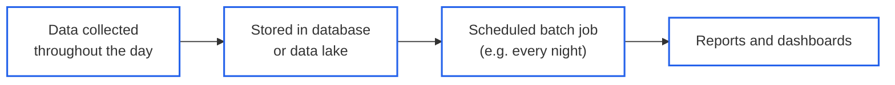

#### Streaming Architecture

Streaming architecture processes data continuously or almost immediately as it arrives.

For example, it can detect suspicious card transactions as they occur. It is best when a fast response is important.

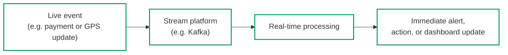

#### Lambda Architecture

Lambda architecture combines batch and streaming processing:

* The batch layer processes complete historical data accurately.
* The speed layer processes recent live data quickly.
* The results are combined for analysis.

For example, a social-media platform may analyse historical user behaviour in batch while also responding to new posts and interactions in near real time.

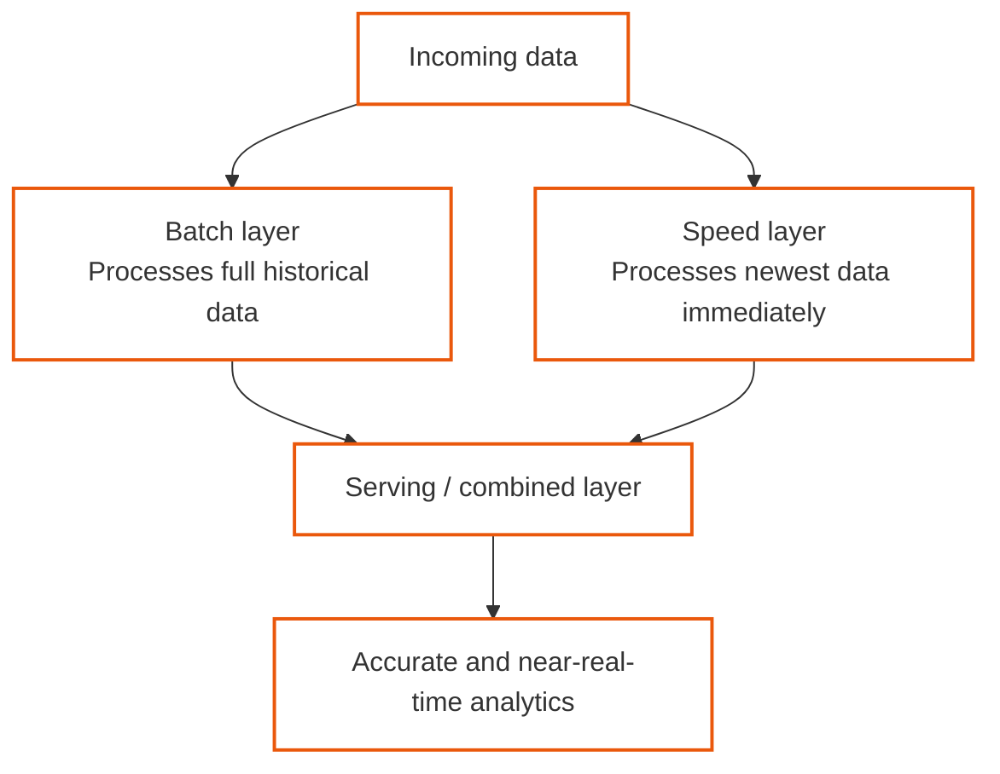

## 3.6 Data Dictionary Table 

### Purpose and Characteristics

A data dictionary documents each data element, including its:

* Name
* Format
* Length
* Business meaning

It provides a shared reference for:

* Consistent database design
* Data architecture implementation


---

# 4. Cloud Reference Architecture
## 4.1 On-Premisess vs Cloud
<details>
    <summary>On-Premise</summary>

On-Premises

An on-premises system is hosted and managed using infrastructure owned by the organisation.

The organisation is responsible for:

* physical servers;
* networking equipment;
* operating systems;
* databases;
* application deployment;
* security;
* backups and maintenance.

On-premises infrastructure provides greater control but usually requires higher initial costs, specialised staff and more maintenance.
</details>

<details>
    <summary>Cloud</summary>

A cloud system uses infrastructure and services provided by companies such as AWS, Microsoft Azure or Google Cloud.

Cloud computing provides:

* faster deployment;
* elastic scaling;
* pay-as-you-use pricing;
* managed backups and recovery;
* access to specialised services;
* reduced infrastructure maintenance.

Possible concerns include security, privacy, ongoing costs, internet dependency and vendor lock-in.
---
| Model    | Description                             | Customer manages                   | Example           |
| -------- | --------------------------------------- | ---------------------------------- | ----------------- |
| **IaaS** | Provides virtual infrastructure         | OS, runtime, applications and data | AWS EC2           |
| **PaaS** | Provides a managed application platform | Applications and data              | Google App Engine |
| **SaaS** | Provides a complete application         | Configuration and usage            | Gmail, Salesforce |
---
Other Cloud Service Models
* Network as a Service (NaaS)
* Communications as a Service (CaaS)
* Compute as a Service (CompaaS)
* Data Storage as a Service (DSaaS)

</details>

## 4.2 Principles for cloud-native architecture
Cloud-native architecture means designing a system to take advantage of cloud capabilities instead of simply placing an existing application on a cloud server.

<details>
    <summary>Principle 1: Design for Automation</summary>

Cloud systems should automate repetitive and error-prone activities.

Automation can be applied to:

* infrastructure provisioning;
* software building and testing;
* application deployment;
* scaling;
* monitoring;
* backup and recovery.

Examples include:

* using Docker to package applications;
* using Terraform to create infrastructure;
* using CI/CD pipelines to test and deploy software;
* using autoscaling to add or remove instances.

Automation makes deployment faster, more consistent and less vulnerable to human error.
</details>

<details>
    <summary>Principle 2: Be Smart with State</summary>

State is information about a user’s current situation within an application.

Examples include:

* login status;
* shopping-cart contents;
* form progress;
* game-session progress.

If state is stored inside one application server, the information may be lost when the server crashes. It also becomes difficult to send the user to another server.

Therefore, application servers should be stateless where possible. Important state should be stored externally in systems such as:

* Redis;
* managed databases;
* cloud storage.

For example, an online store can store shopping-cart information in Redis. Any application server can then retrieve the cart using the customer’s identifier.
</details>

<details>
    <summary>Principle 3: Favour Managed Services</summary>

Managed services are operated and maintained by the cloud provider.

Examples include:

* managed databases;
* message queues;
* cloud storage;
* machine-learning services;
* analytics services.

The provider normally handles:

* infrastructure maintenance;
* updates;
* backups;
* replication;
* availability.

This allows the development team to focus on the product. However, using provider-specific services may create vendor lock-in.

Vendor lock-in can be reduced by:

* using open standards;
* using open-source-compatible services;
* placing provider-specific code behind interfaces;
* using containers;
* documenting a migration strategy.

</details>

<details>
    <summary>Principle 4: Practise Defence in Depth</summary>

Defence in depth means protecting the system with multiple security layers.

These layers may include:

1. Edge firewall: blocks suspicious external traffic.
2. Network segmentation: separates internal parts of the system.
3. Authentication: verifies the identity of users and services.
4. Authorisation: controls what each user or service can access.
5. Application security: validates input and checks permissions.
6. Endpoint security: protects individual devices and servers.
7. Encryption: protects data during storage and transmission.
8. Continuous monitoring: detects suspicious behaviour.

Cloud-native architecture should not automatically trust a component simply because it is located inside the organisation’s network.
</details>

<details>
    <summary>Principle 5: Always Be Architecting</summary>

Cloud architecture should continuously evolve as:

* user requirements change;
* traffic increases;
* security threats develop;
* cloud services improve;
* organisational needs change;
* new technologies become available.

Architects should regularly review and improve the system rather than waiting for a major failure.

For example, a video-streaming platform must adapt its architecture to support new video formats, higher resolutions and increasing user demand.
</details>

<details>
    <summary>Applying the Principles to C4 Diagrams</summary>

The container and component diagrams from previous weeks should be updated to reflect cloud decisions.

Possible changes include:

* replacing a self-hosted database with a managed database;
* adding object storage;
* adding a message queue;
* introducing authentication services;
* adding caching;
* separating state from application servers;
* showing cloud-hosted APIs.

The design should then be justified using the five cloud-native principles.
</details>


## 4.3 Deployment Diagram
A deployment diagram shows how software systems and containers are installed and run on infrastructure in a particular environment, such as development, staging, or production.

* Deployment nodes represent where software runs, including:
    * Physical servers or devices
    * Virtual machines and cloud services such as IaaS or PaaS
    * Containers such as Docker
    * Execution environments such as database servers, Java application servers, or Microsoft IIS

* Deployment nodes can be nested. For example, a Docker container may run inside a virtual machine hosted on AWS.

* The diagram can also include infrastructure components, such as:
    * DNS services
    * Load balancers
    * Firewalls

* AWS, Azure, or other cloud-provider icons may be used, but all icons should be explained in the diagram’s key or legend.

In simple terms: A deployment diagram explains where each part of a system runs and how the infrastructure components are arranged.

### 4.3.1 Example Bank Deployment Diagram


### 4.3.2 Example Pet Clinic Diagram


## 4.4 System Landscape Diagram
A System Landscape Diagram shows how multiple software systems and people fit together across an organisation, department, or enterprise.

Unlike a standard C4 System Context Diagram, which focuses on one specific system, a System Landscape Diagram provides a broader overview without making any single system the main focus.

* Scope: An entire enterprise, organisation, department, or similar area.
* Main elements: People, software systems, and the relationships between them.
* Purpose: To understand how systems interact and support the wider organisation.
* Audience: Both technical and non-technical stakeholders, inside and outside the development team.
* Further detail: Each important system can be explored separately using the standard C4 model.


---

# 5. Security and Privacy

## 5.1 Dynamic Diagram

A **dynamic diagram** shows how system elements interact **at runtime** to complete a feature, use case, or user story. Interactions are numbered to show the order of communication. It can include systems, containers, or components.

**Purpose:** understand **how data moves through the system** before analysing security threats.

<details>
    <summary>Simple example</summary>

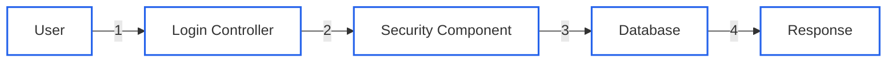

`User → Login Controller → Security Component → Database → Response`

</details>

## 5.2 Threat Modelling

**Threat modelling** is the process of identifying what could go wrong in a system and how to reduce the risk.

Focus on:

* **Entry points** — where users or systems can access the application
* **Trust boundaries** — where data moves between different trust levels
* **Data flow** — how information moves through the system
* **Threats** — possible security problems
* **Mitigations** — controls used to reduce those threats

## 5.3 Security Principles

<details>
    <summary>Minimise Attack Surface</summary>

Reduce the number of possible places an attacker can target.

Examples:

* Disable unnecessary services
* Close unused ports
* Limit exposed APIs
* Restrict admin access

</details>

<details>
    <summary>Secure the Weakest Link</summary>

A system's security can depend on its least secure component.

Example:

`Strong encryption + Secure database + Weak password = Still vulnerable`

The tutorial asks you to consider both principles when analysing a system.

</details>

## 5.4 STRIDE Threat Model

STRIDE is used to classify common security threats. Apply it to components and data flows in the architecture to identify possible threats.

| STRIDE | Meaning | Security Property | Simple Meaning |
|---|---|---|---|
| **S** | Spoofing | Authentication | Pretending to be another user |
| **T** | Tampering | Integrity | Changing data or code |
| **R** | Repudiation | Non-repudiation | Denying an action |
| **I** | Information Disclosure | Confidentiality | Accessing information without permission |
| **D** | Denial of Service | Availability | Making a service unavailable |
| **E** | Elevation of Privilege | Authorization | Gaining permissions you should not have |

## 5.5 Mitigation

A **mitigation** is a security control used to reduce or prevent a threat.

| Threat | Possible Mitigation |
|---|---|
| Spoofing | Authentication / MFA |
| Tampering | Integrity checks |
| Repudiation | Logging and audit records |
| Information Disclosure | Access control / encryption |
| Denial of Service | Rate limiting |
| Elevation of Privilege | Authorization controls |

## 5.6 Connection to C4 Diagrams

Security and privacy should be included in architecture diagrams such as:

* Application/Data Container Diagram
* Component Diagram
* Deployment Diagram

The goal is to show not only **how the system is built**, but also **how it is protected**.

<details>
    <summary>Key process to remember</summary>

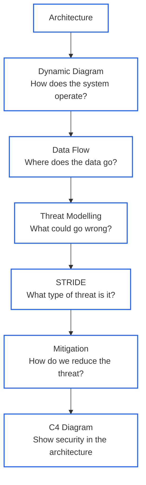

> **Dynamic Diagram** = How the system works
> **Threat Modelling** = What could go wrong
> **STRIDE** = Classify the threat
> **Mitigation** = How to protect against it

</details>

---

# 6. Architecture Styles and Communication Patterns

Week 6 focuses on:

* recognising **bad architecture**
* understanding **dependencies**
* choosing suitable **architecture styles**
* choosing how components **communicate**

## 6.1 Architecture Smells

Architecture smells are warning signs that a system may be difficult to maintain, change, or scale.

| Architecture Smell | Simple Meaning | Marathon Example | Improvement |
|---|---|---|---|
| **Feature Concentration** | One component does too many things | **Backend API** handles registration, schedules, volunteers, vendors, tracking, notifications, feedback, and results | Split into focused components or services |
| **Scattered Functionality** | One responsibility is spread across multiple components | Notification responsibilities exist across Web App, Mobile App, Backend API, and Notification Provider | Centralise notification rules |
| **Dense Structure** | Too many direct dependencies between components | **Backend API** directly connects to apps, database, authentication, payment, timing, notification, and mapping systems | Use focused integration components and asynchronous messaging |
| **Cyclic Dependency** | Components eventually depend back on each other | No cyclic dependency identified in the current Marathon architecture | Recheck after architecture changes |
| **Unstable Dependency** | A core component depends directly on less-stable or external systems | Backend API directly depends on Payment, Notification, Mapping, and Timing services | Use adapters, queues, retries, timeouts, and failure handling |


<details>
    <summary>Easy way to identify them</summary>

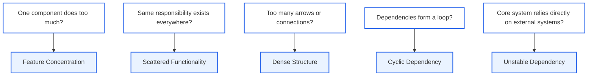

</details>

<details>
    <summary>Single Responsibility Principle</summary>

To avoid **Feature Concentration**, each container or component should have **one clear responsibility**. This keeps changes and fixes focused and localised.

Instead of one Backend API owning every capability:

```text
Backend API
 ├─ Registration
 ├─ Tracking
 ├─ Results
 ├─ Volunteers
 ├─ Vendors
 └─ Notifications
```

separate the responsibilities:

```text
Backend API
 ├─ Registration Component
 ├─ Event Management Component
 ├─ Volunteer Component
 ├─ Vendor Component
 ├─ Tracking Component
 └─ Results Component
```

The updated Marathon solution follows this structure.

</details>

<details>
    <summary>Marathon Database example</summary>

The original Marathon Database stores registration, schedules, volunteers, vendors, timing records, results, and feedback, creating **Feature Concentration**.

The improved architecture separates:

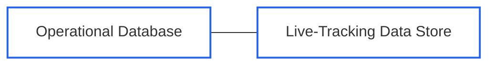

This keeps normal operational data separate from rapidly changing race-tracking data.

</details>

## 6.2 Dependencies

If `A → B`:

* **A depends on B**
* A must know how to connect to B
* B does not need to know about A
* communication can move both ways, but A normally initiates it

<details>
    <summary>Marathon examples</summary>

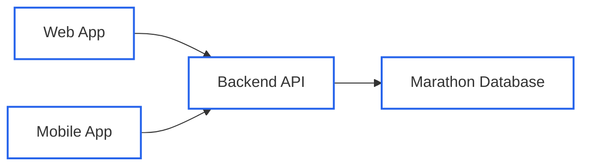

| Component | Depends On |
|---|---|
| Web Application | Backend API |
| Mobile Application | Backend API |
| Backend API | Marathon Database |

</details>

## 6.3 Architecture Styles

Compare architecture styles by **advantages**, **disadvantages**, and **suitable use cases**, then justify which styles should be used in the system.

| Style | Meaning / Marathon Use | Advantages | Disadvantages |
|---|---|---|---|
| **Layered** | Separates presentation, business, and data responsibilities | Clear structure; easier testing and maintenance | Layers may become tightly coupled; limited independent scaling |
| **Service-Oriented** | Used for Payment, Mapping, Notification, and Authentication integrations | Reusable services and standard interfaces | More coordination and governance |
| **Event-Driven** | Used for timing, tracking, race updates, and alerts | Handles traffic spikes, asynchronous processing, and real-time events | Harder tracing, testing, ordering, and error handling |
| **Microservices** | Separate capabilities such as Registration, Tracking, or Results | Independent deployment/scaling and failure isolation | More deployment, networking, monitoring, and data complexity |

<details>
    <summary>Marathon selected approach</summary>

The sample solution uses a **hybrid architecture**:

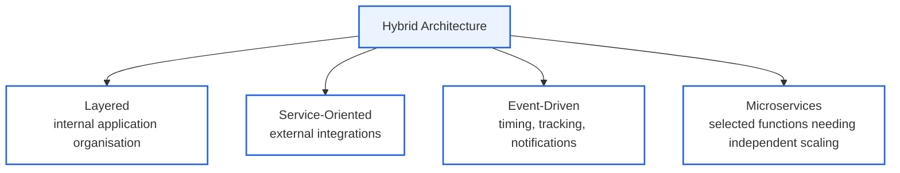

</details>

## 6.4 Communication Patterns

The tutorial introduces four main communication methods:

| Pattern | Simple Meaning | Marathon Example |
|---|---|---|
| **Repository** | Components read and write shared stored data | Backend API → Operational Database |
| **API** | Consumer sends a request to a provider | Web/Mobile → Backend API |
| **Persistent Connection** | Connection remains open for real-time communication | Notification Service → Mobile App |
| **Queue / Broker** | A middleman carries messages asynchronously | Timing Events → Event Broker → Tracking Processor |

## 6.5 Repository Communication

Multiple containers read and write data through a shared repository, usually a database.

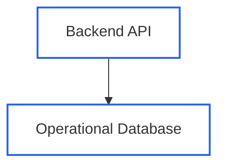

### Limitations

* mainly supports **CRUD**
* constant polling can waste resources
* multiple writers can create consistency problems

CRUD: **Create**, **Read**, **Update**, **Delete**.

## 6.6 API Communication

With APIs, `Consumer → Provider`. The **consumer initiates communication** and can **pull** or **push** information.

<details>
    <summary>Marathon examples</summary>

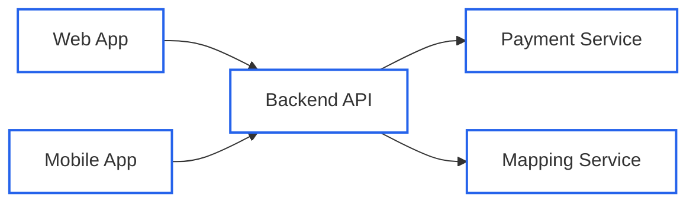

These use APIs over **HTTPS/JSON** in the sample architecture.

</details>

### REST APIs

REST is the main API style discussed in the tutorial.

> **URL = resource/noun**
> **HTTP method = action/verb**

| Method | Example | Meaning |
|---|---|---|
| GET | `/tickets` | Retrieve tickets |
| GET | `/tickets/123` | Retrieve one ticket |
| POST | `/tickets` | Create |
| PUT | `/tickets/123` | Update |
| DELETE | `/tickets/123` | Delete |

Important response codes:

| Code | Meaning |
|---|---|
| **200** | Success |
| **400** | Bad request |
| **401** | Not authenticated |
| **403** | No permission |
| **404** | Not found |

REST APIs are also **stateless**: each request is processed independently without relying on previous requests. Data is commonly exchanged using **JSON**.

### API Limitation → Persistent Connections

REST communication is initiated by the consumer. That creates a problem for real-time updates.

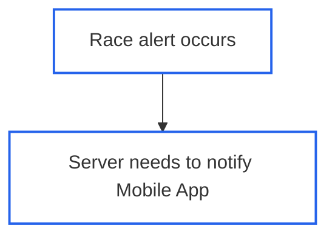

The server should not need to wait for the Mobile App to ask for an update. This is where **persistent connections** are useful.

## 6.7 Persistent Connections / WebSockets

A persistent connection remains open:

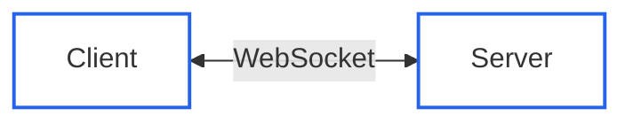

After the consumer creates the connection:

* the client can send messages
* the server can send messages
* either side can close it

Used for timely Marathon:

* race updates
* emergency alerts
* mobile notifications

### Limitations

* **Ambiguous interface:** WebSockets do not strongly define what messages or events should look like, so both sides must agree on the format.
* **Difficult to scale:** persistent connections make the backend more stateful and harder to divide across services.

## 6.8 Queues and Brokers

Instead of services communicating directly (`Producer → Consumer`), use a middleman:

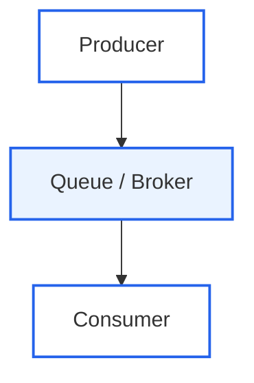

Message queues can provide:

* reliability
* ordering
* prioritisation
* load balancing
* buffering
* playback
* translation

<details>
    <summary>Marathon timing example</summary>

This is an important example of **event-driven communication**:

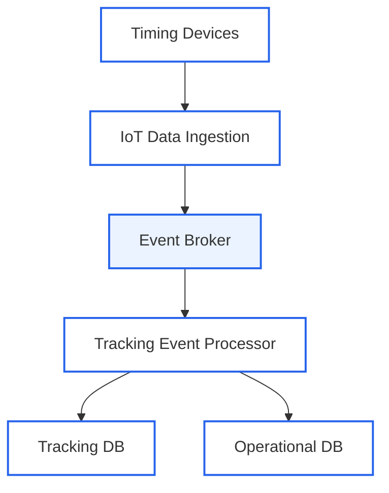

Why use a broker? If thousands of runners cross checkpoints at once, the broker helps **buffer events and decouple the timing devices from processing**.

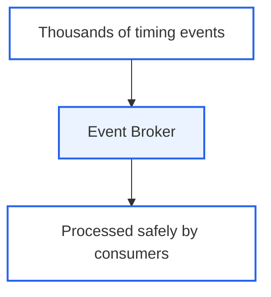

</details>

<details>
    <summary>Publish / Subscribe</summary>

With **Pub/Sub**:

* a **publisher** produces events
* a **subscriber** receives events
* a service can be both

Events are organised into **topics/channels**. The publisher does not need to know every subscriber.

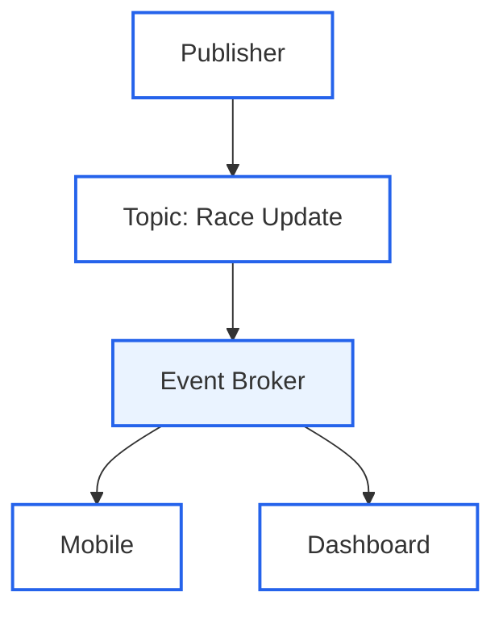

</details>

<details>
    <summary>Marathon notification example</summary>

Instead of `Backend API → Notification Provider`, the improved architecture uses:

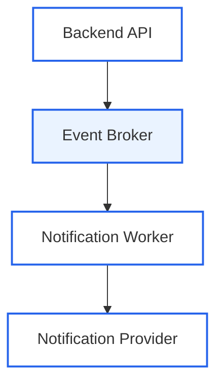

Notification delivery becomes **asynchronous**, so sending a notification does not need to block the user's main request.

</details>

## 6.9 Marathon Communication Summary

| Source → Destination | Pattern | Why |
|---|---|---|
| Web → Backend API | API | Immediate response |
| Mobile → Backend API | API | Current race information |
| Backend → Operational DB | Repository | Store authoritative data |
| Backend → Payment | API | Payment confirmation |
| Backend → Mapping | API | Route information |
| Timing → IoT | Broker / MQTT | High-volume device communication |
| IoT → Event Processing | Queue/Broker | Scalable asynchronous processing |
| Processor → Tracking DB | Repository | Frequent tracking updates |
| Backend → Notifications | Queue/Broker | Avoid blocking user requests |
| Notification → Mobile | Persistent connection | Real-time updates |

<details>
    <summary>Main Week 6 takeaway</summary>

```mermaid
flowchart TD
    A["Good Architecture"] --> B["Clear Responsibilities"]
    A --> C["Controlled Dependencies"]
    A --> D["Correct Communication Pattern"]

    style A fill:#EAF3FF,stroke:#2563EB,stroke-width:2px
    style B fill:#FFFFFF,stroke:#2563EB,stroke-width:2px
    style C fill:#FFFFFF,stroke:#2563EB,stroke-width:2px
    style D fill:#FFFFFF,stroke:#2563EB,stroke-width:2px
```

> **Architecture Style** = how the system is organised.
> **Architecture Smell** = warning that the organisation has a problem.
> **Dependency** = which component relies on another.
> **Communication Pattern** = how components exchange information.

For the Marathon system:

```text
Immediate request?
      → API

Store/retrieve data?
      → Repository

Real-time two-way/update communication?
      → Persistent Connection

High-volume or asynchronous events?
      → Queue / Broker
```

This is the core logic connecting the Week 6 tutorial concepts to the Marathon Management System sample solution.

</details>
